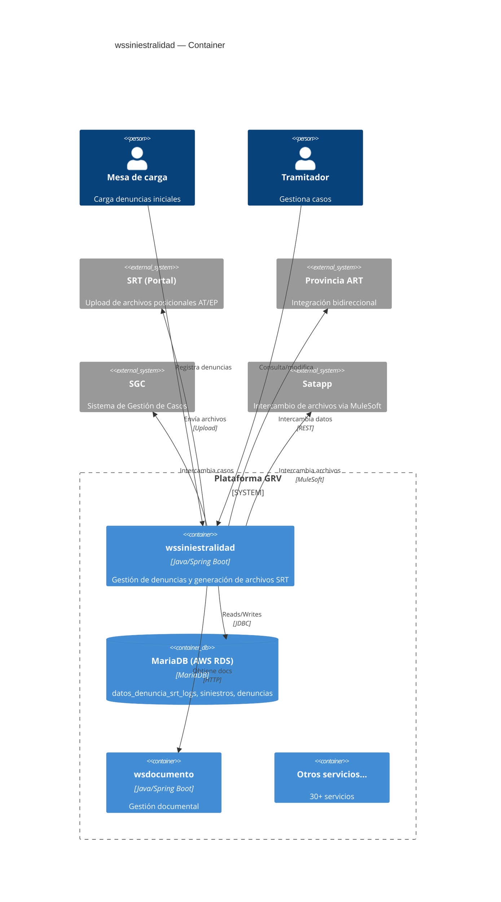
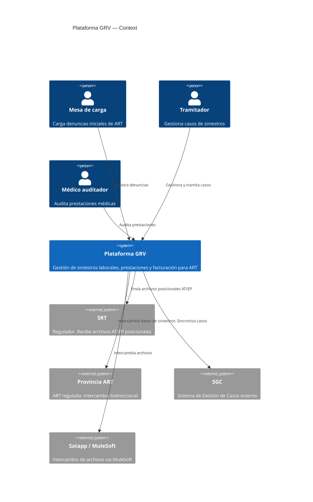
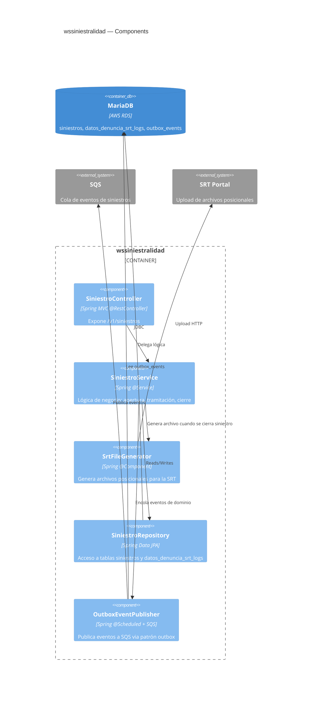

# Skill: c4-diagrams

## Propósito

Generar diagramas C4 (Context, Container, Component) de la plataforma de
GRV para documentación técnica, onboarding y discusión de diseño.

## Niveles de C4 (referencia rápida)

- **Context**: el sistema + actores externos (usuarios, sistemas externos).
- **Container**: el sistema zoom in: microservicios, BDs, frontends, colas.
- **Component**: un container zoom in: componentes internos de un servicio.
- **Code** (nivel 4): opcional, rara vez útil en este contexto.

## Fuente de verdad

- `context/microservices.yaml` — para el nivel Container.
- `context/integrations.yaml` — para Context y Container (actores externos).
- El código del servicio — solo si el usuario pide nivel Component.

## Cuándo usarme

- Documentación técnica de un servicio nuevo.
- Onboarding de un dev al mapa de la plataforma.
- Análisis de impacto de un cambio (visualizar qué toca).
- Preparación de presentación técnica al cliente o al equipo.

## Cuándo NO usarme

- Para código (nivel 4) — ese trabajo es de diagramas de clases o
  herramientas IDE.
- Para diagramas de secuencia de flujos específicos — usar otro formato
  (Mermaid sequenceDiagram).
- Para flowcharts de lógica de negocio — no es C4, usar Mermaid flowchart.

## Formato de salida

Por defecto, genera el diagrama en **Mermaid** (`C4Context`, `C4Container`)
porque se renderiza en GitLab, Notion, y muchos editores. También puede
generar **PlantUML** con la librería C4-PlantUML si el usuario lo prefiere.

## Flujo

1. Preguntar qué nivel quiere el usuario (Context / Container / Component).
2. Preguntar cuál es el alcance (¿todo el sistema? ¿un servicio y sus dependencias? ¿un flujo específico?).
3. Leer `context/microservices.yaml` y `context/integrations.yaml`.
4. Si falta información relevante, **preguntar** antes de inventar
   componentes o relaciones.
5. Generar el diagrama.
6. Explicar el diagrama en texto (qué representa cada caja, qué flechas son síncronas/async).

## Ejemplo

**Usuario**: Hacé un Container de wssiniestralidad y sus dependencias.

**Respuesta**:

Notas:
- No incluí actores específicos de negocio (CEM) porque no están confirmados
  como consumers directos de wssiniestralidad — chequear antes de publicar.
- Las flechas no distinguen sync/async en este nivel; si hace falta, pedílo.

## Límites

- El diagrama es tan bueno como la info en `context/microservices.yaml`.
  Si faltan servicios o dependencias, el diagrama va a reflejar esa carencia.
- No genera layouts "lindos" automáticamente — Mermaid C4 decide el layout.
- No reemplaza una sesión de diseño real; es documentación, no decisión.

## Ejemplos de los 3 niveles

### Nivel 1 — Context (el sistema GRV y sus actores externos)

### Nivel 2 — Container (microservicios y sus relaciones)

Ver el ejemplo en la sección anterior (wssiniestralidad).

### Nivel 3 — Component (internals de un servicio)

## TODO para promover a beta

- [ ] Generación automática de Component desde estructura de paquetes Java.
- [ ] Soporte para exportar a imagen (requiere Mermaid CLI o similar).
- [ ] Actualizar el ejemplo Container con los 30+ servicios reales del workspace.
