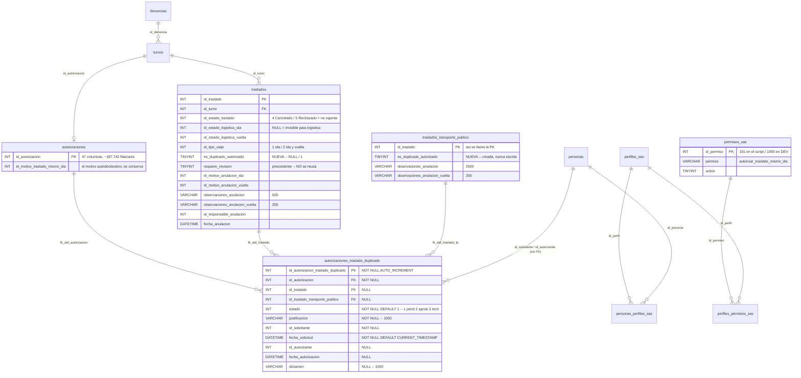
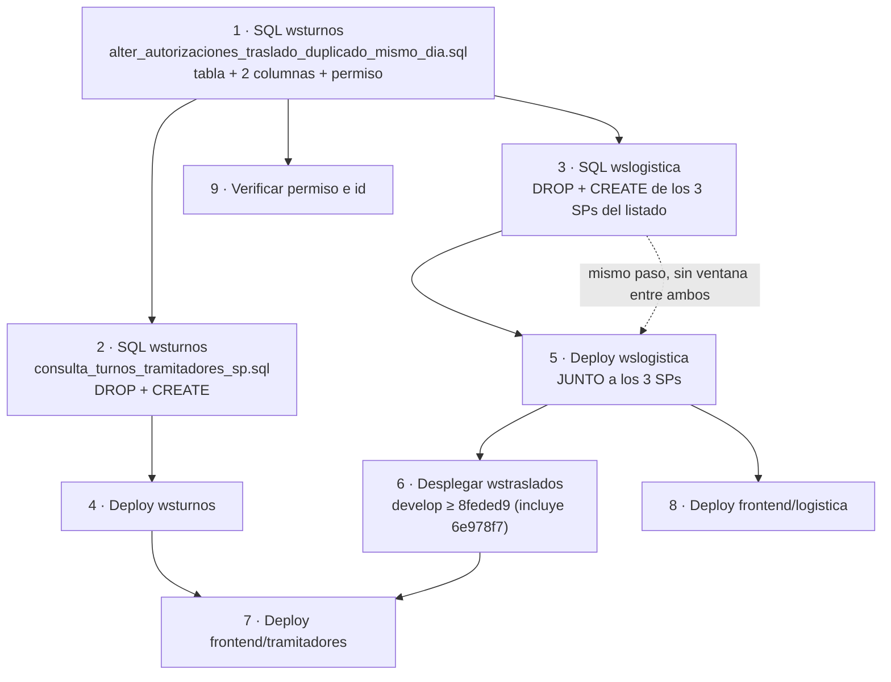

# SDD — Autorización de traslados duplicados del mismo día

| | |
|---|---|
| **Change** | `traslados-duplicados-autorizacion` |
| **Documento** | SDD · Documento de Diseño de la Solución |
| **Fecha** | 18/08/2026 |
| **PRD de referencia** | `PRD-traslados-duplicados-autorizacion.md` (14/08/2026) — este SDD no lo contradice; donde el código difiere, se registra en §13 |
| **Ticket** | **INI-2** (triage inbox, no Jira). Las MRs !1787, !1789, !1790 y wsturnos !837 referencian GRV-2239 por error: ese ticket es «CIE-10 · Trazadoras» |
| **Autoría del desarrollo** | Vanesa Burman |
| **Referentes funcionales** | Silvio (Logística), Karen — reunión del 06/08 · Yanina Di Prima (observación que reformuló el circuito) |
| **Estado** | Mergeado en `develop` en los **cinco** repos, **operativo en DEV** y **desplegado y verificado en TEST** (base, SPs, pool de datos y los cinco servicios). El deploy a TEST estuvo bloqueado un día por un build roto **ajeno a este circuito**: ver §15.3. Sin promover a stage ni producción. *Actualizado el 18/08 a la noche.* |
| **Servicios tocados** | `wsturnos`, `wslogistica`, **`wstraslados`**, `frontend/tramitadores`, `frontend/logistica` |
| **Migraciones** | 2 scripts SQL + los 4 SPs. **Aplicados y verificados en DEV y en TEST** el 18/08, con backup del cuerpo previo de cada SP. Pendientes en stage y producción. |

### Dónde vive cada cosa (estructura OpenSpec)

Este SDD es el **detalle técnico** del change, no su única pieza. El change sigue la estructura de
OpenSpec, y cada documento tiene un trabajo distinto:

| Archivo | Qué contiene | Cuándo se lee |
|---|---|---|
| `proposal.md` | El **qué** y el **por qué**, con el volumen medido y el impacto por servicio | Antes de aprobar el change |
| `specs/<capability>/spec.md` | Los **requisitos verificables**, en formato `Requirement` + `Scenario` (`WHEN` / `THEN`). Cinco capabilities, 28 requisitos, 63 escenarios | Para saber qué tiene que cumplirse, y para escribir los tests |
| `design.md` | Las **decisiones** (D1–D10) con su alternativa descartada, los riesgos y el plan de migración | Cuando hay que entender por qué algo se hizo así |
| `tasks.md` | El **avance real**, tarea por tarea | Para saber qué queda |
| **este SDD** | El detalle exhaustivo: modelo de datos, contratos, matriz de salidas, inventario de artefactos, discrepancias | Al implementar o al auditar |
| `PRD-…md` | La definición funcional de referencia | Para dirimir qué se esperaba |
| `analisis/` | La **evidencia de campo**: capturas, pools de datos, verificaciones (§15) | Para reproducir o para probar |

Las cinco capabilities: `conflicto-traslado-mismo-dia`, `autorizacion-traslado-duplicado`,
`devolucion-resultado-solicitante`, `visibilidad-duplicado-logistica` y
`gate-servidor-traslado-duplicado`. Validado con `openspec validate --strict`.

> **Qué hacer si este SDD y un `spec.md` se contradicen.** Gana el `spec.md`: es el requisito
> acordado. Este documento describe **cómo está implementado**, que es otra cosa — y cuando las dos
> difieren, la diferencia es un defecto, no una decisión. Los que se conocen están en §13.

### Refs verificados

Todo lo que sigue se leyó de `origin/develop` de cada repo. **Un HEAD sin fecha de `fetch` no dice nada**: `develop` se mueve, y este documento ya se equivocó una vez por leer un clon viejo (ver la advertencia de lectura, más abajo). Por eso la tabla declara las dos cosas.

Último `git fetch origin` de los cinco repos: **18/08/2026**.

| Repo | HEAD de `origin/develop` al 18/08 | Commit del circuito |
|---|---|---|
| `backend/wsturnos` | `cd8c50d` (18/08) | `183e80c` (merge `fix/pedir-traslado-duplicado-faltante`), `d8149d2`, `005bede`, `1f8bc04`, `569a7f0`, `31c7472`, `7496daa` |
| `backend/wslogistica` | `912a4c8` (14/08) | `33f32c8` (marca), `eecd91a` (conflicto), `db807e5` (recorte de observación) |
| `frontend/tramitadores` | `67a0b123` (18/08) | `8f285dbf`, `228c082f`, `c88356c0`, `4ef88cbb`, `8a3518d3`, `b900fdf7` |
| `frontend/logistica` | `595ee95` (14/08) | `f865c52` |
| `backend/wstraslados` | `8feded9` (13/08) | `6e978f7`, **mergeado a `develop` el 13/08** por `8feded9` (`bugfix/hardening-anulacion-traslado`, MR !306) |

> Las transcripciones se tomaron con los HEAD vigentes al redactar cada sección: `01e05cd` en `wsturnos` y `37128ebf` en `tramitadores`, ambos ya superados por lo que muestra la tabla. Lo que entró en el medio no toca el circuito descrito acá, con una excepción declarada: la rama `fix/INI-2-pedido-en-el-alta` de `wsturnos` (`d31a644`), que sí lo cambia y está descrita en §2.2.

> **Advertencia de lectura, y la razón por la que está acá.** Los working trees locales de los cinco repos estaban en ramas distintas de `develop` al momento de escribir esto, y en los dos MFE el `develop` **local** estaba desactualizado y **no contenía la feature** (tramitadores local: `ced2a7e3`, del 13/07; logística local: `9dc6f54`, del 06/08). Todas las transcripciones se tomaron con `git show origin/develop:<ruta>`.
>
> La primera versión de este documento se saltó su propia advertencia: corrió `git branch --contains` sobre el clon de `wstraslados` **sin `git fetch`** y concluyó que el commit `6e978f7` estaba fuera de `develop`. No lo estaba: se mergeó el 13/08 por `8feded9`, cinco días antes de la fecha de este SDD, y la propia portada lo decía («mergeado en `develop` en los cinco repos»). El hallazgo se eliminó en la revisión del 18/08 (ver la nota al pie del documento). **La verificación correcta es de ancestría y con `fetch` primero:**
>
> ```
> git fetch origin && git merge-base --is-ancestor 6e978f7 origin/develop
> ```

### Versiones reales de los servicios

| Servicio | Spring Boot | Versión del artefacto | Context path |
|---|---|---|---|
| `wsturnos` (`ws-turnos`) | **2.1.2.RELEASE** (EOL) | **`1.0-SNAPSHOT`** | `/wsturnos` |
| `wslogistica` (`ws-logistica`) | **3.3.13** | `1.0.1` (release) | `/wslogistica` |
| `wstraslados` | **2.1.2.RELEASE** (EOL) | **`1.0-SNAPSHOT`** | `/wstraslados` |

---

## 1. Alcance técnico

### 1.1 Incluido

- Tabla propia `autorizaciones_traslado_duplicado` con su ciclo pendiente → aprobado/rechazado, y el permiso `autorizar_traslado_mismo_dia`.
- Endpoint de **consulta de conflicto** por fecha en `wslogistica`, que devuelve el estado operativo del traslado preexistente y **qué salidas están habilitadas**.
- Endpoints de **pedido** y **resolución** en `wsturnos`, con auto-aprobación cuando el solicitante ya tiene el permiso.
- **Validación server-side** del segundo traslado del mismo día, con 409 CONFLICT.
- Filtro de la tab «Traslados duplicados» en el SP del listado de tramitadores, y contador para la card del home.
- Columna `es_duplicado_autorizado` denormalizada en `traslados` y `traslados_transporte_publico`, devuelta por los tres SPs del listado de logística, y su marca visual en la grilla del sector.
- Reuso del circuito de cancelación existente (`wstraslados/traslado/cancelar-por-turno` → `wslogistica/traslados/cancelar-desde-modulo-externo`) para la salida «anular el preexistente», con recorte de la observación al largo real de cada columna y propagación del resultado real al front.

### 1.2 No-alcance técnico

- **No hay migrador ni backfill.** Los 2.156 casos históricos con motivo autodeclarativo quedan como están; ningún traslado preexistente recibe `es_duplicado_autorizado`.
- **No se toca el catálogo de motivos** (`id_motivo_traslado_mismo_dia` en `autorizaciones` sigue existiendo y sigue siendo válido para el validador). La convivencia es deliberada: sostiene las versiones del MFE que todavía no tienen el circuito.
- **No se implementa la doble instancia** de autorización (estado 4 + segundo autorizante de `autorizaciones`).
- **No hay notificación** al gestor: ni push, ni SSE, ni card, ni fila en ninguna tabla de avisos.
- **No hay endpoint de lectura del pedido resuelto.** El listado sólo trae pendientes.
- **No se introduce Flyway/Liquibase.** Los dos scripts SQL son manuales.
- **No se agrega autenticación** a los endpoints nuevos de `wsturnos`: ese servicio no tiene Spring Security en sus controllers (ver §11 R-1).

---

## 2. Arquitectura de la solución

### 2.1 Por qué el circuito está partido en dos servicios

No es una decisión de comodidad: es la frontera de dominio que ya existía.

| Servicio | Qué le corresponde | Por qué |
|---|---|---|
| **`wsturnos`** | El **pedido** y su **resolución**. El pedido se ancla a `autorizaciones.id_autorizacion`, que es la autorización de la prestación médica del turno. Por ahí se llega al turno, al paciente y a la fecha. | La autorización de la prestación es entidad de turnos. El circuito de aprobación que se copia (Cirugías) vive acá. Y el gate server-side tiene que estar donde nacen los turnos. |
| **`wslogistica`** | El **conflicto** (qué traslado ya existe, en qué estado operativo, qué se puede hacer con él), la **ejecución de la cancelación** por tramo y la **marca** en la grilla del sector. | El estado operativo de un traslado —agencia asignada, estado de logística por tramo, monto cargado— es dato de logística. `wsturnos` no lo conoce y no debería reimplementarlo. Los tres SPs del listado son de logística. |
| **`wstraslados`** | La **puerta de entrada de la anulación desde tramitadores** (`POST /traslado/cancelar-por-turno`), que resuelve el turno a sus traslados y delega en `wslogistica`. | Es el servicio dueño del traslado desde la mirada de tramitadores: el MFE ya le pegaba a él para consultar y cancelar traslados. El circuito **reusa esa vía en lugar de crear una nueva**, que es lo que pide RF-3.6. |

La consecuencia práctica es que **ningún servicio ve el circuito completo**, y el punto de unión es la columna denormalizada `traslados.es_duplicado_autorizado`: `wsturnos` la escribe al aprobar, `wslogistica` la lee en el SELECT de sus SPs. No hay join entre servicios ni lectura cruzada de la tabla del otro.

Hay **dos** cadenas de llamadas REST entre servicios, y las dos terminan en el mismo endpoint de `wslogistica`:

| Origen | Cadena | Cuándo |
|---|---|---|
| **Rechazo de la autorización** | `wsturnos` → `IRestInvokeService.fetchLogisticaOnCancelacion` → `POST /wslogistica/traslados/cancelar-desde-modulo-externo`, con motivo **16** | Momento 4, rama «rechazar» |
| **Salida «anular el preexistente»** | MFE tramitadores → `POST /wstraslados/traslado/cancelar-por-turno` → `wstraslados.cancelarTrasladosPorTurno` → REST (`wsrest.url.wslogistica.traslado.cancelarDesdeModuloExterno`) → **el mismo** `POST /wslogistica/traslados/cancelar-desde-modulo-externo` | Momento 1, salida `ANULAR` |

Que las dos converjan en `cancelar-desde-modulo-externo` es lo que garantiza que la lógica de tramos, el recorte de observaciones y el dual-write de GRV-2084 se apliquen igual por los dos caminos. Lo que **no** es igual es la respuesta: la cadena del rechazo descarta el `ResultadoCancelacionDTO` (§11 R-10) y la cadena del front lo lee y lo muestra.

### 2.2 La llave de invisibilidad, y a qué traslado se le aplica

Lo que decide si logística ve un traslado **no es el estado del traslado**: es que `traslados.id_estado_logistica_ida` no sea nulo. Está en el `WHERE` de los SPs del listado de logística —`consulta_traslado_remis_amb_logistica.sql:51`, `AND t.id_estado_logistica_ida IS NOT NULL`— y ninguno de los tres filtra por `id_estado_traslado`.

De ahí sale el mecanismo central del diseño:

- Un traslado **pendiente de autorización** nace con `id_estado_logistica_ida = NULL` → logística no lo ve. `TurnosServiceImpl.createNewTraslado` no toca esa columna en ningún caso.
- Al **aprobar**, `AutorizacionTrasladoDuplicadoServiceImpl.aprobar()` le pone `id_estado_logistica_ida = 1` (Solicitado), la vuelta sólo si el viaje es de ida y vuelta, y la marca `es_duplicado_autorizado = 1` → recién ahí baja al sector, y marcado.
- Al **rechazar**, nunca tuvo estado de logística: se cancela con motivo 16 y logística no se enteró.

Son **dos redes independientes**: el estado del traslado es lo que ve el gestor; el estado de logística nulo es lo que lo mantiene fuera de la grilla. Si alguien toca el primero por error, el traslado sigue invisible.

#### El mecanismo no vale nada si el pedido apunta al traslado equivocado

La llave es correcta, pero es **relativa a un traslado concreto**: el que el pedido tiene en `autorizaciones_traslado_duplicado.id_traslado`. Y ahí estaba el defecto real, que este SDD describió mal en su primera versión.

El pedido lo registraba el front en una segunda llamada (`POST /autorizaciones/pedir-traslado-duplicado`) mandando en `idTraslado` **el id del primer conflicto** —`primerConflicto?.idTraslado`, o sea el traslado **preexistente**, no el que se estaba creando—. Con eso `aprobar()` marcaba y re-solicitaba el traslado **viejo**, pisándole el estado de logística real que ya tenía, mientras el traslado **nuevo** quedaba sin marca y logística lo cancelaba por duplicado: la autorización no servía de nada. Y en un alta ni llegaba a eso, porque la autorización del turno se crea junto con el turno: sin `idAutorizacion` que mandar, `pedir()` cortaba con «no existe la autorización» y el pedido sólo funcionaba editando un turno ya guardado.

**Cómo queda con `fix/INI-2-pedido-en-el-alta`** (`wsturnos`, `d31a644`), que es el mecanismo que describe el resto de este documento:

- El **alta registra su propio pedido**. `TurnosServiceImpl.createTurno` retiene el id de lo que acaba de crear —`createNewTraslado` y `createTrasladoTransportePublico` hacen su propio `save` y devuelven la entidad persistida, así que el id existe sin depender de cascade ni de flush— y llama a `AutorizacionTrasladoDuplicadoServiceImpl.registrarPedidoDelAlta` con **la autorización de este turno y el traslado nuevo**.
- Es **atómico con el alta**: `createTurno`, `programarTurno` y `updateTurno` pasan a `@Transactional(rollbackFor = Exception.class)` porque declaran `throws Exception` y Spring, por defecto, no revierte ante excepciones chequeadas. Si el alta se revierte, el pedido no existe; no puede quedar huérfano.
- La bifurcación «nace aprobado si el solicitante ya tiene el permiso» **no se duplica**: `pedir()` y el alta comparten el método privado `registrar()`, que es el que decide si el traslado baja a logística marcado o queda esperando.
- Se llena **una sola** de las dos columnas de traslado, nunca las dos, según el tipo de traslado del turno. Y `aprobar()` ahora también le da estado de logística y marca al **transporte público**: la columna `traslados_transporte_publico.es_duplicado_autorizado` existía en la base, la entidad no la tenía mapeada y nadie la escribía (ver §11 R-8).
- El validador acepta la **intención de pedido declarada en el request** (`GenerarTrasladoDTO.tieneIntencionDePedidoDuplicado()`): en un alta el pedido todavía no existe, así que sin eso la tercera salida del bloque de conflicto se comía el mismo 409 que viene a evitar.

Dos advertencias que quedan en pie:

1. **El endpoint `pedir-traslado-duplicado` no se borró**, y para el camino de **edición y programación** el front sigue mandando el id del conflicto en lugar del traslado del turno que se está editando. Ahí el defecto persiste, y el arreglo es del lado del front: el backend recibe un id de traslado válido y hace lo que se le pide. Está documentado en el javadoc del propio endpoint.
2. La invisibilidad **no es una constraint**. `programarTurno` rellena `id_estado_logistica_ida` cuando lo encuentra nulo y la autorización del turno está aprobada con traslado autorizado (`TurnosServiceImpl:905-916`, y para transporte público sin condicionar por autorización, `:930-940`). Es decir: la llave protege el traslado mientras nadie lo programe; no lo protege de un camino que le complete el estado por otra razón.

### 2.3 Diagrama de secuencia — los cuatro momentos

```mermaid
sequenceDiagram
    autonumber
    actor G as Gestor (tramitadores)
    participant FT as MFE tramitadores
    participant WT as wsturnos
    participant WL as wslogistica
    participant DB as cs (MariaDB)
    actor R as Referente / supervisor
    participant FL as MFE logistica

    rect rgb(240,246,255)
    note over G,DB: Momento 1 — el gestor ve el conflicto
    G->>FT: carga un turno con traslado en una fecha
    FT->>WL: POST /wslogistica/traslados/conflictos-mismo-dia<br/>{idDenuncia, fechas[], idTurnoExcluido, idRegionCuerpo}
    WL->>DB: findConflictosByDenunciaAndFechas<br/>(excluye estados 4 y 5)
    WL->>DB: findIdsTrasladoConAgenciaInformada
    WL-->>FT: List<ConflictoPorFechaDTO> con SalidasConflictoDTO<br/>(puedeAnular, puedeDerivarALogistica,<br/>puedeGuardarSinTraslado, requiereAutorizacion, detalle)
    FT-->>G: bloque de conflicto: traslado existente + salidas habilitadas
    end

    rect rgb(255,250,240)
    note over G,DB: Momento 2 — el pedido queda pendiente
    G->>FT: elige "Pedir autorización" + justificación
    FT->>WT: POST /wsturnos/turnos/crear<br/>(turno + traslado + justificacion e idSolicitante<br/>del pedido, en GenerarTrasladoDTO)
    WT->>WT: TrasladoDuplicadoValidator.validar(..., tieneIntencionDePedido)<br/>[antes del try; la intención declarada evita el 409]
    WT->>DB: INSERT turnos + autorizaciones + traslados<br/>(id_estado_logistica_ida = NULL)
    WT->>WT: registrarPedidoDelAlta(autorizacion nueva,<br/>id del traslado NUEVO, justificacion, idSolicitante)
    WT->>DB: SELECT permiso autorizar_traslado_mismo_dia<br/>del idSolicitante
    WT->>DB: INSERT autorizaciones_traslado_duplicado<br/>(estado = 1 PENDIENTE)
    WT-->>FT: el alta responde; el pedido ya quedó registrado<br/>en la MISMA transacción
    note right of DB: El turno YA está guardado.<br/>Sólo el traslado espera.<br/>El pedido apunta al traslado NUEVO.
    end

    rect rgb(245,255,245)
    note over R,DB: Momento 3 — quien autoriza resuelve
    R->>FT: entra al home
    FT->>WT: GET /wsturnos/autorizaciones/traslados-duplicados-pendientes
    WT->>DB: countByEstado(1)
    WT-->>FT: body: <long>  (la card no se muestra si es 0)
    R->>FT: click en la card -> grilla filtrada
    FT->>WT: POST listado de turnos<br/>{trasladosDuplicadosPendientes: true}
    WT->>DB: CALL consulta_turnos_tramitadores_sp<br/>(INNER JOIN ATD + ATD.estado = 1)
    WT-->>FT: filas con justificacion, solicitante y fecha del pedido
    R->>FT: aprueba o rechaza + dictamen
    FT->>WT: POST /wsturnos/autorizaciones/resolver-traslado-duplicado<br/>{idAutorizacionTrasladoDuplicado, aprobar, idAutorizante, dictamen}
    end

    rect rgb(255,245,245)
    note over WT,FL: Momento 4 — el sistema ejecuta la resolución
    alt aprobar = true
        WT->>DB: UPDATE ATD estado=2, id_autorizante, fecha_autorizacion, dictamen
        WT->>DB: UPDATE traslados<br/>id_estado_logistica_ida = 1 (Solicitado)<br/>id_estado_logistica_vuelta = 1 (si tipo viaje = 2)<br/>es_duplicado_autorizado = 1
        WT-->>FT: {resultado: APROBADA, resuelto: true}
        FL->>WL: listado de traslados
        WL->>DB: CALL consulta_traslado_remis_amb_logistica<br/>(devuelve es_duplicado_autorizado)
        WL-->>FL: fila con la marca
        FL-->>R: franja + icono + tooltip "duplicado autorizado"
    else aprobar = false
        WT->>DB: UPDATE ATD estado=3, id_autorizante, fecha_autorizacion, dictamen
        WT->>WL: POST /wslogistica/traslados/cancelar-desde-modulo-externo<br/>motivo 16 + observacion con el dictamen
        WL->>DB: UPDATE traslados estado=4, estados logistica=6,<br/>motivo/observaciones de anulacion, responsable, fecha
        WT-->>FT: {resultado: RECHAZADA, resuelto: true}
        note right of FL: Logistica nunca lo vio:<br/>id_estado_logistica_ida fue NULL<br/>hasta la cancelacion.
    end
    end
```

### 2.4 Diagrama de secuencia — «anular el preexistente»

Es el único caso donde logística **ya tenía** el traslado en su grilla, y el único donde el resultado de la operación se muestra al gestor **antes de guardar**, con las otras salidas todavía disponibles.

```mermaid
sequenceDiagram
    autonumber
    actor G as Gestor
    participant FT as MFE tramitadores<br/>(useAnularConflicto)
    participant WTR as wstraslados
    participant WL as wslogistica
    participant DB as cs (MariaDB)
    participant PR as Proveedor / agencia
    actor L as Logística

    G->>FT: elige "Anular ese traslado y usar el nuevo"<br/>+ motivo + observación
    note over FT: thunk clásico fetchCancelarTraslado,<br/>NO RTK Query
    FT->>WTR: POST /wstraslados/traslado/cancelar-por-turno<br/>[{idTurno, idMotivoAnulacion, observacion,<br/>  idResponsableAnulacion}]
    WTR->>WTR: resolver el turno a sus traslados<br/>(Traslado y/o TrasladoTransportePublico)
    WTR->>WL: POST /wslogistica/traslados/cancelar-desde-modulo-externo<br/>{idTraslado | idTrasladoTransportePublico,<br/> idMotivoAnulacion, observaciones, idResponsable}
    WL->>DB: cargar traslado + montos + estados por tramo

    WL->>WL: resolverTramosACancelar()<br/>combinar(idaFacturable, vueltaFacturable, esIdaYVuelta)

    alt TramosACancelar = NINGUNO (todo facturable)
        WL->>DB: UPDATE traslados requiere_revision = 1
        WL-->>WTR: ResultadoCancelacionDTO.noCancelable
    else AMBOS / SOLO_IDA / SOLO_VUELTA
        WL->>PR: baja del servicio (si corresponde)
        alt el proveedor no confirma la baja
            WL->>DB: requiere_revision = 1 (no se da por hecha)
            WL-->>WTR: RECHAZADO_PRESTADOR / REQUIERE_REVISION
        else baja confirmada
            WL->>DB: UPDATE traslados<br/>id_estado_traslado = 4 (si cancelaTodo)<br/>id_estado_logistica_ida/_vuelta = 6 (Cancelado)<br/>id_motivo_anulacion_ida/_vuelta<br/>observaciones_anulacion (recortada a 500)<br/>observaciones_anulacion_vuelta (recortada a 255)<br/>id_responsable_anulacion, fecha_anulacion
            WL->>DB: dual-write GRV-2084 (sólo entidad Traslado)
            WL-->>WTR: CANCELADO / CANCELADO_PARCIAL
            L->>WL: ve la cancelación en su grilla
        end
    end

    WTR-->>FT: List<ResultadoCancelacionDTO><br/>{resultado, idTraslado, cancelado,<br/> requiereRevision, mensaje, origen}

    FT->>FT: interpretarResultado()<br/>anulado = !noCancelados.length
    alt anulado
        FT->>FT: refrescarConflictos() -> refetch del conflicto
        FT-->>G: snackbar SUCCESS; la salida ANULAR desaparece
    else algún tramo sigue vigente
        FT-->>G: snackbar ERROR (ERROR_SISTEMA / FALLO_COMUNICACION / NO_ENCONTRADO)<br/>o WARNING (el resto).<br/>Las otras salidas siguen disponibles — RF-3.7 / C-14
    end
```

> El campo `origen` del `ResultadoCancelacionDTO` es el que le dice al gestor de quién depende resolverlo: `NEGOCIO` lo resuelve el circuito interno, `PRESTADOR` depende de la agencia —no tiene sentido reintentar— y `SISTEMA` es una falla propia, que corresponde derivar a mesa de ayuda. Es la pieza que convierte «no se pudo» en «esto es lo que hay que hacer», y llegó con `6e978f7`, mergeado a `develop` el 13/08.

> **Nota de fidelidad.** RF-3.6 —la anulación «cancela todos los tramos del turno: ida, vuelta y transporte público»— **se cumple**, y el punto de entrada es uno solo: `cancelarTrasladosPorTurno` resuelve cada turno a sus `Traslado` **y** a sus `TrasladosTransportePublico`, y recorre las dos listas dentro del mismo método `@Transactional(rollbackFor = Exception.class)`. Lo que es por tramo es la **llamada a `wslogistica`**: cada invocación de `cancelar-desde-modulo-externo` apunta a una sola entidad (`idTraslado` XOR `idTrasladoTransportePublico`, validado con `@AssertTrue` en `CancelarEditarDesdeModuloExternoDTO`), y adentro ida y vuelta son dos columnas del mismo registro que se cancelan según su facturabilidad individual (`TramosACancelar`). Es granularidad de implementación, no un límite funcional. Ver §13-D7.

---

## 3. Modelo de datos

Fuente: `wsturnos/src/main/resources/sql/scripts/alter_autorizaciones_traslado_duplicado_mismo_dia.sql` y `wslogistica/src/main/resources/sql/es-duplicado-autorizado-listado.sql`. Ambos declaran en su cabecera: *«script entregado para revisión. NO ejecutado en ningún ambiente»*.

### 3.1 `autorizaciones_traslado_duplicado` — columna por columna

Tipos y nulabilidad leídos del DDL, no inferidos.

| Columna | Tipo | Nulabilidad / default | Para qué |
|---|---|---|---|
| `id_autorizacion_traslado_duplicado` | `INT(11)` | `NOT NULL AUTO_INCREMENT`, PK | Identidad del pedido |
| `id_autorizacion` | `INT(11)` | **`NOT NULL`** | Ancla al turno. FK a `autorizaciones` |
| `id_traslado` | `INT(11)` | `DEFAULT NULL` | El traslado que espera. Nullable porque el pedido se registra en el mismo momento en que se crea el traslado y el orden de inserción puede variar |
| `id_traslado_transporte_publico` | `INT(11)` | `DEFAULT NULL` | El duplicado puede ser de transporte público. Dos columnas, siguiendo el patrón de `traslados_agencias_historico` |
| `estado` | `INT(11)` | `NOT NULL DEFAULT 1` | 1 pendiente · 2 aprobada · 3 rechazada |
| `justificacion` | **`VARCHAR(1000)`** | **`NOT NULL`** | Lo único que lee quien autoriza |
| `id_solicitante` | `INT(11)` | `NOT NULL` | Quién pidió |
| `fecha_solicitud` | `DATETIME` | `NOT NULL DEFAULT CURRENT_TIMESTAMP` | Cuándo pidió |
| `id_autorizante` | `INT(11)` | `DEFAULT NULL` | Quién resolvió. Nulo mientras está pendiente |
| `fecha_autorizacion` | `DATETIME` | `DEFAULT NULL` | Cuándo se resolvió |
| `dictamen` | **`VARCHAR(1000)`** | `DEFAULT NULL` | Motivo del rechazo |

Índices: `idx_atd_estado (estado)`, `idx_atd_autorizacion (id_autorizacion)`, `idx_atd_traslado (id_traslado)`. El primero sirve al contador de la card; el segundo, al INNER JOIN del SP; el tercero, a la búsqueda por traslado.

Constraints: `fk_atd_autorizacion → autorizaciones(id_autorizacion)`, `fk_atd_traslado → traslados(id_traslado)`, `fk_atd_traslado_tp → traslados_transporte_publico(id_traslado)`. Ninguna declara `ON DELETE`/`ON UPDATE`. `ENGINE = InnoDB`, sin `DEFAULT CHARSET` explícito.

> Detalle a no perder: la PK de `traslados_transporte_publico` **se llama `id_traslado`**, no `id_traslado_transporte_publico`. La FK del script lo respeta.

### 3.2 Columnas agregadas a las tablas de traslado

```sql
ALTER TABLE cs.traslados
    ADD COLUMN IF NOT EXISTS es_duplicado_autorizado TINYINT(1) DEFAULT NULL
    COMMENT 'Segundo traslado del mismo dia con excepcion autorizada: no cancelar por duplicado';

ALTER TABLE cs.traslados_transporte_publico
    ADD COLUMN IF NOT EXISTS es_duplicado_autorizado TINYINT(1) DEFAULT NULL
    COMMENT 'Segundo traslado del mismo dia con excepcion autorizada: no cancelar por duplicado';
```

Nullable y sin default distinto de NULL, a propósito: los ~millones de traslados históricos quedan en NULL y sólo el circuito escribe el 1.

El mismo `ALTER` está **duplicado en los dos scripts**, con `IF NOT EXISTS`, para que aplicar cualquiera de los dos primero no rompa el otro. Es idempotente.

> **La columna de transporte público se crea pero nunca se escribe.** `aprobar()` sólo entra si `pedido.getIdTraslado() != null`; el camino de `id_traslado_transporte_publico` no tiene contraparte. Ver §11 R-8.

### 3.3 Mapeo JPA

`wsturnos/src/main/java/ar/com/riovaradero/entities/AutorizacionTrasladoDuplicado.java` — `javax.persistence` (JPA 2.x), `implements Serializable`, sin Lombok, sin `serialVersionUID`.

| Campo Java | Tipo | Anotación |
|---|---|---|
| `idAutorizacionTrasladoDuplicado` | `Long` | `@Id @GeneratedValue(IDENTITY) @Column(name="id_autorizacion_traslado_duplicado", nullable=false)` |
| `autorizacion` | `Autorizacion` | `@ManyToOne @JoinColumn(name="id_autorizacion", referencedColumnName="ID_AUTORIZACION")` |
| `idTraslado` | `Long` | `@Column(name="id_traslado")` |
| `idTrasladoTransportePublico` | `Long` | `@Column(name="id_traslado_transporte_publico")` |
| `estado` | `Long` | `@Column(name="estado", nullable=false)` |
| `justificacion` | `String` | `@Column(name="justificacion", nullable=false)` |
| `idSolicitante` | `Long` | `@Column(name="id_solicitante", nullable=false)` |
| `fechaSolicitud` | `LocalDateTime` | `@Column(name="fecha_solicitud", nullable=false)` |
| `idAutorizante` | `Long` | `@Column(name="id_autorizante")` |
| `fechaAutorizacion` | `LocalDateTime` | `@Column(name="fecha_autorizacion")` |
| `dictamen` | `String` | `@Column(name="dictamen")` |

Y en `entities/Traslados.java:212`:

```java
@Column(name = "es_duplicado_autorizado")
private Long esDuplicadoAutorizado;
```

Tres detalles de mapeo que conviene tener escritos:

1. **Ningún `@Column` declara `length`.** La longitud de `justificacion` y `dictamen` (1000) vive sólo en el DDL. Si alguien generase el schema desde las entidades, saldrían `VARCHAR(255)`.
2. `es_duplicado_autorizado` es `TINYINT(1)` en base y **`Long`** en la entidad (no `Boolean`). Funciona porque el driver lo convierte, pero es un mapeo laxo.
3. El `referencedColumnName` está en mayúsculas (`ID_AUTORIZACION`) mientras el DDL usa minúsculas. Inocuo en MariaDB con la configuración actual, pero es inconsistencia.

En `wslogistica` la columna **no está mapeada en ninguna entidad**: se lee solamente por el SP, hacia `TrasladoResponseDTO.esDuplicadoAutorizado` (`Boolean`).

### 3.4 Límites reales de las columnas de texto, y por qué importan

Este es el punto donde el modelo de datos y el código se tocan de forma no obvia.

| Texto | Columna | Largo real | Fuente de la evidencia |
|---|---|---|---|
| Justificación del pedido | `autorizaciones_traslado_duplicado.justificacion` | **1000** | DDL del script |
| Dictamen de la resolución | `autorizaciones_traslado_duplicado.dictamen` | **1000** | DDL del script |
| Observación de anulación, ida | `traslados.observaciones_anulacion` | **500** | `Constantes.MAX_OBSERVACIONES_ANULACION_IDA = 500` + DER de logística. **No hay migración en el repo que lo pruebe**: la columna es preexistente |
| Observación de anulación, vuelta | `traslados.observaciones_anulacion_vuelta` y `traslados_transporte_publico.observaciones_anulacion_vuelta` | **255** | `agregar-columnas-traslados-traslados-tp.sql` (`VARCHAR(255) NULL`) + `Constantes.MAX_OBSERVACIONES_ANULACION_VUELTA = 255` |
| Observación de anulación, transporte público (ida) | `traslados_transporte_publico.observaciones_anulacion` | **2500** | `Constantes.MAX_OBSERVACIONES_ANULACION_IDA_TP = 2500` + DER. Tampoco hay migración que lo pruebe |

**Por qué importa.** El texto de la observación de anulación se arma **una sola vez** y se escribe en hasta cuatro columnas de largos distintos. Si se escribiera crudo, el mismo texto entraría entero en el campo de 2500, entraría en el de 500, y **provocaría un error de truncamiento de datos (MySQL 1406) en el de 255** — que en MariaDB con `STRICT_TRANS_TABLES` aborta el UPDATE, y sin modo estricto lo trunca en silencio. Por eso el hardening del commit `db807e5` introduce un recorte explícito **por columna**, cada una con su propio máximo:

`wslogistica/src/main/java/ar/com/riovaradero/service/TrasladoServiceImpl.java:3581`

```java
static String recortar(String texto, int maximo) {
  if (texto == null || texto.length() <= maximo) {
    return texto;
  }
  return texto.substring(0, maximo);
}
```

Usos, con el máximo que aplica cada uno:

| Línea | Destino | Máximo |
|---|---|---|
| `:3644` | `Traslado.observacionesAnulacion` | `MAX_OBSERVACIONES_ANULACION_IDA` = **500** |
| `:3648` | `Traslado.observacionesAnulacionVuelta` | `MAX_OBSERVACIONES_ANULACION_VUELTA` = **255** |
| `:3687` | `TrasladoTransportePublico.observacionesAnulacion` | `MAX_OBSERVACIONES_ANULACION_IDA_TP` = **2500** |
| `:3691` | `TrasladoTransportePublico.observacionesAnulacionVuelta` | `MAX_OBSERVACIONES_ANULACION_VUELTA` = **255** |

**El límite que gobierna el diseño del texto es el más chico: 255.** Es el que obliga a que la plantilla de la observación sea corta, y el que está fijado por test:

`wslogistica/src/test/java/ar/com/riovaradero/service/TrasladoObservacionAnulacionTest.java:61`

```java
String preArmada =
    "Cancelado por Nombre Apellido el 13/08/2026 por duplicarse con el traslado 1234567 del mismo día.";
assertTrue(preArmada.length() <= Constantes.MAX_OBSERVACIONES_ANULACION_VUELTA, ...);
```

> **Consecuencia de diseño, no accesoria.** El límite de 255 es la razón técnica por la que la observación nombra el turno en conflicto de forma compacta.
>
> El literal de ese test —y la constante `Constantes.OBS_ANULACION_DUPLICADO_MISMO_DIA` de `wslogistica`, que dice lo mismo— nombran el traslado por su número, pero **ninguno de los dos se persiste**: la constante no tiene un solo llamador y el test compara una cadena escrita a mano. La observación que realmente se guarda la arma el front, con `turnos.conflictoTraslado.observacionAnulacion`, y nombra **tipo de turno y hora**, no un id. O sea que RF-5.1 se cumple; lo que queda es código muerto que dice lo contrario. Ver §13-D8.

### 3.5 Permiso y asignación por perfil

```sql
INSERT INTO cs.permisos_sas (id_permiso, permiso, descripcion, activo, usuario_alta)
SELECT 101,
       'autorizar_traslado_mismo_dia',
       'Autorizar la excepción para que un paciente tenga dos traslados el mismo día',
       1, 1
WHERE NOT EXISTS (SELECT 1 FROM cs.permisos_sas WHERE permiso = 'autorizar_traslado_mismo_dia');
```

Nombre: **`autorizar_traslado_mismo_dia`**, convención verbo_objeto igual que `auditar_traslados` y `desimputar_traslados`. `id_permiso = 101`, «el siguiente libre, el último ocupado es el 100» según el comentario del script.

Perfiles a los que se asigna en `cs.perfiles_permisos_sas`, con los nombres que el propio script documenta:

| `id_perfil` | Perfil | Nota |
|---|---|---|
| 3 | `referente_siniestros` | — |
| 2 | `jefe_de_siniestros` | — |
| 9 | `gerente_de_siniestros` | — |
| 10 | `supervisor` | **PENDIENTE DE CONFIRMAR** en el propio script. Se incluye porque el motivo más declarado de 2026 es «Autorizado por Supervisión» (1.216 usos contra 940 de Auditoría Médica): quien autoriza de hecho es Supervisión. Si negocio decide que no entra, hay que borrar el 10 antes de ejecutar |

El chequeo en backend es una query nativa, en `repositories/IPermisoSasRepository.java`:

```java
SELECT COUNT(1) FROM personas_perfiles_sas pps
  JOIN perfiles_permisos_sas ppp ON ppp.id_perfil = pps.id_perfil AND ppp.activo = 1
  JOIN permisos_sas perm        ON perm.id_permiso = ppp.id_permiso AND perm.activo = 1
 WHERE pps.id_persona = :idPersona AND pps.activo = 1 AND perm.permiso = :permiso
```

> El javadoc de esa interfaz advierte, textualmente, que **`personas_perfiles_sas` «quedó sin confirmar contra la base»**. No se pudo verificar en este SDD: no hay MCP de MariaDB disponible en esta sesión. Queda como verificación obligatoria antes de TEST.

### 3.6 Diagrama entidad-relación



---

## 4. Contratos de API

Todos los DTO se transcribieron de los archivos; no hay campos inferidos.

### 4.1 `POST /wslogistica/traslados/conflictos-mismo-dia`

Consulta el conflicto y **devuelve qué salidas están habilitadas**. Es read-only (`@Transactional(readOnly = true)`).

**Request** — `dto/request/ConflictoTrasladoRequestDTO.java` (record):

| Campo | Tipo | Validación |
|---|---|---|
| `idDenuncia` | `Long` | `@NotNull` |
| `fechas` | `List<LocalDate>` | `@NotNull` (**sin** `@NotEmpty` ni `@Size`) |
| `idTurnoExcluido` | `Long` | — |
| `idRegionCuerpo` | `Long` | — |

**Response** — `ResponseDTO<List<ConflictoPorFechaDTO>>`, envelope `{status, message, body}`.

`ConflictoPorFechaDTO`: `fecha` (`LocalDate`), `tieneConflicto` (`boolean`), `traslados` (`List<TrasladoEnConflictoDTO>`).

`TrasladoEnConflictoDTO` — 15 campos, en este orden:

| # | Campo | Tipo |
|---|---|---|
| 1 | `idTurno` | `Long` |
| 2 | `idTraslado` | `Long` |
| 3 | `esTransportePublico` | `boolean` |
| 4 | `tipoTurno` | `String` |
| 5 | `horaTurno` | `LocalTime` |
| 6 | `centroMedico` | `String` |
| 7 | `idRegionCuerpo` | `Long` |
| 8 | `estadoTraslado` | `String` |
| 9 | `estadoLogisticaIda` | `String` |
| 10 | `estadoLogisticaVuelta` | `String` |
| 11 | `agencia` | `String` |
| 12 | `agenciaInformada` | `boolean` |
| 13 | `horasAlViaje` | `Long` |
| 14 | `mismaRegionCuerpo` | `Boolean` (nullable) |
| 15 | `salidas` | `SalidasConflictoDTO` |

`SalidasConflictoDTO`: `puedeAnular` (`boolean`), `puedeDerivarALogistica` (`boolean`), `puedeGuardarSinTraslado` (`boolean`), `requiereAutorizacion` (`boolean`), `detalle` (`String`).

> Los ids (`idTurno`, `idTraslado`) viajan en el DTO porque el front los necesita como llave de operación. RF-5.1 se cumple en la **presentación**, no en el transporte: el bloque identifica el traslado por tipo de turno, hora, centro médico y agencia.

**Códigos**: 200 declarado explícitamente. 400 por `@Valid` vía handler global. No hay `@ApiResponses` en el método.

**Seguridad**: no hay `@PreAuthorize` ni `@Secured`. `SecurityConfig` deja `permitAll` si `demo.security.enabled=false`; con seguridad activa, la ruta cae en `authenticated()` con `oauth2ResourceServer(jwt)` — **JWT sí, chequeo de permiso no**.

### 4.2 `POST /wsturnos/autorizaciones/pedir-traslado-duplicado`

**Request** — `dto/autorizacionDuplicado/PedirAutorizacionDuplicadoDTO.java`:

| Campo | Tipo | Validación |
|---|---|---|
| `idAutorizacion` | `Long` | `@NotNull` |
| `idTraslado` | `Long` | — |
| `idTrasladoTransportePublico` | `Long` | — |
| `justificacion` | `String` | `@NotBlank` (**sin `@Size`**, aunque la columna es `VARCHAR(1000)`) |
| `idSolicitante` | `Long` | `@NotNull` |

**Response**: `ResponseDTO` con `body = ResultadoAutorizacionDuplicadoDTO`.

**Códigos**: **200** siempre que el service no explote, incluso cuando el resultado interno es `NO_ENCONTRADO`. 400 por `@Valid`. 500 en el `catch (Exception)` del controller.

**Comportamiento clave**: si el `idSolicitante` **ya tiene** el permiso, el pedido se guarda directamente en estado 2 (aprobada) con `id_autorizante = id_solicitante` y `fecha_autorizacion = now()`, y acto seguido se ejecuta la aprobación completa. No se pide autorización a sí mismo.

> **Alcance real: edición y programación de un turno que ya existe.** En un alta este endpoint no sirve —la autorización se crea junto con el turno, así que el front no tiene `idAutorizacion` que mandar y el service corta con «no existe la autorización»—. El alta registra su propio pedido dentro de la transacción que crea el turno; ver §2.2.
>
> Y para el camino de edición **queda un fix pendiente del lado del front**: hoy manda en `idTraslado` el id del primer conflicto (`primerConflicto?.idTraslado`), es decir el traslado **preexistente**, y no el del turno que se está editando. Con eso `aprobar()` marca y re-solicita el traslado viejo mientras el nuevo queda sin marca. El backend no lo puede adivinar: recibe un id de traslado válido y hace lo que se le pide.

### 4.3 `POST /wsturnos/autorizaciones/resolver-traslado-duplicado`

**Request** — `ResolverAutorizacionDuplicadoDTO.java`:

| Campo | Tipo | Validación |
|---|---|---|
| `idAutorizacionTrasladoDuplicado` | `Long` | `@NotNull` |
| `aprobar` | `Boolean` | `@NotNull` — `true` aprueba, `false` rechaza |
| `idAutorizante` | `Long` | `@NotNull` |
| `dictamen` | `String` | **ninguna** |

> El javadoc del campo dice «Motivo del rechazo. **Obligatorio al rechazar**», y **no hay nada que lo haga cumplir** en el DTO, el controller ni el service. Ver §13-D4.

**Response** — `ResultadoAutorizacionDuplicadoDTO`:

| Campo | Tipo |
|---|---|
| `resultado` | `Resultado` (enum) |
| `idAutorizacionTrasladoDuplicado` | `Long` |
| `idTraslado` | `Long` |
| `resuelto` | `boolean` (getter `isResuelto()`) |
| `mensaje` | `String` |
| `idAutorizante` | `Long` |
| `fechaAutorizacion` | `LocalDateTime` |

**El enum de resultados** (`ResultadoAutorizacionDuplicadoDTO.Resultado`, anidado, 6 valores, sin códigos numéricos — serializa por nombre):

| Valor | Cuándo | `resuelto` | Campos poblados |
|---|---|---|---|
| `APROBADA` | Se aprobó: el traslado baja a logística | `true` | idPedido, idTraslado, mensaje |
| `RECHAZADA` | Se rechazó: el traslado se cancela con motivo | `true` | idPedido, idTraslado, mensaje |
| `YA_RESUELTO` | Otro lo resolvió antes. No se toca nada | `false` | **+ `idAutorizante` y `fechaAutorizacion`** — es la única que los puebla |
| `NO_ENCONTRADO` | No existe el pedido, o no existe la autorización del turno | `false` | sólo mensaje |
| `SIN_PERMISO` | Quien intentó resolver no tiene el permiso | `false` | idPedido, mensaje |
| `PENDIENTE` | El pedido quedó esperando a alguien con el permiso | `false` | idPedido, idTraslado, mensaje |

**Códigos**: **200 en los seis casos.** `SIN_PERMISO` no devuelve 403, `YA_RESUELTO` no devuelve 409, `NO_ENCONTRADO` no devuelve 404. El error viaja en el enum, no en el status. Es deliberado —el javadoc de la clase lo explica: el equivalente de Cirugías devuelve `null` y el segundo en dictaminar se come un `NullPointerException`— pero rompe la semántica HTTP. Ver §11 R-9.

Mensajes exactos (de `Constantes.java:454-467`):

```
MSG_DUPLICADO_APROBADO   = "Se autorizó el segundo traslado del día. Ya pasó al sector de traslados para que lo coordinen."
MSG_DUPLICADO_RECHAZADO  = "No se autorizó el segundo traslado y se canceló. El turno sigue en pie: el paciente viaja con el traslado que ya tenía."
MSG_DUPLICADO_YA_RESUELTO = "Este pedido ya lo resolvió otra persona."
MSG_DUPLICADO_PEDIDO_NO_ENCONTRADO = "No se encontró el pedido de autorización."
MSG_DUPLICADO_PENDIENTE  = "El turno se guardó. El segundo traslado del día quedó esperando la autorización de un referente; hasta que la aprueben no baja al sector de traslados."
MSG_DUPLICADO_AUTORIZACION_NO_ENCONTRADA = "No se encontró la autorización del turno."
MSG_DUPLICADO_SIN_PERMISO = "No tenés permiso para autorizar dos traslados el mismo día."
OBS_DUPLICADO_RECHAZADO  = "No se autorizó el segundo traslado del mismo día. "
```

### 4.4 `GET /wsturnos/autorizaciones/traslados-duplicados-pendientes`

Sin parámetros: ni query params ni path variables. Devuelve `ResponseDTO` con `body` = un `long` crudo:

```json
{"status": 200, "message": "OK", "body": 7}
```

**El contador es global**, no está acotado por usuario, cuenta, cliente ni cartera. Es la causa técnica del riesgo R-2 del PRD: la card cuenta todos los pendientes y la grilla filtra por el alcance del usuario, así que los dos números pueden diferir.

Códigos: 200, 500.

### 4.5 El 409 de la validación server-side

`exceptions/TrasladoDuplicadoSinAutorizarException.java` es una `RuntimeException` con un único constructor `(String message)`. Su mapeo, en `controller/GlobalExceptionHandler.java:111`:

```java
@ExceptionHandler(TrasladoDuplicadoSinAutorizarException.class)
@ResponseStatus(HttpStatus.CONFLICT)
@ResponseBody
public ResponseDTO handleTrasladoDuplicadoSinAutorizarException(
        TrasladoDuplicadoSinAutorizarException ex) {
    logger.warn("Traslado duplicado bloqueado: {}", ex.getMessage());
    return ResponseDTO.custom(HttpStatus.CONFLICT, ex.getMessage());
}
```

**409 CONFLICT**, mismo status que SE-214 «porque es la misma clase de bloqueo». Body:

```json
{
  "status": 409,
  "message": "El paciente ya tiene un traslado ese día. Para cargar un segundo traslado hay que indicar el motivo, o pedir la autorización de un referente.",
  "body": "CONFLICT"
}
```

> El `body` no viene en `null`: `ResponseDTO.custom(HttpStatus, String)` pasa el propio enum como tercer argumento y Jackson lo serializa como `"CONFLICT"`. El javadoc del método dice «body null» y está equivocado. Es cosmético, pero un cliente que lea `body` recibe una string donde esperaría un objeto.

Endpoints que pueden devolver este 409: `POST /wsturnos/turnos/crear` y `PATCH /wsturnos/turnos/programar-turno`. Nada más (ver §6).

### 4.6 Los dos endpoints de anulación que el circuito reusa

Ninguno es nuevo de este change. Se documenta lo que el circuito depende de ellos.

**`POST /wslogistica/traslados/cancelar-desde-modulo-externo`** — el que ejecuta de verdad. Es el destino de las dos cadenas de §2.1.

- `idMotivoAnulacion` es `Long` y **llega en el request, sin `@NotNull`**. No hay código de motivo hardcodeado en `wslogistica` (un `findById(null)` explota).
- El motivo 16 sí está hardcodeado, pero en `wsturnos`: `Constantes.MOTIVO_ANULACION_ALARMA_REPETIDA = 16L` («Cancelado por alarma repetida»), usado por `rechazar()`. Y en el front, como `MOTIVO_ANULACION_TRASLADO_DUPLICADO = 16`.
- El request valida `@AssertTrue isValid()`: `idTraslado` **XOR** `idTrasladoTransportePublico`. Una llamada apunta a una sola de las dos entidades.
- La respuesta es `ResultadoCancelacionDTO`, con el camino `noCancelable` que sostiene RF-3.7 / C-14.
- La ruta está en la whitelist `permitAll` de `SecurityConfig`.

**`POST /wstraslados/traslado/cancelar-por-turno`** — la puerta de entrada desde el MFE de tramitadores. Es a la que apunta `FETCH_URL_CANCELAR_TRASLADO` (`${CONTEXT_TRASLADOS}/traslado/cancelar-por-turno`, con `CONTEXT_TRASLADOS = ${CONTEXTO_API}/grv/traslados`).

| | |
|---|---|
| Request | `List<IdTrasladoDTO>` con `@Valid` — un `idTurno` por elemento, más `idMotivoAnulacion`, `observacion` e `idResponsableAnulacion`. **Recibe turnos, no traslados**: resuelve internamente los tramos y las dos entidades |
| Response | `ResponseDTO` con `List<ResultadoCancelacionDTO>`: `resultado`, `idTraslado`, `cancelado`, `requiereRevision`, `mensaje`, `origen`. Lo trajo `6e978f7`, en `develop` desde el 13/08 |
| Códigos | 200; 500 en el `catch (Exception)` |

Antes de ese commit respondía **200 con body vacío**, y el comentario lo dice sin vueltas: *«Se devuelve el resultado por traslado: antes era un 200 con body vacío, así que el front no podía saber si el traslado había quedado cancelado o seguía vigente.»* Es la razón por la que el front de tramitadores no puede desplegarse contra una versión de `wstraslados` anterior a `8feded9` (§9.1, dependencia 0).

> **Que el circuito use este endpoint y no directamente el de `wslogistica` es correcto y deliberado:** RF-3.6 pide que la cancelación se haga «con el circuito de cancelación que ya existe (el mismo que dispara el drawer de cancelar traslado), no con uno nuevo». Ese circuito entra por `wstraslados`.

---

## 5. La matriz de salidas

`wslogistica/src/main/java/ar/com/riovaradero/service/ConflictoTrasladoServiceImpl.java`. El diseño deliberadamente separa la **decisión** (métodos `static`, sin dependencias, testables sin contexto de Spring) del **acceso a datos**.

### 5.1 Firma de la decisión

```java
static SalidasConflictoDTO calcularSalidas(
    Long idEstadoLogisticaIda, BigDecimal montoIda,
    Long idEstadoLogisticaVuelta, BigDecimal montoVuelta,
    boolean esIdaYVuelta, Long horasAlViaje,
    boolean agenciaInformada, long horasMinimasAnulacion)   // línea 215
```

Auxiliares estáticos: `compararRegion(...)` (286), `horasAlViaje(...)` (318), `esFacturable(...)` (260, private), `esRehabilitacionDeOtraRegion(...)` (276, private).

Parámetro configurable, no hardcodeado:

```java
@Value("${wslogistica.conflicto-traslado.horas-minimas-anulacion:3}")
private long horasMinimasAnulacion;
```

`application.properties` lo fija explícitamente en `3`. Que la política de «cuánto margen hace falta para anular» sea configuración y no código es lo que permite cumplir RF-1.4 sin tocar el front ni recompilar.

### 5.2 Cómo se calculan los insumos

| Insumo | De dónde sale |
|---|---|
| `idEstadoLogisticaIda/Vuelta`, `montoIda/Vuelta`, `esIdaYVuelta` | Proyección `ConflictoTrasladoProjection` (18 getters) sobre `traslados` / `traslados_transporte_publico`. Para TP los montos son `pasajeMonto` y `pasajeMontoVuelta` |
| `esIdaYVuelta` | `idTipoViaje == 2` (`TiposViajeEnum.IDA_VUELTA`) |
| `agenciaInformada` | `TrasladoAgenciaHistoricoRepository.findIdsTrasladoConAgenciaInformada`: existe un histórico con `agenciaInformada = true` y etiqueta de agencia **no** en (5 CANCELADO, 6 DESESTIMADO) |
| `horasAlViaje` | `ChronoUnit.HOURS.between(ahora, fechaTurno.atTime(horaTurno != null ? horaTurno : MIDNIGHT))`. Si `fechaTurno == null` → `null` (no hay conflicto de día posible) |
| `esFacturable(estado, monto)` | `estado ∈ {4 REALIZADO, 5 FALLIDO, 8 NEGATIVO_AUTORIZADO}` **O** `monto > 0` |
| Universo consultado | Traslados de la denuncia en esas fechas, **excluyendo `id_estado_traslado` 4 (Cancelado) y 5 (Rechazado)** — el mismo criterio de vigencia del validador |

### 5.3 Las tres formas de salida

`SalidasConflictoDTO` tiene tres fábricas, y sólo tres combinaciones son alcanzables:

| Fábrica | `puedeAnular` | `puedeDerivarALogistica` | `puedeGuardarSinTraslado` | `requiereAutorizacion` |
|---|---|---|---|---|
| `resoluble` | ✅ | ✅ | ✅ | ✅ |
| `sinAnular` | ❌ | ✅ | ✅ | ✅ |
| `soloInformativo` | ❌ | ❌ | ✅ | ❌ |

`soloInformativo` es el caso «no hay nada que autorizar»: no se pide motivo, no se bloquea, y la única salida es guardar el turno sin traslado nuevo o seguir de largo. Es la respuesta técnica al hallazgo de que **la mitad de los duplicados no son evitables** (en 76 de 158 casos de julio el otro traslado ya ocurrió o está en viaje).

### 5.4 La matriz, en orden de evaluación

El orden importa: es una cascada de guardas, la primera que matchea gana.

| # | Condición | Salida | `detalle` |
|---|---|---|---|
| 1 | **Todos los tramos vigentes son facturables** (`idaFacturable && vueltaFacturable` si ida y vuelta; sólo `idaFacturable` si es sólo ida) | `soloInformativo` | «El traslado ya tiene un tramo realizado o con monto cargado, así que no se puede cancelar.» |
| 2 | `horasAlViaje != null && horasAlViaje <= 0` — el viaje ya empezó | `soloInformativo` | «El viaje ya empezó, así que no hay traslado duplicado que evitar.» |
| 3 | `horasAlViaje != null && horasAlViaje < horasMinimasAnulacion` (3 por defecto) | `sinAnular` | «Falta muy poco para el viaje: la cancelación la tiene que gestionar logística con la agencia.» |
| 4 | `idaFacturable \|\| vueltaFacturable` — un tramo facturable, el otro pendiente | `resoluble` | «Sólo se puede cancelar el tramo pendiente: el otro ya está realizado o facturado y se mantiene.» |
| 5 | `agenciaInformada` | `resoluble` | «La agencia ya está avisada del viaje: al cancelarlo, el traslado queda para revisión de logística.» |
| 6 | `esIdaYVuelta` | `resoluble` | «El viaje es de ida y vuelta con espera, así que se cancelan los dos tramos juntos.» |
| 7 | resto | `resoluble` | `null` |

Filtro previo, fuera de la cascada: en `mapear(...)` se descartan los conflictos que **no son conflicto** por región del cuerpo. `compararRegion` devuelve `null` si no es plan de rehabilitación o si falta alguno de los dos datos de región; devuelve `false` si las regiones difieren, y en ese caso la fila se filtra (`.filter(p -> !esRehabilitacionDeOtraRegion(p, idRegionCuerpoNueva))`). Dos tandas de rehabilitación de regiones distintas el mismo día no son un duplicado.

### 5.5 Catálogos numéricos usados

| Enum | Códigos |
|---|---|
| `EstadosTrasladosEnum` | SOLICITADO 1, PROGRAMADO 2, SUPERVISADO 3, **CANCELADO 4**, **RECHAZADO 5**, SUPERVISADO_IDA 6, SUPERVISADO_VUELTA 7, AUSENTE 8, NO_SUPERVISADO 10, BORRADOR 11 (no hay 9) |
| `EstadosTrasladosLogisticaEnum` | SOLICITADO 1, ASIGNADO 2, PROGRAMADO 3, **REALIZADO 4**, **FALLIDO 5**, CANCELADO 6, NO_COORDINABLE 7, **NEGATIVO_AUTORIZADO 8**. `FACTURABLES_NO_CANCELABLES = {4, 5, 8}` |
| `TiposViajeEnum` | IDA 1, IDA_VUELTA 2 |

---

## 6. La validación server-side

`wsturnos/src/main/java/ar/com/riovaradero/service/TrasladoDuplicadoValidator.java`, `@Service` sin interfaz.

### 6.1 Por qué existe, con el número

El gate del traslado duplicado vivía sólo en el front. Los cuatro drawers piden el motivo, pero cualquier otro camino de alta lo esquivaba. Medido sobre 2026: **~58 casos por mes** con traslado duplicado y sin motivo declarado. Esa es la brecha que cierra la clase.

### 6.2 Por qué antes del `try` — el patrón de SE-214

Los controllers de `wsturnos` envuelven la llamada al service en un `try { ... } catch (Exception e) { return ResponseDTO.custom(HttpStatus.INTERNAL_SERVER_ERROR, ...) }`. Ese `catch (Exception)` es genérico: **atrapa cualquier RuntimeException y la convierte en 500**. Si el validador se invocara adentro, el 409 se perdería y el cliente recibiría un error interno con el mensaje de negocio pegado.

Por eso la invocación va **fuera del try**, exactamente como hace `DenunciaTurnoValidator` (SE-214). Así la excepción sube limpia al `@ControllerAdvice`, que la mapea a 409. Está escrito como comentario en el propio código:

`controller/TurnosController.java:272` (`origin/develop`)

```java
denunciaTurnoValidator.validarPuedeCargarTurno(
    createTurnoDTO.getCreateTurnoDTO().getIdDenuncia(),
    createTurnoDTO.getCreateTurnoDTO().getFechaTurno());
// El gate del traslado duplicado vivía sólo en el front, así que este camino lo esquivaba. Va
// antes del try, igual que la validación de SE-214, para que el 409 suba limpio al handler.
trasladoDuplicadoValidator.validar(
    createTurnoDTO.getCreateTurnoDTO().getIdDenuncia(),
    createTurnoDTO.getCreateTurnoDTO().getFechaTurno(),
    createTurnoDTO.getGenerarTrasladoDTO() != null
        ? createTurnoDTO.getGenerarTrasladoDTO().getRequiereTraslado()
        : null,
    createTurnoDTO.getGenerarTrasladoDTO() != null
        ? createTurnoDTO.getGenerarTrasladoDTO().getIdMotivoTrasladoMismoDia()
        : null,
    null,   // idAutorizacion
    null);  // idTurnoExcluido
try {
```

### 6.3 Dónde se invoca — inventario completo

Grep exhaustivo sobre `src/main/java/` de `origin/develop`: **exactamente dos llamadas, las dos en `TurnosController`, las dos antes del try.**

| Endpoint | Línea | Método invocado |
|---|---|---|
| `POST /wsturnos/turnos/crear` | `:280` | `validar(idDenuncia, fechaTurno, requiereTraslado, idMotivo, null, null)` |
| `PATCH /wsturnos/turnos/programar-turno` | `:228` | `validarProgramacion(idTurno, fechaTurno, idMotivo)` |

**Caminos que crean o programan turnos y NO invocan el validador** (verificado por ausencia):

| Camino | Tiene SE-214 | Tiene gate de duplicado |
|---|---|---|
| `PUT /wsturnos/turnos/editar` (`updateTurno`) | ✅ `validarPuedeProgramarTurno` (`:256` en develop) | ❌ |
| `TurnosRehabilitacionController:140` (programación en tanda) | ✅ `validarPuedeProgramarTurno` en lambda | ❌ |
| `POST /wsturnos/autorizaciones/generar-autorizacion` | ✅ `validarPuedeGenerarAutorizacion` | ❌ |

RF-4.4 pide que «cualquier endpoint nuevo que cree o programe turnos debe invocar esta validación, igual que con la regla SE-214». **Hoy no se cumple en tres caminos.** Ver §13-D6.

### 6.4 Qué acepta y qué rechaza

La lógica es una cascada de cortocircuitos, ordenada por costo: lo que no toca la base va primero.

```java
if (!Boolean.TRUE.equals(requiereTraslado) || idDenuncia == null || fechaTurno == null) return;
if (idMotivoTrasladoMismoDia != null) return;
long vigentes = trasladoRepository.contarTrasladosVigentesEnFecha(idDenuncia, fechaTurno, idTurnoExcluido);
if (vigentes == 0) return;
if (tienePedidoDeExcepcion(idAutorizacion)) return;
throw new TrasladoDuplicadoSinAutorizarException(Constantes.TRASLADO_DUPLICADO_SIN_MOTIVO);
```

| Situación | Resultado | Caso del PRD |
|---|---|---|
| `requiereTraslado` distinto de `TRUE` (false o null) | **ACEPTA** | C-03 |
| `idDenuncia` o `fechaTurno` en null | **ACEPTA** — un turno sin fecha no puede tener conflicto de día | C-15 |
| **Motivo declarado** (`idMotivoTrasladoMismoDia != null`) | **ACEPTA**, sin consultar la base | RF-4.2 |
| Sin motivo + **0 traslados vigentes** ese día | **ACEPTA** | C-01 |
| Sin motivo + hay vigentes + pedido **PENDIENTE (1)** | **ACEPTA** | RF-4.2 / C-12 |
| Sin motivo + hay vigentes + pedido **APROBADA (2)** | **ACEPTA** | RF-4.2 |
| Sin motivo + hay vigentes + pedido **RECHAZADA (3)** | **RECHAZA → 409** | RF-4.3 / C-11 |
| Sin motivo + hay vigentes + **ningún pedido** | **RECHAZA → 409** | RF-4.1 / C-10 |
| Sin motivo + hay vigentes + `idAutorizacion == null` | **RECHAZA → 409** | — |

Dos precisiones que no se pueden omitir:

1. **El motivo declarado no se valida contra el catálogo.** Cualquier `Long` no nulo alcanza. El gate comprueba que alguien declaró *algo*, no que declaró algo válido.
2. **En `/turnos/crear` la vía de escape «pedido pendiente/aprobado» nunca aplica**, porque el controller pasa `idAutorizacion = null` y `tienePedidoDeExcepcion(null)` devuelve `false` de entrada. En el alta sólo se acepta por motivo declarado o por 0 vigentes. Es coherente con el orden real de las operaciones —el pedido se registra después de que el turno exista— pero significa que **C-12 del PRD no se verifica en `/turnos/crear`**; se verifica en `/programar-turno`, donde `idAutorizacion` sí se resuelve desde el turno. Ver §13-D5.

   > **`fix/INI-2-pedido-en-el-alta` cierra esto**, y no buscando el pedido antes de que exista: agrega una sobrecarga `validar(..., boolean tieneIntencionDePedido)` que acepta la **intención declarada en el request** y corta antes de tocar la base, igual que el motivo. El pedido se registra unas líneas más tarde, en la misma transacción del alta. Sin eso, la tercera salida del bloque de conflicto se comía el mismo 409 que viene a evitar. Ver §2.2.

### 6.5 El criterio de vigencia y el de «pedido que vale»

`repositories/ITrasladoRepository.java:46` — JPQL, no nativa:

```java
@Query("SELECT COUNT(t) FROM Traslados t"
    + " WHERE t.turno.idDenuncia = :idDenuncia"
    + " AND FUNCTION('DATE', t.turno.fechaTurno) = FUNCTION('DATE', :fecha)"
    + " AND t.estadoTraslado.idEstadoTraslado NOT IN (4, 5)"
    + " AND (:idTurnoExcluido IS NULL OR t.turno.idTurno <> :idTurnoExcluido)")
long contarTrasladosVigentesEnFecha(...)
```

- Excluye **4 (Cancelado) y 5 (Rechazado)**, literales inline. Mismo criterio que el endpoint de conflicto de `wslogistica`, pero **duplicado**: son dos implementaciones del mismo concepto en dos servicios.
- Agrupa por **denuncia**, no por afiliado: dos denuncias del mismo paciente no se cruzan.
- `FUNCTION('DATE', ...)` a los dos lados de la igualdad **impide el uso de índice** sobre `turnos.fecha_turno`. Hoy es tolerable; es lo primero que se va a notar si el volumen crece.
- La navegación implícita `t.estadoTraslado.idEstadoTraslado` se resuelve como INNER JOIN: un traslado con `estadoTraslado` en NULL **no se cuenta**.

Y el criterio de qué pedido vale **no es uniforme entre las tres implementaciones**:

| Lugar | Criterio |
|---|---|
| `AutorizacionTrasladoDuplicadoRepository.findByAutorizacion` | `ORDER BY id DESC` — devuelve la lista, «el que vale es el último» |
| `consulta_turnos_tramitadores_sp` (la grilla) | `MAX(id_autorizacion_traslado_duplicado)` — **el último gana** |
| `TrasladoDuplicadoValidator.tienePedidoDeExcepcion` | `anyMatch` sobre **toda la lista** histórica |

Consecuencia concreta: un turno con un pedido **rechazado** (el último) y otro **aprobado** (anterior) no aparece en la grilla de pendientes, pero **sí pasa el validador**. Ver §13-D9.

---

## 7. Frontend

> **Raíz del código, para que nadie la busque donde no está.** En los dos MFE la raíz de React está anidada dos niveles más abajo de lo que sugiere el nombre del repo:
> - tramitadores: `tramitadores/src/main/reactjs/tramitadores/src/...`
> - logística: `grv-logistica/src/main/reactjs/grv-logistica/src/...` (la carpeta se llama `grv-logistica`, no `logistica`)
>
> Las rutas de esta sección son relativas a esas raíces.

### 7.1 El bloque de conflicto — árbol de componentes

El bloque es un único componente montado en **cuatro drawers**, que es exactamente el conjunto de caminos por los que se carga o programa un turno con traslado desde el MFE:

```
components/DenunciaCompleta/Turnos/
├── Drawers/DrawerNuevoTurno/components/StepTraslado.jsx:160 ──────────┐
├── Drawers/DrawerProgramarTurno/index.jsx:293 ────────────────────────┤
├── TurnosRehabilitacion/Drawers/DrawerEditarTurno/index.jsx:175 ──────┼──> <BloqueConflictoTraslado />
└── TurnosRehabilitacion/Drawers/DrawerGenerarAutorizacion/            │
        components/StepTraslado.js:344 ─────────────────────────────────┘

components/DenunciaCompleta/Turnos/components/BloqueConflictoTraslado/
├── BloqueConflictoTraslado.jsx          el componente (RadioGroup de tres salidas)
├── useConflictoTraslado.js              consulta el conflicto (RTK Query)
├── useAnularConflicto.js                ejecuta la anulación (thunk clásico)
└── exigeMotivoTrasladoMismoDia.js       la regla del motivo declarado (función pura)
```

No hay `index.js`, ni CSS propio, ni tests en el directorio.

**Props** (`propTypes`, líneas 407-421): `idDenuncia`, `fechas` (array de strings), `idTurnoExcluido`, `idRegionCuerpo`, `idSolicitante`, `idAutorizacion`, `motivosTrasladosMismoDia`, `idMotivoTrasladoMismoDia`, `onChangeMotivo` (la única `isRequired`), `onChangeSalida`, `onGuardarSinTraslado`, `activo`, `disabled`.

**Estado local**: cuatro piezas — `salidaElegida` (arranca en `null`), `justificacion`, `resultadoPedido`, más `pidiendo` de la mutation. El estado de la anulación vive dentro de `useAnularConflicto`.

**Corte temprano** (línea 111): `if (!hayConflicto || cargando) return null;`. Sin conflicto el bloque no existe, no se renderiza vacío.

### 7.2 Las tres salidas las decide el backend

RF-1.4 se cumple literalmente: el front lee los cuatro booleanos de `SalidasConflictoDTO` y **no replica ninguna regla de la matriz de §5**.

| Salida | Valor de `SALIDA_CONFLICTO_TRASLADO` | Flag del backend | Condición extra del front |
|---|---|---|---|
| Anular ese traslado y usar el nuevo | `ANULAR` | `salidas?.puedeAnular` | `&& !resultadoAnulacion?.anulado` — una vez anulado, la opción desaparece |
| Guardar el turno sin traslado | `SIN_TRASLADO` | `salidas?.puedeGuardarSinTraslado` | `&& onGuardarSinTraslado` — sólo si el drawer padre pasó el handler |
| Pedir autorización / Autorizar los dos | `AUTORIZACION` | `salidas?.requiereAutorizacion` | ninguna |

La tercera opción es la misma salida con dos formas, y lo que las separa es el permiso (`puedeAutorizar`, línea 80):

- **Con** el permiso: un `CustomSelect` con `motivosTrasladosMismoDia`. Se declara el motivo y el pedido se registra ya aprobado.
- **Sin** el permiso: un textarea de `justificacion` más el botón de envío, que dispara `usePedirTrasladoDuplicadoMutation` con `{ idAutorizacion, idTraslado: primerConflicto?.idTraslado, justificacion, idSolicitante }`.

Presentación: un `RadioGroup` de tarjetas (`TARJETA_SX` con `borderLeft: '4px solid #ed6c02'` sobre `#fffcf7`), y el formulario de la opción elegida se renderiza **dentro** de la opción (línea 370: `{salidaElegida === opcion.valor && opcion.contenido}`). Es lo que sostiene RF-1.3: no son tres botones sueltos, es una elección donde cada opción explica qué implica antes de elegirla.

### 7.3 De dónde sale el estado — es mixto, y a propósito

El MFE convive con dos generaciones de manejo de estado, y este change usa las dos según qué necesita.

| Componente | Redux clásico (thunks) | RTK Query | `useState` local | Contexto / router |
|---|---|---|---|---|
| `BloqueConflictoTraslado` | — | `useGetConflictosMismoDiaQuery`, `usePedirTrasladoDuplicadoMutation` | `salidaElegida`, `justificacion`, `resultadoPedido` | — |
| `useAnularConflicto` | **`fetchCancelarTraslado`**, `searchMotivosAnulacionTraslado`, `setSnackbar`; `useSelector` sobre `listados.motivosAnulacionTraslado` y `generalConfig.usuarioActivo` | — | `idMotivoAnulacion`, `observacion` | — |
| `Turnos.js` | `generalConfig.usuarioActivo`, `gerenteSiniestros.idClientes`, `generalConfig.isTramitador` | `useGetGestoresQuery`, `useGetReferentesQuery` | `request`, `pendienteProgramar` (índice de tab), `misDenuncias` | `useUser()` para permisos · `location.state` para el deep-link de la card |
| `TablaTurnos.js` | **las filas**: `state.turnos.turnosData` vía thunk `actions.searchTurnos` | — | `openDrawerResolverDuplicado`, `pedidoDuplicado`, `filaInfoTraslado`, `turnoInfoTraslado` | — |
| `DrawerResolverDuplicado.js` | `generalConfig.usuarioActivo`, `tiposTurnosSlice.data` | `useResolverTrasladoDuplicadoMutation` | `dictamen`, `faltaDictamen`, `resultado`, `errorInesperado` | `useUser()` |

**Consecuencia que hay que tener escrita:** la grilla de pendientes **no sale de RTK Query**, sale del SP por thunk clásico. Por eso el refresco después de resolver es **doble** (ver 7.5).

### 7.4 Los hooks RTK Query y sus tags

Los endpoints del circuito viven en **dos api slices distintos**, y eso condiciona la coherencia de cache.

**`services/turnosApi.js`** — `reducerPath: 'turnosApi'`, base `${CONTEXT_TURNOS}/`:

```js
tagTypes: ['shiftById', 'duplicadosPendientes']
```

| Hook generado | Método | URL | Tags |
|---|---|---|---|
| `useGetTrasladosDuplicadosPendientesQuery` | GET | `autorizaciones/traslados-duplicados-pendientes` | `providesTags: ['duplicadosPendientes']` |
| `usePedirTrasladoDuplicadoMutation` | POST | `autorizaciones/pedir-traslado-duplicado` | `invalidatesTags: ['duplicadosPendientes']` |
| `useResolverTrasladoDuplicadoMutation` | POST | `autorizaciones/resolver-traslado-duplicado` | `invalidatesTags: ['duplicadosPendientes']` |

Los tres hacen `transformResponse` desenvolviendo `response?.body` (la query con `?? 0`, para que la card no reciba `undefined`).

**`services/logisticaApi.js`** — donde vive el conflicto:

| Hook generado | Método | URL | Body | Tags |
|---|---|---|---|---|
| `useGetConflictosMismoDiaQuery` | POST | `traslados/conflictos-mismo-dia` | `{ idDenuncia, fechas, idTurnoExcluido, idRegionCuerpo }` | **ninguno** |

`logisticaApi` **no declara `tagTypes`** y el endpoint no tiene `providesTags`. No es un olvido con arreglo simple: **la invalidación cruzada entre dos `createApi` distintos es estructuralmente imposible**. Una mutation de `turnosApi` no puede invalidar cache de `logisticaApi`.

El mismo `turnosApi` tiene además **dos invalidaciones que no hacen nada**: `addShift` invalida `'homeReferenteSiniestro'` y `editShift` invalida `'homeContadores'`, y ninguno de los dos está declarado en su `tagTypes` (`['shiftById', 'duplicadosPendientes']`). RTK Query descarta en silencio los tags no declarados. `'homeContadores'` sí existe, pero en **`tramitadoresApi`** —otro `createApi`—, así que invalidarlo desde `turnosApi` no lo alcanza; `'homeReferenteSiniestro'` no está declarado en ninguna parte del repo. No es de este change, pero es el mismo pozo y conviene no caer en él al agregar tags nuevos: ver §13-D21 y §11 R-20.

Por eso la frescura del conflicto se resuelve con un **`refetch()` explícito**: `useConflictoTraslado` expone `refrescarConflictos`, y `useAnularConflicto` lo invoca vía `onAnulado?.()` — pero **sólo cuando la anulación realmente ocurrió** (ver 7.6).

`useConflictoTraslado` además normaliza las fechas a `YYYY-MM-DD` y **las ordena**, para que la clave de cache de RTK Query sea estable frente al orden en que el drawer las arme. Y falla abierto, con el comentario textual: *«Ante un error de red NO se informa conflicto: el gate blando del motivo sigue estando»* — decisión correcta: si el endpoint de conflicto se cae, el drawer no queda bloqueado y el gate server-side de §6 sigue en pie.

### 7.5 La tab de pendientes, la card y el «ya resuelto»

**La tab** es `TAB_TURNOS.DUPLICADOS_PENDIENTES`, y el valor **5 está al final del enum a propósito** — el comentario del código lo explica: el índice de la tab se guarda en el state de navegación y se compara por valor, así que intercalar corre las existentes.

Su visibilidad se resuelve con el permiso: `title: puedeAutorizarDuplicados ? t('referenteSiniestros.titulos.trasladosDuplicadosAutorizar') : null`. Un título `null` hace que `CustomTabs` no la renderice.

El flag del request **se recalcula desde el índice de la tab en cada búsqueda**, y el comentario del código documenta el bug que eso arregló (`Turnos.js:316-324`):

```js
// Sin esta línea el flag quedaba pegado al valor con el que se entró desde la card del home:
// se seguía filtrando por duplicados después de cambiar de pestaña, o no se filtraba nunca si
// se llegaba a Turnos por el menú.
trasladosDuplicadosPendientes: pendienteProgramar === TAB_TURNOS.DUPLICADOS_PENDIENTES,
```

`esDuplicadosPendientes` baja como prop a `TablaTurnos` y cambia tres cosas:

1. **Se quita la columna de turno** (`columnaTurno = esDuplicadosPendientes ? [] : [...]`) — RF-5.1, ningún id a la vista.
2. **Se agregan tres columnas**: `solicitanteDuplicado`, `fechaSolicitudDuplicado` y `justificacionDuplicado`, esta última truncada a `LARGO_JUSTIFICACION_EN_GRILLA` con un `CustomTooltip` que muestra el texto completo. Cumple RF-2.5.
3. **El menú de la fila cambia** a `opcionesDuplicado(row)`: «gestionar autorización» y «ver información de traslado».

**La card del home** (`Tramitadores/HomeReferenteSupervisor/CardsTurnosCirugiasInternados.jsx`) usa `useGetTrasladosDuplicadosPendientesQuery(undefined, { skip: !puedeAutorizarDuplicados })` — a quien no tiene el permiso **no se le hace ni la llamada**. Y se renderiza con las dos condiciones que pide RF-2.4:

```js
...(puedeAutorizarDuplicados && duplicadosPendientes > 0 ? [ { ... } ] : [])
```

Comentario del código: *«solo se muestra a quien TIENE EL PERMISO y solo SI HAY PENDIENTES. En cero no ocupa lugar»*. Navega a `/home/turnos` con `state: { trasladosDuplicadosPendientes: true, idReferentes, idGestores }`.

> **Hay una tercera condición que el PRD no menciona.** La card vive dentro de `turnosItems`, y esa `CardSection` completa se renderiza bajo `{!isGerente && (...)}`, donde `isGerente = hasProfile(ROLES.GERENTE_DE_SINIESTROS) || hasPermission(PERMISOS.CONSULTAR_GRILLAS_GERENTE_GENERAL)`. **Un gerente de siniestros con el permiso ve la tab en Turnos pero nunca ve la card.** Y el perfil 9 `gerente_de_siniestros` es uno de los cuatro a los que el script asigna el permiso. Ver §13-D18.

**El «ya resuelto» se trata como información, no como error** — RF-2.7, y está implementado con cuidado:

```js
const salioDePendientes =
    respuesta?.resuelto || respuesta?.resultado === RESULTADO_TRASLADO_DUPLICADO.YA_RESUELTO;
if (salioDePendientes && onResuelto) onResuelto();
```

`severidadResultado()` mapea: `SUCCESS` para `APROBADA`/`RECHAZADA`, `ERROR` para `SIN_PERMISO`/`NO_ENCONTRADO`, e **`INFO`** para `YA_RESUELTO`/`PENDIENTE`. El título es `turnos.resolverDuplicado.yaResueltoTitulo`.

Y acá aparece H-4 desde el otro lado, con el comentario textual del código:

> *«Del que resolvió primero, el backend hoy devuelve el id y no el nombre. Un id no se le muestra a nadie … así que el cartel informa la fecha y nada más.»*

O sea: `Resultado.YA_RESUELTO` **sí** devuelve `idAutorizante` y `fechaAutorizacion` (§4.3), pero el front sólo puede usar la fecha, porque el id no es mostrable y no hay endpoint que lo resuelva a nombre. Es el mismo hueco de H-4, en otra pantalla.

**El refresco es doble**, y el comentario del código dice por qué (`TablaTurnos.js:677`):

```
/* La mutation invalida el tag `duplicadosPendientes` (eso actualiza el contador de la
   card), pero la grilla sale del SP por thunk clásico: hay que releerla a mano. */
onResuelto={buscarTurnosPorPaginado}
```

El dictamen se exige sólo al rechazar: `if (!aprobar && !dictamen?.trim())`. **Es la única implementación de RF-2.6 que existe** — el backend no lo valida (§13-D4).

### 7.6 La anulación, y por qué 200 no significa cancelado

`useAnularConflicto` es el único hook del circuito que **no** usa RTK Query: usa el thunk clásico `fetchCancelarTraslado`, con body `[{ idTurno, idMotivoAnulacion, observacion, idResponsableAnulacion: usuarioActivo?.id }]`.

Y la parte importante es la interpretación de la respuesta. `interpretarResultado` calcula `anulado: !noCancelados.length`, y el refetch del conflicto (`onAnulado?.()`) **se dispara sólo si `anulado` es true**. La severidad del snackbar se elige según el origen del problema: `ERROR` para `ERROR_SISTEMA | FALLO_COMUNICACION | NO_ENCONTRADO`, `WARNING` para los demás no-cancelados.

Es la implementación de RF-3.7 y de C-14: **el resultado real de la anulación se muestra antes de guardar, y las otras salidas siguen disponibles** — porque la opción `ANULAR` sólo desaparece cuando `resultadoAnulacion?.anulado` es true.

El hook también desactiva el escapado de i18next (`interpolation: { escapeValue: false }`), porque las fechas se estaban persistiendo en la observación como `14&#x2F;08&#x2F;2026`. Es el fix del commit `8a3518d3`, y el riesgo R-6 del PRD es precisamente que ese defecto sigue activo para el resto de la aplicación.

### 7.7 La regla del motivo declarado — `exigeMotivoTrasladoMismoDia`

Es la pieza de lógica más chica del change y la que más consecuencias tiene: decide si el drawer bloquea el guardado exigiendo el motivo autodeclarativo. Cuatro líneas, tres entradas, cuatro drawers que la consumen.

```js
const exigeMotivoTrasladoMismoDia = ({ tieneTrasladoMismoDia, salidaConflicto, puedeAutorizar }) => {
	if (!tieneTrasladoMismoDia) return false;
	if (!salidaConflicto) return true;
	if (salidaConflicto === SALIDA_CONFLICTO_TRASLADO.AUTORIZACION) return !!puedeAutorizar;
	return false;
};
```

**Tabla de verdad completa:**

| # | `tieneTrasladoMismoDia` | `salidaConflicto` | `puedeAutorizar` | Exige motivo | Por qué |
|---|---|---|---|---|---|
| 1 | `false` / falsy | cualquiera | cualquiera | **No** | Sin conflicto no hay nada que justificar |
| 2 | `true` | falsy (`null` / `undefined` / `''`) | cualquiera | **Sí** | **El gate duro.** Hay conflicto y no se eligió salida: no se puede guardar |
| 3 | `true` | `AUTORIZACION` | `true` | **Sí** | Es una autorización **propia**: el motivo declarado *es* la declaración, y queda registrada a su nombre |
| 4 | `true` | `AUTORIZACION` | `false` / `undefined` | **No** | Está **pidiendo** la autorización, no declarándola. Lo que se exige acá es la justificación, no el motivo |
| 5 | `true` | `ANULAR` | cualquiera | **No** | Ya no hay duplicado: se canceló el que existía |
| 6 | `true` | `SIN_TRASLADO` | cualquiera | **No** | Ya no hay duplicado: el turno se guarda sin traslado |
| 7 | `true` | cualquier otro valor | cualquiera | **No** | Rama por defecto |

**La fila 4 es la corrección de fondo del change** (commit `c88356c0`, «el motivo declarado se exige solo cuando es una autorizacion propia»). Antes, cualquiera que enfrentara un conflicto tenía que elegir uno de los dos motivos del catálogo —«Autorizado por Supervisión» o «Autorizado por Auditoría Médica»— para poder avanzar. Ahí nacían las **2.156 autorizaciones que nunca existieron**: el gestor sin autoridad para autorizar declaraba una autorización porque era el único camino para guardar. El JSDoc de la función nombra ese número. Con esta regla, quien no tiene el permiso ya no declara nada: **pide**.

Las cuatro invocaciones pasan la misma forma, `{ tieneTrasladoMismoDia, salidaConflicto: salidaConflictoTraslado, puedeAutorizar: puedeAutorizarMismoDia }`:

| Call site | Cómo se usa |
|---|---|
| `DrawerNuevoTurno/hooks/useTurnosSave.js:982` | Empuja `'idMotivoTrasladoMismoDia'` a `trasladoErrors` |
| `DrawerProgramarTurno/index.jsx:80` | `exigeMotivoMismoDia` |
| `DrawerEditarTurno/hooks/useEditarTurnoRehabilitacion.js:234` | `(request?.idMotivoTrasladoMismoDia \|\| !exigeMotivoMismoDia)` |
| `DrawerGenerarAutorizacion/components/StepTraslado.js:127` | `motivoMismoDiaValido = exigeMotivoMismoDia ? requestTraslado?.idMotivoTrasladoMismoDia > 0 : true` |

### 7.8 El permiso en el front

Declarado una sola vez, `config/permissionsConfig.js:24`:

```js
// Autoriza que un paciente tenga dos traslados el mismo dia. La validacion bloqueante vive
// en wsturnos: esto solo decide que se muestra.
AUTORIZAR_TRASLADO_MISMO_DIA: 'autorizar_traslado_mismo_dia',
```

`hasPermission` (`hooks/permisos/usePermissions.js`) es una búsqueda en el array del contexto de usuario, sin llamada al backend y sin memo:

```js
const hasPermission = (permission) => user?.permisos?.includes(permission) || false;
```

Siete puntos de consumo, todos vía `hasPermission(PERMISOS.AUTORIZAR_TRASLADO_MISMO_DIA)`: los cuatro drawers (`useTurnosSave.js:80`, `DrawerProgramarTurno/index.jsx:78`, `useEditarTurnoRehabilitacion.js:43`, `StepTraslado.js:98`), el bloque (`BloqueConflictoTraslado.jsx:80`), la card (`CardsTurnosCirugiasInternados.jsx:30`) y la tab (`Turnos.js:53`).

**El permiso es el único discriminador y no se usa el rol** — cumple lo que pide el PRD §3. Y el chequeo es sólo de presentación: el propio comentario del archivo dice que la validación bloqueante vive en `wsturnos`.

### 7.9 Constantes del circuito

`Utils/const.js`:

```js
export const TAB_TURNOS = {
	PENDIENTE_PROGRAMAR: 0,
	PENDIENTE_PROCESAR: 1,
	SOLICITA_PRESTADOR: 2,
	EVOLUTIVO_INFORME: 3,
	PENDIENTE_APROBAR: 4,
	// Va al final a proposito: el indice de la tab se guarda en el state de navegacion y se compara
	// por valor, asi que intercalar corre las existentes.
	DUPLICADOS_PENDIENTES: 5
};

export const SALIDA_CONFLICTO_TRASLADO = {
	ANULAR: 'ANULAR',
	SIN_TRASLADO: 'SIN_TRASLADO',
	AUTORIZACION: 'AUTORIZACION'
};
```

Y las del mismo circuito, en el mismo archivo:

| Constante | Valor | Nota |
|---|---|---|
| `MOTIVO_ANULACION_TRASLADO_DUPLICADO` | `16` | Tabla `motivos_anulacion`, `id_tipo = 2`. **Es el 16 duplicado en el front**: el backend lo tiene en `wsturnos/Constantes.MOTIVO_ANULACION_ALARMA_REPETIDA` |
| `MAX_OBSERVACION_ANULACION_TRASLADO` | `255` | Comentario: «largo de `observaciones_anulacion_vuelta`». **El 255 de §3.4, replicado en el front** — así el texto se corta antes de viajar, no sólo del lado del servidor |
| `RESULTADO_TRASLADO_DUPLICADO` | `APROBADA`, `RECHAZADA`, `YA_RESUELTO`, `NO_ENCONTRADO`, `SIN_PERMISO`, … | Espejo del enum `Resultado` de §4.3 |
| `RESULTADO_CANCELACION` | `CANCELADO`, `CANCELADO_PARCIAL`, `REQUIERE_REVISION`, `NO_CANCELABLE`, `RECHAZADO_PRESTADOR`, `FALLO_COMUNICACION`, `ERROR_SISTEMA`, `NO_ENCONTRADO` | Los que interpreta `useAnularConflicto` |

`Utils/responsive.js` — tres exports, todos CSS puro, sin estado:

| Export | Qué resuelve |
|---|---|
| `RESPONSIVE_DRAWER_SX` | Topea `DrawerRight` en `100vw` bajo `md`. Usado por `DrawerResolverDuplicado.js:179` |
| `SHIFT_DRAWER_SIN_DESBORDE_SX` | **Nació de este change.** Comentario textual: *«En el bloque de conflicto de traslados eso cortaba justo los circulos de los radio buttons: no se podia ver que opcion estaba elegida.»* El drawer tenía `100vw` más `margin: 16px`, o sea ~47px fuera de pantalla a 768px y a 390px. Se corrige con `width: calc(100vw - 32px) !important` |
| `RESPONSIVE_FORM_SX` | Apila los items del Grid de a uno bajo 600px, de a dos entre 600 y 899.95px |

### 7.10 La marca en la grilla de logística

Archivos (raíz `grv-logistica/src/main/reactjs/grv-logistica/src/`):

- `components/Traslados/common/TablaTraslados/TablaTraslados.tsx`
- `components/Traslados/TrasladosTypes.ts` — **un nivel arriba de `common/`**, no dentro de `TablaTraslados/`

**Los dos campos del type**, en `PedidoTrasladoType` (líneas 90-97), ambos **no opcionales**:

```ts
requiereRevision: boolean,
/**
 * Segundo traslado del mismo dia con excepcion autorizada por un referente, jefe o gerente.
 * La grilla lo marca para que no se cancele por duplicado: el paciente necesita los dos viajes.
 */
esDuplicadoAutorizado: boolean,
/** Quien autorizo la excepcion y cuando, para el tooltip de la marca. */
duplicadoAutorizadoPor: string | null,
```

Están declarados bajo un marcador preexistente `//Agregar a la response:` — o sea, **declarados en el front antes de que el backend los confirme**. `duplicadoAutorizadoPor` es exactamente el campo de H-4: el front lo espera y el backend no lo manda (§10 H-4). Y como el hook `findAllTraslados` está tipado `({ request }: any)` y **no tiene `transformResponse` ni mapeo de campos**, TypeScript no detecta la ausencia: el campo llega `undefined` en runtime y el tipo dice `string | null`.

**La franja** es un `borderLeft` sobre la **fila entera**, vía `setRowStyle` de `CustomTable`, no una celda. Color `#0B8F8A`, declarado en `styles.tableColors.duplicadoAutorizado`. La cadena de precedencia (líneas 351-356):

```tsx
setRowStyle={(row: PedidoTrasladoType) => !isPersonalInterno && (
    row.isEspontaneo ? { borderLeft: `5px solid ${styles.tableColors.espontaneo}` }        // #E34850
        : row.requiereRevision ? { borderLeft: `5px solid ${styles.tableColors.requiereRevision}` }  // #F29423
            : row.esDuplicadoAutorizado ? { borderLeft: `5px solid ${styles.tableColors.duplicadoAutorizado}` }
                : {}
)}
```

**El ícono no es nuevo:** reusa `InfoIcon` (`assets/varios/info-icon.svg`), el mismo que ya usa `requiereRevision`, renderizado en la primera columna sin título —que sólo existe cuando `!isDetalleSiniestro`—. Líneas 53-72:

```tsx
render: (row: PedidoTrasladoType) => row.requiereRevision ? (
    <ActionTooltip title={t('traslados.requiereRevision')} placement={PlacementEnum.TOP}>
        
    </ActionTooltip>
) : row.esDuplicadoAutorizado ? (
    <ActionTooltip
        title={row.duplicadoAutorizadoPor
            ? t('traslados.duplicadoAutorizadoPor', { autorizante: row.duplicadoAutorizadoPor })
            : t('traslados.duplicadoAutorizado')}
        placement={PlacementEnum.TOP}>
        
    </ActionTooltip>
) : null
```

**Los textos del tooltip** (`idiomas/{es,en}/traslados.json:204-205`), con la variable de interpolación `autorizante`:

| Clave | Español | Inglés |
|---|---|---|
| `duplicadoAutorizado` | `Segundo traslado del día autorizado` | `Second same-day transfer authorized` |
| `duplicadoAutorizadoPor` | `Segundo traslado del día, autorizado por {{autorizante}}. No cancelar por duplicado.` | `Second same-day transfer, authorized by {{autorizante}}. Do not cancel as duplicate.` |

**El fallback existe y funciona bien:** el chequeo es de truthiness, así que cubre `null`, `undefined` y `''`, y cae a la clave genérica —que no tiene el placeholder— en lugar de mostrar `{{autorizante}}` crudo o un guion. Hoy **siempre** cae al fallback, porque el backend no manda el campo. El diseño es correcto; lo que falta es el dato.

**La leyenda al pie existe**, como prop `referencias` (líneas 344-350):

```tsx
referencias={isPersonalInterno ? [] : [
    { text: t('traslados.requiereRevision'), color: styles.tableColors.requiereRevision },
    { text: t('traslados.duplicadoAutorizado'), color: styles.tableColors.duplicadoAutorizado },
    ...(isTransportePublico ? [] : [
        { text: t('traslados.esEspontaneo'), color: styles.tableColors.espontaneo },
    ])
]}
```

Se renderiza incondicionalmente dentro de `!isPersonalInterno`, incluso cuando ninguna fila es un duplicado autorizado. Cumple RF-3.4 completo: franja, ícono con tooltip y entrada en la leyenda.

**Fuente de datos**: `redux/services/logisticaApi.ts` → `findAllTraslados` (líneas 138-154), hook `useLazyFindAllTrasladosQuery`, `POST ${CONTEXTO_LOGISTICA}/traslados/listar`. Los dos campos se consumen pass-through, por esas claves JSON exactas.

> **La franja y el ícono no tienen la misma precedencia.** `isEspontaneo` participa de la cadena de la franja y **no** de la del ícono. Consecuencia: una fila **espontánea y duplicado autorizado** muestra **franja roja con tooltip de duplicado** — la franja dice una cosa y la leyenda dice otra. Y una fila **`requiereRevision` y duplicado autorizado** oculta la marca de duplicado **en las dos capas**: logística ve «revisar esto» y no ve que está autorizado, que es exactamente el escenario que RF-3.4 quiere evitar. Ver §13-D17.

### 7.11 Tests de frontend

**Cero. En los dos repos.** Verificado por ausencia sobre `origin/develop`, no inferido:

- `git ls-tree -r --name-only origin/develop | grep -iE "\.(test|spec)\.(j|t)sx?$|__tests__|/tests?/|setupTests"` → ningún archivo de test.
- `git grep -lE "^\s*(describe|it|test)\(" origin/develop -- '*.js' '*.jsx' '*.ts' '*.tsx'` → sin salida, exit 1.

En **tramitadores** el harness **está armado y commiteado**: `jest.config.js` con `rootDir: 'src'`, entorno `jsdom`, `babel-jest` y `setupFilesAfterEach: ['@testing-library/jest-dom']`. Todo listo y ningún test escrito.

En **logística** ni el harness: no hay `jest.config` ni `vitest.config` commiteado, aunque `package.json` declara `"test": "cross-env BABEL_ENV=test jest"` con `jest ^27.5.1`, `ts-jest` y `@testing-library/react`. El único archivo de test versionado es Java y no tiene relación (`GrvAuditoriaFacturacionApplicationTests.java`).

**Lo que más duele que no esté testeado**: `exigeMotivoTrasladoMismoDia`. Es una función **pura**, de cuatro líneas, con tres entradas y una tabla de verdad de siete filas, importada por cuatro drawers, y es la que decide si se exige el motivo autodeclarativo — el corazón funcional del change en el front. Jest ya está configurado. Es el test de mayor retorno que se puede escribir en el MFE.

Segundo en la lista: `interpretarResultado` de `useAnularConflicto`, que es la lógica que traduce ocho valores de `RESULTADO_CANCELACION` a «anulado / no anulado» más severidad, y de la que depende que RF-3.7 no mienta.


---

## 8. Decisiones de diseño y alternativas descartadas

### D-1 · Tabla propia en lugar de columnas en `autorizaciones`

**Se hizo:** `autorizaciones_traslado_duplicado`, con FK a `autorizaciones`.

**La alternativa** era sumar cinco columnas a `autorizaciones` (estado, justificación, solicitante, autorizante, dictamen), que es donde ya vive `id_motivo_traslado_mismo_dia` y donde Cirugías corre su circuito de aprobación.

**Por qué se descartó**, con los números del propio script: `autorizaciones` **ya tiene 47 columnas y ~187.742 filas por año**, y ya arrastra cinco campos de traslado. Sumarle cinco más consolidaría una mezcla de prestación médica con logística que conviene desarmar, no ampliar. El pedido tiene su propio ciclo de vida y no es una autorización de prestación.

Lo que **no** cambia es el mecanismo: el flujo pendiente → aprobado/rechazado con solicitante, autorizante y dictamen es el mismo que usa Cirugías. Cambia dónde vive, no cómo funciona. Y los códigos de estado (1/2/3) espejan `estados_autorizaciones` a propósito, para no introducir vocabulario nuevo, pero sin depender de ese catálogo.

### D-2 · `id_estado_logistica_ida` en NULL como llave de invisibilidad, no un estado nuevo

**Se hizo:** el traslado pendiente nace con `id_estado_logistica_ida = NULL`; al aprobar se le pone 1 (Solicitado).

**La alternativa** era crear un estado nuevo —«Pendiente de autorización»— en el catálogo de estados de traslado o de logística, y filtrarlo en los SPs del listado.

**Por qué se descartó:**

1. **El mecanismo ya existe y está en uso.** Los SPs del listado de logística no filtran por estado de traslado en ningún momento: lo que decide la visibilidad es que `id_estado_logistica_ida` no sea nulo. Verificado sobre el SP, no supuesto. Y hay evidencia de escala: **6.188 traslados de 2026 tienen ese campo nulo y por eso logística no los ve, 266 de ellos en estado Solicitado**. Ya existen hoy traslados solicitados que no bajaron al sector.
2. **Un estado nuevo obliga a tocar los 19 SPs de traslados** y todo consumidor que enumere estados, incluidos los del SAS clásico. Un NULL no toca nada.
3. **Es más robusto.** El estado del traslado y el estado de logística son dos redes independientes: si alguien cambia el primero por error, el traslado sigue invisible. Un estado nuevo sería una sola red.

Corolario correcto y explícito: el traslado pendiente **no pasa a «Solicitado»**, porque no está solicitado hasta que alguien autoriza. Si fuera a Solicitado con estado de logística cargado, logística lo vería y lo cancelaría como duplicado — exactamente el ruido que el circuito quiere evitar.

### D-3 · No reusar `requiere_revision` para la marca

**Se hizo:** columna nueva `es_duplicado_autorizado`.

**La alternativa** era encender `requiere_revision`, que ya es un flag operativo de `traslados`, ya tiene contador en el home de logística («Requiere revisión» en *Traslados de hoy* y *de mañana*) y ya tiene filtro en la grilla. Cero DDL, cero SP, cero front.

**Por qué se descartó:** `requiere_revision` significa «algo salió mal, mirá esto» — 798 casos en 2026. Compartir la señal dejaría a logística **sin poder distinguir** un duplicado autorizado (que hay que coordinar normalmente) de un traslado con problema (que hay que revisar). Son dos mensajes opuestos: uno dice «esto está bien, no lo canceles», el otro dice «esto está mal». Y el flag ya está en uso por el propio circuito de anulación de este change, que lo enciende cuando el proveedor no confirma la baja.

### D-4 · La columna nueva al final del SELECT de los SPs

**Se hizo:** `es_duplicado_autorizado` es la **última columna** del SELECT en los tres SPs, no está al lado de `requiere_revision`, que es donde conceptualmente correspondería.

**Por qué:** hay **19 stored procedures de traslados** en el esquema y varios los consume el SAS clásico (`consulta_traslados_legacy_remis_sp`, `consulta_traslados_legacy_tp_sp`, los `*_sp` de enero). Se verificó que **ninguno de los 19 hace `SELECT *`**, así que agregar una columna es inocuo en cualquier posición. Igual se agregó al final: **un consumidor que lea por posición no ve correrse ningún índice existente.** Es una precaución de costo cero contra un consumidor que no controlamos.

En `consulta_traslados_internos_logistica` la columna va como **`NULL as es_duplicado_autorizado`**, porque `traslados_internos` no la tiene y no debe tenerla: son traslados de personal, no de pacientes, así que no puede haber duplicado de paciente. Es el mismo criterio que el SP ya aplica con `requiere_revision`.

### D-5 · El flag denormalizado en lugar de un JOIN a la tabla del pedido

**Se hizo:** `traslados.es_duplicado_autorizado`, escrito por `wsturnos` al aprobar.

**La alternativa** era que los SPs del listado joineen `autorizaciones_traslado_duplicado` y resuelvan la marca en la consulta.

**Por qué se descartó:** `consulta_traslado_remis_amb_logistica` es el SP más caliente del flujo de logística. Un JOIN nuevo ahí se paga en cada carga de la grilla; una columna en el SELECT, no. Es el mismo criterio con el que `requiere_revision` ya es un flag y no una consulta.

El costo de la decisión es que **la marca puede desincronizarse** de la tabla del pedido si alguien toca una y no la otra. Se acepta porque el único escritor es `aprobar()`, en una sola transacción.

### D-6 · El JOIN del filtro de la tab, condicional

**Se hizo:** el INNER JOIN a `autorizaciones_traslado_duplicado` en `consulta_turnos_tramitadores_sp` se concatena **dentro del `IF`** que evalúa `JSON_EXTRACT(filtros, '$.trasladosDuplicadosPendientes') = true`. Por defecto las cuatro columnas del pedido viajan como NULL casteado y el JOIN no se agrega.

**Por qué:** es el SP del listado principal de tramitadores, el que corre en todas las demás tabs. Con el JOIN incondicional, **la tab de duplicados definiría el plan de ejecución de todas las otras**, y además el INNER JOIN convertiría en INNER el LEFT JOIN a `autorizaciones` — perdiendo todos los turnos sin autorización. Con el JOIN condicional, el resto de las tabs ejecuta exactamente el mismo plan que antes del cambio.

Los NULL van **casteados** (`CAST(NULL AS SIGNED)`, `CAST(NULL AS CHAR)`, `CAST(NULL AS DATETIME)`) para que el driver reciba el tipo declarado en el mapping y no un NULL sin tipo.

### D-7 · El guard de idempotencia devuelve resultado, no `null`

**Se hizo:** cuando el pedido ya estaba resuelto, `resolver()` devuelve `Resultado.YA_RESUELTO` **con el autorizante y la fecha de la resolución que sí valió**, y no toca nada.

**La alternativa** era el patrón que ya usa Cirugías. El javadoc de la clase lo dice sin eufemismos: *«El equivalente de Cirugías (`AutorizacionesServiceImpl.obtenerYActualizarAutorizacion`) devuelve `null` cuando el pedido ya estaba resuelto, y el llamador lo usa sin chequear: el segundo en dictaminar se come un `NullPointerException` en lugar de un mensaje.»*

**Por qué:** RF-2.7 pide que el segundo reciba *información*, no un error. `YA_RESUELTO` es la única de las seis fábricas que puebla `idAutorizante` y `fechaAutorizacion`, «porque es el caso donde más importa».

### D-8 · El permiso se valida también en el backend

**Se hizo:** `resolver()` chequea `tienePermisoParaAutorizar(request.getIdAutorizante())` antes de tocar nada, y `pedir()` lo usa para decidir si auto-aprueba.

**Por qué:** el comentario del código es «el front se puede saltear». Es el mismo argumento que justifica el validador de §6, aplicado al permiso.

**Lo que la decisión no resuelve:** el id del autorizante **viene en el body**, no de un token. Se valida que *ese id* tenga el permiso, no que el llamante *sea* esa persona. Ver §11 R-1.

Orden de los guards en `resolver()`, que es deliberado: (1) existe el pedido → (2) tiene permiso → (3) ya está resuelto. Un usuario sin permiso recibe `SIN_PERMISO` incluso si el pedido ya estaba resuelto.

### D-9 · No implementar la doble instancia de autorización

**Se hizo:** un solo autorizante. `estado` tiene tres valores.

**La alternativa** existe modelada: `autorizaciones` soporta estado 4 más un segundo autorizante.

**Por qué se descartó:** tiene **cero usos en 2026**. Implementar una segunda instancia contra un modelo que nadie usa duplicaría la superficie del circuito (dos estados intermedios, dos permisos, dos pantallas, la pregunta de qué pasa si el primero aprueba y el segundo rechaza) para un requisito que no está pedido. Si algún día hace falta, el `estado` es un `INT` y admite valores nuevos sin migrar datos.

### D-10 · La decisión de la matriz, en métodos estáticos

**Se hizo:** `calcularSalidas`, `compararRegion` y `horasAlViaje` son `static`, sin dependencias inyectadas.

**Por qué:** es la única parte del circuito con lógica combinatoria densa —siete guardas en cascada sobre ocho parámetros— y hacerla estática la vuelve testeable sin contexto de Spring ni base. El resultado se ve en la cobertura: **18 tests** sobre `calcularSalidas`, contra **0** sobre el service del pedido y la resolución (§12).

### D-11 · Un solo lugar decide qué se puede hacer, y es el backend

**Se hizo:** el front sólo renderiza los cuatro booleanos de `SalidasConflictoDTO`. No replica ninguna regla de la matriz.

**Por qué:** RF-1.4, literal. Si mañana cambia la política de qué se puede anular, el front no se toca. El umbral de horas ni siquiera es código: es `wslogistica.conflicto-traslado.horas-minimas-anulacion`.

### D-12 · Se conserva el motivo autodeclarativo

**Se hizo:** `idMotivoTrasladoMismoDia` sigue siendo una vía de aceptación válida del validador, y es la **primera** que se evalúa.

**Por qué:** las versiones del MFE que todavía no tienen el circuito siguen mandando el motivo. Si el validador lo rechazara, el gate nuevo rompería a los clientes viejos el día del deploy. La convivencia es transitoria por diseño; cuándo se retira es la pregunta abierta 3 del PRD.

---

## 9. Plan de despliegue

### 9.1 El orden, y por qué no es negociable

Hay dos dependencias duras y van en direcciones opuestas.



**Dependencia 0 — `wstraslados` antes del front de tramitadores.** No es de base, es de contrato: el MFE llama a `POST /wstraslados/traslado/cancelar-por-turno` y **lee la lista de `ResultadoCancelacionDTO`** para decidir si la anulación ocurrió. Contra una versión anterior a `6e978f7`, que responde con body vacío, `interpretarResultado` recibe una lista vacía, calcula `anulado = !noCancelados.length` → **`true`**, y **da por cancelado un traslado que puede seguir vigente**. El gestor ve un cartel de éxito, la opción de anular desaparece y el turno duplicado queda cargado contra un traslado que nunca se dio de baja.

> **Es la única dependencia bloqueante del plan.** El resto se puede reordenar con cuidado; esta no: el front de tramitadores **no debe desplegarse** contra un `wstraslados` anterior a `8feded9`. En TEST hoy `wstraslados` todavía no está promovido (ver la portada), así que el orden importa en la práctica y no sólo en el papel.

**Dependencia 1 — la tabla antes que el SP.** `consulta_turnos_tramitadores_sp` referencia `autorizaciones_traslado_duplicado` con **INNER JOIN**. El JOIN está dentro de un `IF`, así que en MariaDB el SP se crea igual (el SQL es dinámico, armado por `CONCAT`, y no se valida al crear). Pero **la primera persona que entre a la tab de duplicados recibe un error 1146 «Table doesn't exist»**. La tabla va primero, siempre.

**Dependencia 2 — los tres SPs de logística junto al deploy del ws, y los tres juntos entre sí.** `TrasladoResponseDTO` se mapea con `resultClasses` de los tres procedures a la vez. Si el ws espera la columna y **alguno** de los tres SPs no la devuelve, **ese listado se rompe completo**. El orden inverso sí es tolerable: un SP que devuelve una columna que el ws viejo no conoce es inocuo. Conclusión operativa: **primero los tres SPs, después el ws**, y los tres SPs en la misma ventana.

**No hay dependencia** entre el SQL de `wsturnos` y el de `wslogistica` en cuanto a las dos columnas `es_duplicado_autorizado`: los dos scripts las crean con `IF NOT EXISTS`, así que aplicar cualquiera primero funciona.

### 9.2 La ventana sin procedure

**MariaDB no admite `CREATE OR REPLACE PROCEDURE`.** Los tres archivos de `wslogistica/src/main/resources/sql/storedProcedure/` (`consulta_traslado_remis_amb_logistica.sql`, `consulta_traslados_aereos_logistica.sql`, `consulta_traslados_internos_logistica.sql`) contienen sólo el `CREATE ... PROCEDURE`, **sin `DROP` y sin `DELIMITER`**. El `DROP PROCEDURE IF EXISTS` está documentado como paso manual en `es-duplicado-autorizado-listado.sql:41-48`, no dentro de los archivos.

Consecuencias operativas, las dos:

1. **Si se corren los archivos tal como están, sin el DROP previo, fallan con «PROCEDURE already exists».** No es un riesgo teórico: es el modo de fallo por defecto de quien ejecute el archivo directamente.
2. **Entre el `DROP` y el `CREATE` no existe el procedure.** Cualquier llamada en esa ventana falla con «PROCEDURE does not exist». La ventana es de segundos, pero es real y se multiplica por tres. **Coordinar fuera del horario de logística.** Igual criterio que el SP de tramitadores.

El mismo problema aplica a `consulta_turnos_tramitadores_sp` en `wsturnos`: es un `create ... procedure`, y su reemplazo tiene su propia ventana, esta vez sobre el listado principal de tramitadores — que es más caliente que el de logística.

### 9.3 Qué verificar después de cada paso

**Después del paso 1 (SQL de wsturnos).** El script trae las verificaciones 4.1 a 4.5. Las que importan:

```sql
-- La tabla existe y está vacía.
SELECT COUNT(*) AS pedidos_de_excepcion FROM cs.autorizaciones_traslado_duplicado;
-- Las dos columnas de marca existen y están vacías (las dos deben dar 0).
SELECT SUM(CASE WHEN es_duplicado_autorizado IS NOT NULL THEN 1 ELSE 0 END) FROM cs.traslados;
SELECT SUM(CASE WHEN es_duplicado_autorizado IS NOT NULL THEN 1 ELSE 0 END) FROM cs.traslados_transporte_publico;
-- El permiso quedó una sola vez, y CON QUÉ ID.
SELECT id_permiso, permiso, activo FROM cs.permisos_sas WHERE permiso = 'autorizar_traslado_mismo_dia';
-- Los perfiles esperados y activos.
SELECT ppp.id_perfil, ps.perfil, ppp.activo FROM cs.perfiles_permisos_sas ppp
  JOIN cs.permisos_sas perm ON perm.id_permiso = ppp.id_permiso
  LEFT JOIN cs.perfiles_sas ps ON ps.id_perfil = ppp.id_perfil
 WHERE perm.permiso = 'autorizar_traslado_mismo_dia' ORDER BY ppp.id_perfil;
-- Nadie pierde permisos: el total antes y después, más las filas nuevas.
SELECT COUNT(*) FROM cs.perfiles_permisos_sas WHERE activo = 1;
```

> **Sobre la reversibilidad, para no confiarse.** En MariaDB el DDL hace **COMMIT implícito**: el `CREATE TABLE` y los `ALTER TABLE` **no se revierten con ROLLBACK**. Por eso el script está partido: primero el DDL (aditivo, nada lo lee todavía) y después los INSERT del permiso, que sí van en `START TRANSACTION`. El `ROLLBACK` de esa transacción deshace el permiso y nada más. Para deshacer el DDL hay que correr el bloque 5 del script, y **sólo antes de desplegar el backend**: después del deploy, dropear rompe el servicio.

**Después del paso 2 (SP de tramitadores).** El listado sin filtro devuelve la misma cantidad de filas que antes (el JOIN es condicional: no debe cambiar nada), y la tab de duplicados devuelve 0 filas sin error.

**Después del paso 3 (SPs de logística).** Las verificaciones 3.1 y 3.2 de `es-duplicado-autorizado-listado.sql`:

```sql
-- Los tres devuelven la columna (los tres deben dar 1).
SELECT ROUTINE_NAME, ROUTINE_DEFINITION LIKE '%es_duplicado_autorizado%' AS devuelve_la_columna
FROM INFORMATION_SCHEMA.ROUTINES WHERE ROUTINE_SCHEMA = 'cs'
  AND ROUTINE_NAME IN ('consulta_traslado_remis_amb_logistica',
                       'consulta_traslados_aereos_logistica',
                       'consulta_traslados_internos_logistica');
-- Ningún SP legacy fue tocado (los seis deben dar 0).
SELECT ROUTINE_NAME, ROUTINE_DEFINITION LIKE '%es_duplicado_autorizado%' AS fue_tocado
FROM INFORMATION_SCHEMA.ROUTINES WHERE ROUTINE_SCHEMA = 'cs'
  AND ROUTINE_NAME IN ('consulta_traslados_legacy_remis_sp','consulta_traslados_legacy_tp_sp',
                       'consulta_traslados_remis_ambulancia_sp','consulta_traslados_transporte_publico_sp',
                       'consulta_traslados_unificada_sp','consulta_traslados_internos_auditoria_sp');
```

Y el listado sigue devolviendo la **misma** cantidad de filas para un rango de fechas con datos: la columna es aditiva y no filtra nada.

**Después de los pasos 4 y 5 (deploys).** Que los servicios arranquen: `wsturnos` mapea la entidad nueva, así que si la tabla no está, el contexto de JPA falla al levantar. Y el listado de logística tiene que devolver filas — si algún SP quedó sin la columna, `resultClasses` rompe el mapping completo.

**Después del paso 6 (`wstraslados`).** Que `POST /wstraslados/traslado/cancelar-por-turno` devuelva la lista de `ResultadoCancelacionDTO` y no un body vacío. Es el chequeo que habilita el paso 7. Verificable con un bruno/curl contra un turno con traslado de prueba.

**Después de los pasos 7 y 8 (fronts).** Recorrer C-01 a C-16 del PRD. En particular:

- **C-09** (dos personas resolviendo el mismo pedido): no tiene cobertura automatizada y el guard no tiene lock (R-7). Probarlo de verdad, con dos sesiones.
- **C-14** (anulación que logística rechaza): es el caso que depende del paso 6 y el que el PRD marca como el más cuidado.
- **La marca de logística con señales en competencia** (R-21 / D-17): un traslado espontáneo y duplicado autorizado, y otro con `requiere_revision` y duplicado autorizado. No están en la casuística del PRD y son los dos escenarios donde la marca se pierde.
- **La card para el perfil 9** (R-22 / D-18): confirmar si un gerente de siniestros tiene que verla.

### 9.4 Nota de prolijidad: el `id_permiso`

El script inserta el permiso con **`id_permiso = 101`**, con el comentario «el id 101 es el siguiente libre (el último ocupado es el 100)». En DEV el permiso quedó con **`id_permiso = 1000`**.

> **Es prolijidad, no una corrección pendiente ni un bloqueante.** Verificado: el permiso se resuelve **por nombre** en las dos puntas. En el backend, `IPermisoSasRepository.contarPermisoDePersona` cierra con `AND perm.permiso = :permiso`; en el front, `usePermissions().hasPermission` hace `user?.permisos?.includes(permission)` sobre el string `autorizar_traslado_mismo_dia`. Ningún camino del circuito lee el id. Y la FK de `perfiles_permisos_sas` la resuelve el propio script con un `CROSS JOIN` que busca el id por nombre: **el script es correcto con cualquier id**.

Lo que sí conviene ordenar, sin urgencia:

- **El script quedó desalineado con la realidad de DEV.** Si se aplica tal cual en TEST y PROD, esos ambientes tendrán 101 y DEV 1000. La verificación 4.3 del script («con el id esperado») fallaría en DEV, y cualquier SQL de soporte escrito contra un id fijo se rompe en un ambiente u otro. Que es un argumento para **no** escribir SQL contra el id.
- **Cuando se toque el script:** decidir el id definitivo, actualizar el `INSERT` y el comentario, y **confirmar contra la base de cada ambiente cuál es el primer id libre** — la afirmación «el último ocupado es el 100» no se pudo verificar en este SDD (sin MCP de MariaDB en esta sesión).
- **Verificación mínima en cada ambiente**, para saber con qué id quedó:

```sql
SELECT MAX(id_permiso) AS ultimo_ocupado FROM cs.permisos_sas;
SELECT id_permiso, permiso FROM cs.permisos_sas WHERE permiso = 'autorizar_traslado_mismo_dia';
```

### 9.5 Cómo se despliegan los servicios

Los ambientes bajos (dev / test / stage) se despliegan por **CodePipeline con webhook automático**; el `Jenkinsfile` es código muerto para esos ambientes. No hay paso manual de build.

Advertencia asociada: **`wsturnos` está en producción como `1.0-SNAPSHOT`**. No hay versión inmutable a la que volver por número de artefacto; el rollback es por rama/commit.

### 9.6 Rollback

| Paso | Rollback |
|---|---|
| Fronts | Volver a la versión anterior del MFE. Inocuo: los endpoints nuevos quedan sin llamador |
| `wstraslados` | Volver a la versión anterior a `8feded9` (revierte `6e978f7`). **Pero el front de tramitadores tiene que bajar primero**, o queda leyendo una respuesta vacía como éxito |
| `wslogistica` | Bajar el ws **y** reaplicar la versión previa de los tres `.sql` (está en el historial de git, commit anterior a `33f32c8`), con su `DROP` previo. Las columnas pueden quedar: son nullable y nadie más las lee |
| `wsturnos` | Bajar el ws y reaplicar la versión previa de `consulta_turnos_tramitadores_sp.sql` |
| Permiso | **Baja lógica, no `DELETE`**: `activo = 0, fecha_baja = NOW(), usuario_baja = 1` en `perfiles_permisos_sas` y en `permisos_sas` |
| DDL | Bloque 5 del script (`DROP TABLE`, dos `DROP COLUMN`), **sólo con el ws ya bajado** |

---

## 10. Los cuatro huecos de trazabilidad, a nivel técnico

El PRD (§7.1) los enuncia funcionalmente. Acá está qué falta exactamente, en qué DTO y en qué endpoint, para cerrar cada uno. Todos verificados por ausencia en `origin/develop`.

### H-1 — El dictamen no se lee en ninguna parte

**Dónde está el hueco.** El dictamen se escribe en `autorizaciones_traslado_duplicado.dictamen` (`VARCHAR(1000)`) y **no viaja en ningún endpoint de lectura**:

- El `@select_duplicado` del SP de la grilla devuelve **cuatro** columnas: `idAutorizacionTrasladoDuplicado`, `justificacionDuplicado`, `solicitanteDuplicado`, `fechaSolicitudDuplicado`. **`dictamen` no está.**
- `ResultadoAutorizacionDuplicadoDTO` no tiene campo `dictamen`. Ni siquiera la fábrica `yaResuelto`, que es la que más contexto devuelve, lo incluye.
- No existe ningún `GET` de detalle del pedido.

**Qué falta para cerrarlo.** Lo mínimo: agregar `ATD.dictamen as "dictamenDuplicado"` al `@select_duplicado` del SP y un campo `dictamen` a `TurnosTramitadoresResponseDTO` **al final de los 24 parámetros del constructor** (hay un test que fija ese orden). Eso lo hace legible para quien autoriza, pero **no para el gestor**, porque el listado sólo trae pendientes (ver H-3). Para que le vuelva al gestor hace falta el endpoint de H-3 o la vía de H-2.

**Por qué no es un detalle.** El dictamen se hizo obligatorio al rechazar con el argumento de que «es lo único que le vuelve al gestor», y no le vuelve nada. Peor: como se muestra en §13-D4, **tampoco es obligatorio de verdad** — no hay validación server-side que lo exija.

### H-2 — El gestor nunca se entera del resultado

**Dónde está el hueco.** No hay ningún mecanismo de vuelta. Verificado: no hay notificación, ni SSE, ni fila en una tabla de avisos, ni campo en el turno que indique el estado del pedido, ni card en el home del gestor. La resolución escribe en `autorizaciones_traslado_duplicado` y en `traslados`, y ahí termina.

**Qué falta para cerrarlo.** Las tres opciones, con su costo técnico:

| Opción | Qué hay que construir | Costo |
|---|---|---|
| **Card en el home del gestor** | Un `GET /wsturnos/autorizaciones/mis-traslados-duplicados-resueltos?idSolicitante=` (o mejor: derivado del token) que traiga los pedidos resueltos del solicitante, con dictamen. Y la marca de «visto», porque sin ella la card no se apaga nunca | Medio. Es simétrico a lo que ya existe para quien autoriza: mismo patrón, filtro por `id_solicitante` y `estado IN (2,3)` |
| **Indicador en el turno** | Que el listado de turnos del gestor traiga el estado del último pedido de ese turno. El SP ya tiene el JOIN escrito; hoy está detrás del `IF` del filtro y con `ATD.estado = 1` | Bajo, y es la más barata: el JOIN por `MAX(id)` ya existe, hay que hacerlo `LEFT` e incondicional, y sacar el `estado = 1` del WHERE |
| **Notificación** | Infraestructura de avisos. No existe en este circuito | Alto |

**Decisión funcional pendiente.** Es la pregunta abierta 2 del PRD. Técnicamente, la segunda opción es la que cierra H-2 y H-3 de una vez.

### H-3 — La justificación desaparece al resolverse

**Dónde está el hueco.** La cláusula del filtro es literal:

```sql
SET @where_clause = CONCAT(@where_clause, ' AND ATD.estado = 1 ');
```

Y el JOIN es `INNER`, contra el `MAX(id)` de la autorización. Combinados: en cuanto el pedido pasa a 2 o 3, **la fila desaparece del listado y con ella la justificación**. No hay otro endpoint que la devuelva. `ResultadoAutorizacionDuplicadoDTO` tampoco la trae.

**Qué falta para cerrarlo.** Un endpoint de consulta histórica del pedido, que no existe hoy en ninguna forma. Dos caminos:

1. **Parametrizar el filtro del SP.** Cambiar `trasladosDuplicadosPendientes` (booleano) por un filtro de estados, y el `INNER JOIN` por `LEFT JOIN` con el estado en el SELECT en lugar del WHERE. Con eso la grilla puede mostrar resueltos y la justificación sobrevive. Impacto: hay un test (`FiltroTrasladosDuplicadosPendientesTest`) que fija el nombre del flag en el JSON, y `TramitadoresFilterDTO.trasladosDuplicadosPendientes` es un `boolean` primitivo que viaja siempre — cambiarlo es un cambio de contrato con el front.
2. **`GET /wsturnos/autorizaciones/traslado-duplicado/{idAutorizacion}`** que devuelva el último pedido completo: estado, justificación, solicitante, autorizante, fecha y dictamen. El repositorio **ya tiene el método**: `findByAutorizacion(idAutorizacion)` con `ORDER BY id DESC`. Falta el DTO de respuesta y el método de controller. Es la opción más chica y la que además cierra H-1.

**Lo que se pierde mientras no esté.** La posibilidad de auditar el criterio con el que se autoriza. Con 2.156 autorizaciones autodeclaradas por año como línea de base, eso es precisamente lo que el circuito venía a hacer medible.

### H-4 — El tooltip de logística nunca dice quién autorizó

**Dónde está el hueco, con evidencia de las tres capas.**

1. **Los SPs no lo devuelven.** `grep -i autorizante` sobre los tres archivos de `storedProcedure/` sólo trae `negativo_autorizado`, `autorizacion_ambulancia` y `es_duplicado_autorizado`. Lo único parecido es el par `nombre_tramitador` / `apellido_tramitador`, que **no es el autorizante**: sale de `LEFT JOIN personas ptr ON ptr.id_persona = d.id_auditor`, o sea el auditor de la **denuncia**.
2. **El DTO no tiene el campo.** `TrasladoResponseDTO` no declara nada `*autorizante*`. Lo único que este change agregó es el booleano `esDuplicadoAutorizado` (`Boolean`). Nada de identidad, ni fecha de autorización, ni motivo.
3. **El front cae al texto genérico.** Al no recibir el nombre, el tooltip muestra «duplicado autorizado» y nada más.

**Qué falta para cerrarlo, y por qué es el más caro de los cuatro.** El nombre del autorizante vive en `autorizaciones_traslado_duplicado.id_autorizante`, que es una tabla **de `wsturnos`**. Las opciones:

| Opción | Qué implica |
|---|---|
| Joinear `autorizaciones_traslado_duplicado` + `personas` en los SPs de logística | Contradice D-5 (el flag existe precisamente para no joinear en el SP más caliente), y hace que un SP de logística dependa de una tabla de turnos |
| Denormalizar también el nombre o el id del autorizante en `traslados` | Coherente con D-5, costo bajo: una columna más que escribe `aprobar()`. Pero denormaliza identidad, que envejece peor que un booleano |
| Un endpoint aparte en `wsturnos`, que el front de logística consulte al abrir el tooltip | Respeta las fronteras de dominio y no toca los SPs. Cuesta una llamada por tooltip, y obliga al MFE de logística a hablar con `wsturnos`, algo que hoy no hace |

Ninguna es gratis. **Recomendación:** la tercera, pero sólo si RF-3.4 realmente necesita la identidad. Si alcanza con distinguir la fila, el booleano ya lo hace y H-4 puede cerrarse **cambiando el requisito**, no el código.

### La raíz común

Los cuatro tienen la misma causa estructural: **el circuito está completo para conceder la autorización y vacío para devolver el resultado.** Hay tres endpoints de escritura y decisión (`conflictos-mismo-dia`, `pedir`, `resolver`), uno de conteo (`traslados-duplicados-pendientes`) y **cero de lectura del pedido**. La mitad de vuelta no está implementada.

---

## 11. Riesgos técnicos y deuda

Los R-1 a R-6 corresponden a los riesgos del PRD §10, con su lectura técnica. Los R-7 en adelante son deuda detectada al verificar el código para este documento.

> **R-19 fue eliminado** en la revisión del 18/08: sostenía que el circuito dependía de un commit fuera de `develop`, y era falso. La numeración de los que siguen **no se corrige a propósito**, para no romper las referencias cruzadas del documento.

| # | Riesgo | Evidencia técnica | Estado / mitigación |
|---|---|---|---|
| **R-1** | **Los endpoints del circuito no autentican en `wsturnos`, y el permiso se valida contra un id que viaja en el body.** Alguien podría aprobar su propio duplicado pasando el id de un supervisor | Confirmado: `AutorizacionesController` no tiene `@PreAuthorize`, `@Secured` ni `@RolesAllowed` en ningún método, y no hay Spring Security en el controller. `resolver()` valida que el `idAutorizante` **del body** tenga el permiso, no que el llamante sea esa persona. Idem `pedir()` con `idSolicitante` — que además decide la auto-aprobación. En `wslogistica` la situación es mejor: `SecurityConfig` exige JWT en `/traslados/conflictos-mismo-dia` cuando `demo.security.enabled=true` | **Abierto y es el riesgo más serio.** Confirmar que en stage y prod los endpoints queden detrás del gateway. La mitigación de fondo es resolver la identidad del token, no del body |
| **R-2** | El contador de la card y las filas de la grilla pueden mostrar números distintos | `contarPendientes()` es `countByEstado(1)` **global**, sin filtro de usuario, cuenta, cliente ni cartera. El listado sí queda acotado por los filtros de alcance del usuario | Abierto. Se cierra pasando el alcance al contador, lo que hoy no tiene ni parámetro de entrada |
| **R-3** | Con el filtro de alcance como está, un pedido de otra cartera puede quedar sin quien lo resuelva | El SP aplica los filtros de alcance del usuario (`ces.id_cuenta`, `d.id_cliente`, `d.id_empleador`) **antes** del INNER JOIN al pedido | A verificar en la prueba. Es efecto de una decisión de negocio anterior al circuito |
| **R-4** | El catálogo de motivos llega mezclado: el front no pasa el tipo aunque el backend lo soporta | Fuera del alcance de este change | Abierto. Arreglarlo requiere hacerlo para los dos consumidores juntos, por el cache compartido |
| **R-5** | «Anular ese traslado» cancela más de un tramo, pero el texto habla en singular | El código cancela por tramo según facturabilidad (`TramosACancelar`), y el `detalle` del caso 6 de la matriz sí lo dice («se cancelan los dos tramos juntos») | Ajustar el texto del front |
| **R-6** | El escapado de i18n sigue activo para el resto de la aplicación | Se corrigió puntualmente en la observación de anulación (`8a3518d3`: la fecha se guardaba como `&#x2F;`). Cualquier otro texto que interpole una fecha o una URL tiene el mismo defecto | A decidir. Es transversal, no de este circuito |
| **R-7** | **`resolver()` no tiene control de concurrencia real.** El guard de «ya resuelto» lee `pedido.getEstado()` en memoria, sin `@Version`, sin `SELECT ... FOR UPDATE` y sin constraint que lo respalde | `EstadoAutorizacionDuplicadoEnum.yaResuelto(estado)` sobre la entidad ya cargada. Dos transacciones concurrentes pueden **ambas** leer estado 1 y ambas escribir | Abierto. Mitiga en la práctica que dos personas resuelvan en el mismo instante es improbable, y que el segundo UPDATE pisa al primero sin corromper datos. Pero **RF-2.8 («un pedido resuelto no se puede volver a resolver») no está garantizado**, sólo es probable. Cerrarlo cuesta un `@Version` en la entidad |
| **R-8** | ~~La marca nunca se escribe para transporte público~~ | ~~`aprobar()` sólo entra al bloque de escritura si `pedido.getIdTraslado() != null`~~ | **CERRADO — verificado sobre `origin/develop` el 19/08/2026.** `aprobar()` **sí tiene** su bloque de transporte público: `if (pedido.getIdTrasladoTransportePublico() != null)`, con el estado de logística de ida, el del tramo de vuelta condicionado al tipo de viaje, y la marca. Su comentario en el código explica el defecto que corrigió. Esta fila describía un estado anterior del código. La columna `traslados_transporte_publico.es_duplicado_autorizado` existe en DEV y en TEST, verificada en base — **lo que falta ahora son datos de transporte público para probarlo**, no el código |
| **R-9** | **Los seis resultados de la resolución viajan en HTTP 200.** `SIN_PERMISO` no es 403, `YA_RESUELTO` no es 409, `NO_ENCONTRADO` no es 404 | `ResponseDTO.general(HttpStatus.OK, resultado)` en las dos ramas del controller | Deuda de contrato. Un cliente que sólo mire el status HTTP no distingue un rechazo de permiso de una aprobación exitosa. Deliberado (D-7) pero corregible sin perder el mensaje |
| **R-10** | **Llamada REST saliente dentro de un método `@Transactional`.** `rechazar()` invoca `wslogistica` con la transacción de BD abierta | `resolver()` es `@Transactional` y llama a `rechazar()`, que hace `restInvokeService.fetchLogisticaOnCancelacion(...)` | Abierto. Si `wslogistica` tarda, la transacción y su conexión quedan tomadas; si falla, la excepción revierte el UPDATE del pedido — lo que en este caso es el comportamiento **deseado** (no dejar el pedido rechazado con el traslado vivo), pero es un acoplamiento frágil. El patrón correcto sería `TransactionSynchronization` o un reintento |
| **R-11** | **Sin `@Size` sobre `justificacion` ni `dictamen`.** Los DTO validan `@NotBlank`/nada, y la columna es `VARCHAR(1000)` | `PedirAutorizacionDuplicadoDTO.justificacion` es `@NotBlank` sin `@Size`; `ResolverAutorizacionDuplicadoDTO.dictamen` no tiene ninguna validación. Y ningún `@Column` declara `length` | Deuda barata de cerrar. Hoy un texto de 2000 caracteres pasa la validación y explota en el INSERT con error de truncamiento — que el `catch (Exception)` del controller convierte en un 500 con el mensaje crudo de JDBC |
| **R-12** | **El criterio de vigencia está duplicado en los dos servicios.** «Vigente = todo excepto 4 y 5» está escrito dos veces, con literales inline | `ITrasladoRepository.contarTrasladosVigentesEnFecha` (`NOT IN (4, 5)`) y `ConflictoTrasladoServiceImpl.ESTADOS_SIN_CONFLICTO` (`CANCELADO, RECHAZADO`) | Deuda de consistencia. Si mañana se agrega un estado no vigente, hay que acordarse de los dos lugares. En `wslogistica` al menos usa el enum; en `wsturnos` son números mágicos en un string de JPQL |
| **R-13** | **`ATD.estado = 1` es un número mágico en el SP.** El acoplamiento entre `consulta_turnos_tramitadores_sp` y `EstadoAutorizacionDuplicadoEnum.PENDIENTE` no está declarado en ninguna parte | Literal `1` concatenado al WHERE | Deuda menor pero real: si el enum cambiara, el SP quedaría silenciosamente desalineado. No hay test que lo ligue |
| **R-14** | **`FUNCTION('DATE', ...)` impide el uso de índice** en el conteo de traslados vigentes | La función se aplica a la columna, no sólo al parámetro | Tolerable hoy (el filtro por denuncia acota drásticamente antes). Es lo primero que se nota si el patrón se generaliza |
| **R-15** | **Código muerto ya nacido.** `findFirstByIdTrasladoOrderByIdAutorizacionTrasladoDuplicadoDesc` y `EstadoAutorizacionDuplicadoEnum.estaPendiente` no tienen ningún llamador en `src/main/java/` | Grep exhaustivo sobre `origin/develop`: sólo aparecen en su declaración y en los tests | Menor. Vale registrarlo para no interpretar que existe una vía de acceso por traslado que en realidad nadie usa |
| **R-16** | **`personas_perfiles_sas` no fue confirmada contra la base.** Lo dice el javadoc del propio repositorio del permiso | `IPermisoSasRepository`: *«se toma de la documentación de permisos del workspace y quedó sin confirmar contra la base»*. Además la interfaz declara `extends JpaRepository<Autorizacion, Long>` — usa `Autorizacion` como entidad de conveniencia | **Verificación obligatoria antes de TEST.** No se pudo hacer en este SDD: no hay MCP de MariaDB en esta sesión. Si el nombre de la tabla o de las columnas de baja lógica difiere, `tienePermisoParaAutorizar` devuelve siempre `false` y **nadie puede autorizar** |
| **R-17** | **Spring Boot 2.1.2 EOL en `wsturnos`, y en producción como `1.0-SNAPSHOT`** | `pom.xml`: parent `2.1.2.RELEASE`, `<version>1.0-SNAPSHOT</version>` | Preexistente, no lo introduce este change. Pero condiciona: `javax.persistence`, Hibernate 5.3.7, JUnit 4, y sin versión inmutable a la que volver |
| **R-18** | **Los tests de `wslogistica` no corren en el build.** El `pom.xml` fija `<skipTests>true</skipTests>` a nivel de propiedades | `wslogistica/pom.xml:25`. Los 47 tests corren sólo si se fuerza `-DskipTests=false` | **Deuda de proceso, y es la que más duele:** los 18 tests de la matriz de salidas son la única red de seguridad de la lógica más densa del circuito, y el pipeline no los ejecuta. Sacar esa propiedad es una línea |
| **R-20** | **Los `tagTypes` de `turnosApi` tienen dos tags fantasma.** `addShift` invalida `'homeReferenteSiniestro'` y `editShift` invalida `'shiftById'` y `'homeContadores'`, pero `'homeReferenteSiniestro'` y `'homeContadores'` **no están declarados** en `tagTypes` | `services/turnosApi.js:11` (`tagTypes: ['shiftById', 'duplicadosPendientes']`), `:27` y `:91`. `'homeContadores'` sí existe, pero declarado en **`tramitadoresApi.js:15`** — otro `createApi`, así que invalidarlo desde `turnosApi` no lo alcanza. `'homeReferenteSiniestro'` no está declarado en ninguna parte del repo | Preexistente, no de este change. RTK Query **descarta silenciosamente** los tags no declarados: esas invalidaciones no hacen nada. Vale registrarlo porque quien agregue un tag nuevo al circuito puede caer en el mismo pozo. Registrado también como §13-D21 |
| **R-21** | **La marca de logística se pierde de la FRANJA cuando compite con otra señal.** La franja y el ícono usan cadenas de precedencia **distintas**: la franja es un ternario excluyente (`isEspontaneo > requiereRevision > esDuplicadoAutorizado`) y el ícono es **aditivo** | `TablaTraslados.tsx:351-356` (franja) vs `:53-72` (ícono) | **Acotado el 19/08/2026, leyendo el bundle servido por DEV.** La divergencia de precedencia **se confirma**, pero **la parte grave se refuta**: en el build desplegado el ícono de duplicado **sí se renderiza** junto al de revisión, así que la marca se pierde **sólo de la franja**, no de las dos capas. La redacción anterior describía el commit `f865c52`, donde el ícono también era excluyente. **Los dos escenarios quedaron NO REPRODUCIBLES POR DATOS**: en todo DEV hay **una sola** fila con `es_duplicado_autorizado = 1` y no tiene ninguna de las otras banderas. Falta construir el dato, no arreglar el código. Aparece además un problema **nuevo y peor** (LOG-01): el ícono usa `fill="#F29423"`, **el mismo naranja que la leyenda asigna a «Requiere revisión»**, y un octógono de advertencia — iconografía de peligro para una excepción **concedida** |
| **R-22** | **Un gerente de siniestros con el permiso ve la tab pero nunca la card.** La `CardSection` completa está bajo `{!isGerente && (...)}` | `CardsTurnosCirugiasInternados.jsx:310`, con `isGerente = hasProfile(ROLES.GERENTE_DE_SINIESTROS) \|\| hasPermission(PERMISOS.CONSULTAR_GRILLAS_GERENTE_GENERAL)`. Y el perfil **9 `gerente_de_siniestros`** es uno de los cuatro a los que el script asigna el permiso | Abierto. RF-2.4 no se cumple para uno de los cuatro perfiles habilitados. La tab sí se ve, así que el circuito es usable — pero sin el contador no hay disparador |
| **R-23** | **Cero tests de frontend en los dos MFE**, con el harness de Jest ya configurado y commiteado en tramitadores | Verificado por ausencia sobre `origin/develop` en los dos repos | Abierto. `exigeMotivoTrasladoMismoDia` es una función pura de 4 líneas con 7 filas de tabla de verdad, importada por 4 drawers, y es la que decide si se exige el motivo autodeclarativo. Es el test de mayor retorno del change y no existe |

### Deuda que este change no crea pero sí expone

- **No hay Flyway ni Liquibase.** Los dos scripts SQL son manuales y ambos declaran «NO ejecutado en ningún ambiente». No hay registro versionado de qué se aplicó dónde, y la única manera de saberlo es consultar `INFORMATION_SCHEMA`.
- **Los archivos de stored procedure no son ejecutables tal cual.** Sin `DROP` y sin `DELIMITER`, hay que saber que el paso previo existe y está documentado en otro archivo. Es una trampa para quien no leyó el `es-duplicado-autorizado-listado.sql`.
- **El SP de tramitadores arma SQL dinámico por concatenación de strings.** Los filtros de este change entran por `JSON_EXTRACT` y no interpolan texto libre, así que no agregan superficie de inyección. Pero el patrón está y no es de este change.

---

## 12. Observabilidad y pruebas

### 12.1 Observabilidad: qué queda registrado y qué no

**Trazabilidad en base.** Es lo mejor cubierto del circuito. Cada pedido registra quién (`id_solicitante`), cuándo (`fecha_solicitud`), por qué (`justificacion`), quién resolvió (`id_autorizante`), cuándo (`fecha_autorizacion`) y con qué argumento (`dictamen`). La cancelación por rechazo registra `id_responsable_anulacion`, `fecha_anulacion`, motivo y observación, y en la entidad `Traslado` además hace el dual-write de GRV-2084.

**Logs.** Los puntos de log son deliberados y suficientes para reconstruir un caso:

| Nivel | Dónde | Qué dice |
|---|---|---|
| `WARN` | `TrasladoDuplicadoValidator.validar` | idDenuncia, fecha y cuántos traslados vigentes había, al rechazar |
| `WARN` | `GlobalExceptionHandler` | «Traslado duplicado bloqueado: {mensaje}» |
| `WARN` | `AutorizacionTrasladoDuplicadoServiceImpl` | autorización no encontrada, pedido no encontrado, sin permiso |
| `INFO` | `pedir()` | si quedó pendiente o se auto-aprobó |
| `DEBUG` | `ConflictoTrasladoServiceImpl.parsearHora` | hora de turno no parseable |

**Lo que no hay:** ninguna métrica. No hay contador de 409 emitidos, ni de pedidos por estado, ni de tiempo hasta la resolución, ni de cuántas veces la matriz devuelve `soloInformativo`. Para un circuito cuya justificación es un número (2.156 autorizaciones inexistentes al año), **no poder medir si el número baja es un hueco de diseño.** La query manual existe (`SELECT estado, COUNT(*) FROM autorizaciones_traslado_duplicado GROUP BY estado`), pero nadie la mira sola.

**No hay dual-write ni tabla de historial** para el pedido: `autorizaciones_traslado_duplicado` se actualiza en su lugar. Si un pedido se resolviera dos veces (R-7), la primera resolución se pierde sin traza.

### 12.2 Tests que existen hoy — contados corriendo `mvn test`

Los dos módulos se compilaron y ejecutaron localmente contra `origin/develop` (JDK 21, Maven offline, `-DskipTests=false`). Los números son de la corrida, no de un grep.

**`wsturnos` — 51 tests en total, `BUILD SUCCESS`. Del circuito: 18.**

| Clase | Tests | Qué cubre |
|---|---|---|
| `TrasladoDuplicadoValidatorTest` | **9** | La matriz completa de §6.4, sobre `validar(...)`: `sinTrasladoNoValidaNada`, `sinFechaNoValidaNada`, `conMotivoDeclaradoNoConsultaLaBase`, `sinTrasladoPrevioNoBloquea`, `conTrasladoPrevioYSinMotivoBloquea`, `conPedidoPendienteNoBloquea`, `conPedidoAprobadoNoBloquea`, `conPedidoRECHAZADOSiBloquea`, `sinPedidosParaLaAutorizacionBloquea` |
| `EstadoAutorizacionDuplicadoEnumTest` | **5** | `pendienteSePuedeResolver`, `resueltoNoSeVuelveAResolver`, `toleraNull`, `codigoDesconocidoNoEsResuelto`, `losCodigosEspejanElCatalogo` |
| `FiltroTrasladosDuplicadosPendientesTest` | **4** | `elFlagViajaEnElJsonQueLeeElSp`, `elFlagEnFalseNoFiltra`, `elMappingUbicaLosDatosDelPedidoAlFinal`, `sinFiltroLosDatosDelPedidoVienenVacios` |

La tercera clase merece una nota: **cubre el contrato con el SP**, que es lo único que se puede romper del lado de Java sin que nadie se entere. Replica el `ObjectMapper` del servicio (`NON_NULL` + `NON_EMPTY` + `JavaTimeModule`) y verifica que el flag viaje con ese nombre exacto en el JSON, y que los cuatro datos del pedido sean los **últimos** de los 24 parámetros del constructor del mapping. Es la clase de test que evita un bug de posición silencioso.

No relacionadas con el circuito, en el mismo módulo: `AutoaprobacionProtocoloResolverTest` (8), `EvaluadorAutoaprobacionProtocoloTest` (13), `DescripcionImagenHelperTest` (12) — son de GRV-2239.

**`wslogistica` — 47 tests en total, `BUILD SUCCESS`. Del circuito: 26, más 7 relacionados.**

| Clase | Tests | Qué cubre |
|---|---|---|
| `ConflictoTrasladoMatrizTest` | **18** | Los siete casos de la matriz y sus bordes: `solicitadoConMargenEsResoluble`, `agenciaInformadaSeAnulaConAclaracion`, `sinMargenNoSePuedeAnular`, `enElUmbralSePuedeAnular`, `viajeEnCursoEsSoloInformativo`, `realizadoNoSeAnula`, `fallidoYNegativoAutorizadoNoSeAnulan`, `conMontoCargadoNoSeAnula`, `montoEnCeroNoBloquea`, `noCoordinableSeAnula`, `idaRealizadaConVueltaPendienteEsParcial`, `ambosTramosRealizadosNoSeAnulan`, `idaYVueltaAvisaQueSeCancelanLosDos`, `vueltaFacturableSeIgnoraEnViajeDeSoloIda`, `elUmbralEsParametrizable`, `sinHoraSeAsumeElComienzoDelDia`, `regionesDistintasNoSonDuplicado`, `sinDatoDeRegionLaComparacionNoAplica` |
| `ConflictoTrasladoQueryParseTest` | **3** | Que las tres JPQL del conflicto parsean: `queryDeTrasladosEsValida`, `queryDeTransportePublicoEsValida`, `queriesDeAgenciaInformadaSonValidas` |
| `TrasladoObservacionAnulacionTest` | **5** | El recorte de §3.4: `recortaAlLimite`, `noRecortaSiEntra`, `enElLimiteNoRecorta`, `toleraNull`, `laObservacionPreArmadaEntraEnLaVuelta` |
| `TrasladoCancelacionPorTramoTest` | **7** | La resolución de `TramosACancelar` (usada por la salida «anular el preexistente») |

`ConflictoTrasladoQueryParseTest` es el otro test de contrato: verifica que las JPQL parsean, que es exactamente el tipo de error que en Spring Boot no aparece hasta el arranque o hasta la primera invocación.

> ⚠️ **Pero el pipeline no los corre.** `wslogistica/pom.xml:25` fija `<skipTests>true</skipTests>`. Sin `-DskipTests=false`, el build declara `BUILD SUCCESS` sin ejecutar un solo test. Ver R-18.

### 12.3 Qué NO está cubierto

Verificado por ausencia de archivos de test, no por inferencia.

**`wsturnos` — el corazón del circuito tiene cero tests:**

| Sin cobertura | Por qué importa |
|---|---|
| `AutorizacionTrasladoDuplicadoServiceImpl`, **completo** | Ni `pedir`, ni `resolver`, ni la auto-aprobación, ni el guard de «ya resuelto», ni `aprobar()`, ni `rechazar()`, ni `tienePermisoParaAutorizar`, ni `contarPendientes`. **Toda la máquina de estados del circuito está sin test.** Es el gap más grande |
| `aprobar()` en particular | Es donde se escribe `id_estado_logistica_ida = 1`, `id_estado_logistica_vuelta` condicional al tipo de viaje, y `es_duplicado_autorizado = 1`. Es la llave de invisibilidad de D-2 y no hay nada que verifique que se enciende |
| `rechazar()` | Es donde se fija el motivo 16 y se llama a `wslogistica`. Ningún test verifica que el motivo sea 16 ni que la observación incluya el dictamen |
| Los tres endpoints de `AutorizacionesController` | Cero tests. Ni de contrato, ni de códigos, ni de validación |
| El mapeo a 409 de `GlobalExceptionHandler` | Cero tests. El comportamiento central de RF-4.1 se verifica sólo a mano |
| `ResultadoAutorizacionDuplicadoDTO` y sus 6 fábricas | Cero tests, incluida la de `yaResuelto` que es la única que puebla autorizante y fecha |
| `TrasladoDuplicadoValidator.validarProgramacion` | Los 9 tests apuntan a `validar`. El camino de `/programar-turno` —que es el único donde `idAutorizacion` sí se resuelve y por lo tanto el único donde C-12 realmente se ejercita— no tiene test |
| `contarTrasladosVigentesEnFecha` | Está mockeada en los 9 tests del validador. **La JPQL nunca se ejecuta**, ni contra H2 ni contra nada: si `FUNCTION('DATE', ...)` o el `NOT IN (4,5)` estuvieran mal, ningún test lo detecta |
| `AutorizacionTrasladoDuplicadoRepository` | Cero tests. `findByAutorizacion` es JPQL y tampoco se ejecuta nunca |

**`wslogistica` — el acceso a datos y la escritura:**

- `consultarConflictos(...)`, el método público: los 18 tests cubren `calcularSalidas` (estático), no la orquestación — ni el filtrado por región, ni el merge de traslados y transporte público, ni el armado de `ConflictoPorFechaDTO`.
- `cancelarDesdeModuloExterno` end-to-end: hay 7 tests de `TramosACancelar` y 5 del recorte, pero no del método completo.
- Los stored procedures: **cero verificación automatizada** de que devuelven la columna. Las verificaciones de §9.3 son SQL manual.

**`wstraslados` — cero tests del cambio.** `cancelarTrasladosPorTurno` y el `ResultadoCancelacionDTO` no tienen ninguna cobertura, y son la pieza de la que depende RF-3.7. Es la brecha más cara del repo: el método recorre dos listas de entidades y arma su resultado a partir de lo que devuelve un ws remoto, y nada de eso está fijado.

**Frontend — cero tests en los dos MFE.** Detalle y evidencia en §7.11. Lo más caro: `exigeMotivoTrasladoMismoDia` (función pura, 7 filas de tabla de verdad, 4 consumidores, Jest ya configurado) y `interpretarResultado` de `useAnularConflicto` (traduce 8 valores de `RESULTADO_CANCELACION` a «anulado / no anulado» más severidad, y de eso depende que RF-3.7 no mienta).

**Transversal — lo que ningún test toca:**

- **La integración `wsturnos` → `wslogistica`** del rechazo. Ni un mock de contrato.
- **La concurrencia de R-7.** No hay test de dos resoluciones simultáneas, que es precisamente lo que el guard dice proteger (C-09).
- **El camino de transporte público**, en ninguno de los dos servicios. Coherente con R-8: no está implementado, así que no hay qué testear — pero tampoco hay un test que documente que falta.
- **El SP de tramitadores.** `FiltroTrasladosDuplicadosPendientesTest` verifica el JSON que le entra y el orden de columnas que le sale, que es lo máximo que se puede hacer sin base. **Nada verifica el SQL del SP en sí.**

### 12.4 Prioridad sugerida para cerrar la brecha

Sin gold-plating, en orden de retorno:

1. **Sacar `<skipTests>true</skipTests>` del `pom.xml` de `wslogistica`.** Una línea, y activa 47 tests que ya están escritos. Nada más en esta lista tiene esa relación costo/beneficio.
2. **Un test de `exigeMotivoTrasladoMismoDia`** en tramitadores. Función pura, sin mocks, siete casos, Jest ya configurado. Es media hora y cubre la regla que decide si se exige el motivo autodeclarativo — el corazón funcional del change en el front.
3. **Tests de `AutorizacionTrasladoDuplicadoServiceImpl` con mocks**, sobre los cinco caminos de `resolver` y los tres de `pedir`. Verificar en particular que `aprobar()` escribe los tres campos y que `rechazar()` usa el motivo 16.
4. **Un test que ejecute las JPQL de `wsturnos`** (mismo patrón que `ConflictoTrasladoQueryParseTest`): `contarTrasladosVigentesEnFecha` y `findByAutorizacion` nunca se ejecutan hoy.
5. **Un test de `validarProgramacion`**, que es el camino donde C-12 se verifica de verdad.
6. **Un test de `interpretarResultado`** con los ocho valores de `RESULTADO_CANCELACION`, incluido el caso de lista vacía — que es el que hoy convierte un `wstraslados` viejo en un falso «anulado».
7. Métrica mínima: exponer el conteo por estado del pedido, para poder medir si los 2.156 casos anuales bajan.

---

## 13. Discrepancias detectadas

Diferencias entre el PRD (14/08/2026) o el enunciado del circuito y lo que el código de `develop` efectivamente hace. Ninguna se maquilla: van con la evidencia y con qué habría que corregir, el documento o el código.

> **Esta sección fue auditada hallazgo por hallazgo contra el código el 18/08/2026.** De las 20 originales: **13 confirmadas, 3 falsas, 3 parciales, 1 no verificable**. Las falsas se eliminaron o se reescribieron, las parciales se corrigieron, y se agregó una nueva (D-21) del mismo género que D-19. La numeración de las eliminadas **no se reutiliza**: ver la nota abajo de la tabla. El balance completo está en la nota de revisión al final del documento.

| # | Dice el PRD | Dice el código | Qué corregir |
|---|---|---|---|
| **D-1** | §9: «`wsturnos` y `wslogistica` corren sobre **Spring Boot 2.1.2, EOL**» | `wsturnos` sí: parent `2.1.2.RELEASE`, artefacto `1.0-SNAPSHOT`. **`wslogistica` está en Spring Boot 3.3.13**, artefacto `1.0.1` (release, no SNAPSHOT) | **El PRD.** La afirmación de EOL vale sólo para `wsturnos`. No es cosmético: cambia qué se puede usar (`jakarta.*` vs `javax.*`, records, `List.of`, JUnit 5) y qué riesgo de soporte se asume |
| **D-2** | §7: la observación de anulación se guarda en «`traslados.observaciones_anulacion_ida` (500)» | **Esa columna no existe.** Se llama **`observaciones_anulacion`**, sin sufijo `_ida`. Verificado en la entidad (`Traslado.java:286`: `@Column(name = "observaciones_anulacion")`) y en el DER de logística | **El PRD, ya corregido** (§7 del PRD, 18/08). El error de nombre importa porque cualquier SQL de soporte escrito contra `observaciones_anulacion_ida` falla en el primer intento, y falla con «Unknown column». Los tres largos que el PRD declara (500 / 255 / 2500) **sí** coinciden exacto con `MAX_OBSERVACIONES_ANULACION_IDA`, `_VUELTA` y `_IDA_TP` |
| **D-4** | RF-2.6 y §12: «**el dictamen es obligatorio para rechazar**» y es «decisión cerrada» | **No hay ningún enforcement server-side.** `ResolverAutorizacionDuplicadoDTO.dictamen` no tiene `@NotBlank`, `@NotNull` ni `@Size`; el controller no lo chequea; `resolver()` no lo chequea; y `rechazar()` maneja explícitamente el caso nulo (`request.getDictamen() != null ? ... : Constantes.VACIO`). El javadoc del campo **dice** «Obligatorio al rechazar» y nada lo cumple | **El código.** La obligatoriedad vive sólo en el front (C-08 pasa por validación de formulario). Cualquier llamada directa al endpoint rechaza sin dictamen. Y como el dictamen tampoco se lee en ninguna parte (H-1), el requisito hoy es doblemente vacío |
| **D-5** | C-12: «Alta con pedido **pendiente** → se permite» | En `POST /turnos/crear` el controller pasa `idAutorizacion = null`, y `tienePedidoDeExcepcion(null)` devuelve `false` de entrada. **En el alta, un pedido pendiente nunca habilita nada**: sólo el motivo declarado o 0 vigentes. C-12 se verifica únicamente en `PATCH /programar-turno` | **Ninguno de los dos, pero hay que documentarlo.** Era coherente con el orden real de entonces (el pedido se registraba después de que existiera la autorización del turno). **La rama `fix/INI-2-pedido-en-el-alta` lo cierra:** el alta registra su propio pedido y el validador acepta la intención declarada en el request, así que C-12 pasa a ser ejecutable sobre `/turnos/crear`. Ver §2.2 |
| **D-6** | RF-4.4: «**cualquier** endpoint nuevo que cree o programe turnos debe invocar esta validación, igual que con la regla SE-214» | Sólo dos endpoints la invocan. **No la invocan:** `PUT /turnos/editar`, `TurnosRehabilitacionController:140` (programación en tanda) y `POST /autorizaciones/generar-autorizacion` — los tres **sí** invocan `DenunciaTurnoValidator` (SE-214), así que la asimetría es visible en el mismo archivo | **El código.** RF-4.4 no se cumple. La brecha es concreta: una tanda de rehabilitación programada en lote esquiva el gate, y RF-1.5 dice explícitamente que la tanda es un caso del circuito |
| **D-7** | RF-3.6: la anulación «cancela **todos los tramos** del turno: ida, vuelta y transporte público» | **Existe el camino y hace exactamente eso.** `wstraslados.cancelarTrasladosPorTurno` (`POST /traslado/cancelar-por-turno`) resuelve cada turno a sus `Traslado` **y** a sus `TrasladosTransportePublico` y recorre **las dos listas dentro del mismo método `@Transactional(rollbackFor = Exception.class)`**. El javadoc del endpoint lo dice: «cancelar los Traslados **y** Traslados Transporte Publicos de uno o varios turnos». Es el camino que usa el bloque de conflicto | **Ninguno de los dos.** El XOR con `@AssertTrue` que la versión anterior de esta fila tomó como contradicción es el del DTO de `cancelar-desde-modulo-externo`, un endpoint **interno de `wslogistica`**: una llamada **por tramo**, para que la facturabilidad se resuelva por entidad. Es granularidad de implementación, no un límite funcional. Lo que queda en pie de la observación original es R-5, que es de redacción del front (el texto habla en singular) |
| **D-8** | RF-5.1: «**Nunca se muestra un id al usuario** [...] Aplica también a los textos que se guardan: la observación de anulación nombra el turno por su tipo y hora, no por su número interno» | **Parcial: RF-5.1 se cumple en lo que se persiste.** La observación que efectivamente se guarda la arma el front con `turnos.conflictoTraslado.observacionAnulacion` — «Cancelado por {{usuario}} el {{fecha}} por duplicarse con el traslado del turno de **{{turno}}** del mismo día» — y `{{turno}}` es `tipoTurno + horaTurno`, con el comentario del código explicando por qué (*«Antes iba el id del traslado: no se muestran ids, y acá menos que en otros lados porque este texto queda guardado»*). Lo que sí nombra el traslado por su número es la constante `Constantes.OBS_ANULACION_DUPLICADO_MISMO_DIA` de `wslogistica` — que **no tiene un solo llamador**: grep sobre `origin/develop` la encuentra únicamente en su declaración — y el literal escrito a mano del test `laObservacionPreArmadaEntraEnLaVuelta`, que compara largos y no arma nada | **El código, pero es higiene, no una violación.** Borrar la constante muerta o reescribirla con el mismo criterio que el front, y ajustar el literal del test para que fije la plantilla real. Mientras esté ahí, cualquiera que la lea va a creer que ese es el texto que se guarda |
| **D-9** | Implícito en el diseño: «el pedido que vale es el último» | Tres criterios distintos: el repositorio ordena `id DESC`, el SP joinea contra `MAX(id)`, y **`TrasladoDuplicadoValidator` usa `anyMatch` sobre toda la lista histórica**. Un turno con un pedido rechazado (último) y otro aprobado (anterior) **no aparece en la grilla pero sí pasa el validador** | **El código.** Es un agujero de RF-4.3: el rechazo se puede neutralizar si existe un pedido aprobado más viejo. Unificar al criterio del `MAX(id)` |
| **D-10** | §3: «En DEV el permiso quedó con `id_permiso = 1000`, no 101 como decía el script» | El script inserta 101 y comenta «el último ocupado es el 100». **No se pudo verificar el estado de ningún ambiente**: no hay MCP de MariaDB en esta sesión, y la réplica read-only apunta a producción, no a DEV. Lo que **sí** se verificó es que el id da igual: el permiso se resuelve **por nombre** en las dos puntas (`IPermisoSasRepository`: `AND perm.permiso = :permiso`; front: `usePermissions().hasPermission` sobre el string), y la FK de `perfiles_permisos_sas` la resuelve el script con un `CROSS JOIN` por nombre | **Sin verificar, y funcionalmente irrelevante.** No es una corrección pendiente: es prolijidad. Bajada de severidad en §9.4. La divergencia sólo importa si alguien escribe SQL de soporte contra un id fijo — que es justamente lo que no hay que hacer |
| **D-11** | §3: «Perfiles a los que se asigna: 3, 2, 9 y 10» y la **tabla** de roles habla de «Referente / supervisor / jefe de siniestros» | Los ids del script son 3 `referente_siniestros`, 2 `jefe_de_siniestros`, **9 `gerente_de_siniestros`**, 10 `supervisor`. La **tabla** del PRD §3 nombra tres roles para cuatro perfiles. La **prosa sí lo nombra**: RF-2.10 dice «queda excluido el referente, el jefe de siniestros y **el gerente**, que ya tienen la card de pedidos pendientes». Y el propio script marca el 10 como **«PENDIENTE DE CONFIRMAR»** | **El PRD, y es sólo la tabla de §3 —ya corregida el 18/08—.** El resto del hallazgo sigue en pie: es la pregunta abierta 5 (que define R-3), y hay que cerrar si el supervisor entra. Se relaciona con D-18 y R-22: el gerente tiene el permiso, ve la tab y **no** ve la card |
| **D-12** | §7: «Marca de duplicado autorizado → se guarda en `traslados.es_duplicado_autorizado`» | Correcto para `traslados`. Pero el DDL crea **también** `traslados_transporte_publico.es_duplicado_autorizado`, el SP aéreo/TP ya la devuelve, y **ningún código la escribe** | **El código.** Ver R-8. Es un caso funcional sin cubrir, no una inconsistencia de documentación |
| **D-13** | RF-2.8: «Un pedido resuelto **no se puede volver a resolver**» | El guard existe pero **no es una garantía**: es una lectura en memoria sin `@Version`, sin `FOR UPDATE` y sin constraint. Dos transacciones concurrentes pueden ambas pasar el guard | **El código.** El requisito es «muy probable», no «no se puede». Ver R-7 |
| **D-14** | RF-1.2: el bloque informa «si a la agencia ya se le avisó del viaje» | El código lo resuelve por `TrasladoAgenciaHistorico.agenciaInformada` (con etiquetas 5 y 6 descartadas), **no** por `traslados.mail_agencia_enviado` — que en la medición previa daba **0 en todos los casos**, porque el aviso a la agencia no está automatizado | **Ninguno.** El código eligió la señal correcta. Se registra para que nadie «arregle» el criterio apuntándolo al campo que está muerto |
| **D-15** | §9: los stored procedures requieren `DROP + CREATE` porque MariaDB no admite `CREATE OR REPLACE PROCEDURE` | Correcto, y peor de lo que suena: **los archivos de SP no traen el `DROP`**. Está documentado como paso manual en otro archivo (`es-duplicado-autorizado-listado.sql:41-48`). Ejecutar los archivos tal cual falla con «PROCEDURE already exists» | **El código.** Agregar el `DROP PROCEDURE IF EXISTS` a cada archivo lo vuelve autocontenido y elimina un modo de fallo evitable |
| **D-17** | RF-3.4: «la fila se distingue con franja de color propia, ícono con tooltip y su entrada en la leyenda al pie. **Sin la marca, logística vería dos traslados el mismo día y cancelaría uno**, deshaciendo la autorización» | Las tres capas existen, pero la franja y el ícono tienen **cadenas de precedencia distintas** y la marca **se pierde** en dos escenarios: (a) espontáneo + duplicado autorizado → franja roja con tooltip de duplicado, que se contradicen; (b) `requiereRevision` + duplicado autorizado → la marca de duplicado no aparece **ni en la franja ni en el ícono**. El escenario (b) es el más grave: logística ve «revisar esto» y no ve que está autorizado | **El código.** Unificar la precedencia, o mejor: no hacerlas mutuamente excluyentes (el duplicado autorizado no es una alternativa a `requiereRevision`, es una dimensión distinta) |
| **D-18** | RF-2.4: «Quien autoriza ve una card en el home con la cantidad de pedidos pendientes. La card sólo aparece si tiene el permiso **y** hay pedidos» | Hay una **tercera** condición no documentada: la `CardSection` completa está bajo `{!isGerente && (...)}`. Un **gerente de siniestros** con el permiso —y el perfil 9 es uno de los cuatro a los que el script se lo asigna— **nunca ve la card**, aunque sí ve la tab | **Los dos.** El PRD tiene que declarar la condición o el código tiene que sacarla. Se relaciona con D-11 y con la pregunta abierta 5 |
| **D-19** | Implícito: el circuito es coherente en cache, el front se refresca solo | `conflictos-mismo-dia` vive en **`logisticaApi`** y los tres endpoints del pedido en **`turnosApi`**. Son dos `createApi` distintos, y `logisticaApi` **no declara `tagTypes`**. La invalidación cruzada es **estructuralmente imposible**: la frescura del conflicto depende de un `refetch()` explícito, y la de la grilla de pendientes, de un `buscarTurnosPorPaginado()` a mano porque sale de un thunk clásico | **Ninguno, pero hay que documentarlo.** Las dos soluciones manuales están puestas y comentadas en el código. Lo que no hay es una garantía estructural: si alguien agrega un camino de escritura y se olvida del refetch, el conflicto queda viejo sin que nada avise |
| **D-20** | §7 del PRD: «Marca de duplicado autorizado → lo ve Logística → Franja, ícono y **tooltip** en su grilla» | El tooltip existe y tiene **dos variantes**: `duplicadoAutorizadoPor` (con el nombre del autorizante) y `duplicadoAutorizado` (genérico). El type declara `duplicadoAutorizadoPor: string \| null` **como campo no opcional**, bajo el marcador `//Agregar a la response:` — o sea, declarado en el front antes de existir en el backend. Y como el hook está tipado `({ request }: any)` sin `transformResponse`, **TypeScript no detecta la ausencia**: el campo llega `undefined` en runtime y el tipo afirma que es `string \| null` | **Ninguno de los dos miente**, pero el PRD debería decir que el tooltip cae siempre al genérico (H-4). El fallback del front está bien hecho —chequeo de truthiness, sin placeholder crudo—; lo que falta es el dato |

| **D-21** | Implícito, y del mismo género que D-19: los tags de RTK Query que el circuito toca son coherentes | **Dos invalidaciones de `turnosApi` no hacen nada.** `addShift` invalida `'homeReferenteSiniestro'` y `editShift` invalida `'homeContadores'`, y el slice declara `tagTypes: ['shiftById', 'duplicadosPendientes']`. RTK Query **descarta en silencio** los tags no declarados. `'homeContadores'` sí existe, pero declarado en **`tramitadoresApi`** —otro `createApi`, y los tags no cruzan instancias—; `'homeReferenteSiniestro'` no está declarado en ninguna parte del repo | **El código.** Preexistente, no lo introduce este change, pero está en el archivo donde viven los tres hooks del pedido y es el mismo pozo que D-19: hay que declarar el tag o borrar la invalidación, porque una invalidación que no invalida es peor que ninguna — parece que el refresco está resuelto y no lo está. Ver §11 R-20 y §7.4 |

**Numeración.** **D-3** y **D-16** se eliminaron en la auditoría del 18/08 y sus números **no se reutilizan**, para que cualquier referencia previa a esta sección siga resolviendo:

- **D-3** — atribuía al PRD una cita que no está en el PRD («el código recorta a 255 por el tramo más chico»). El PRD sólo declara los tres largos, y los tres coinciden exacto con las constantes del código. Lo único válido era el nombre de la columna, que ya cubre **D-2**.
- **D-16** — sostenía que `6e978f7` de `wstraslados` estaba fuera de `develop`, y se llamaba «el hallazgo más importante de este documento». Está mergeado desde el 13/08 (merge `8feded9`), cinco días antes de la fecha del SDD. Con él caen la advertencia de la portada, R-19 y la «acción requerida antes de cualquier promoción a TEST».

### Una diferencia que no es discrepancia, pero conviene registrar

El working tree local de `wsturnos` está en `fix/pedir-traslado-duplicado-faltante` (ya mergeada), y `origin/develop` está por delante con **SE-268**, que reescribió `DenunciaTurnoValidator` por completo: desapareció `validarDenunciaAdmiteTurnosFuturos(Long)` y apareció `validarPuedeGenerarAutorizacion(GenerarAutorizacionDTO)`, con un criterio nuevo (fecha límite = alta médica, o fecha de rechazo).

Consecuencia para este SDD: el javadoc de `TrasladoDuplicadoValidator` dice «sigue el patrón de `DenunciaTurnoValidator`», y **el patrón sigue vigente en forma** (`@Service` sin interfaz, invocado antes del try, excepción propia mapeada a 409 por el `@ControllerAdvice`). Lo que cambió es la clase referenciada, no el patrón. El `@link` a `validarPuedeProgramarTurno` sigue resolviendo.

---

## 14. Anexo — inventario de artefactos

### 14.1 `backend/wsturnos`

| Ruta (relativa a `src/main/`) | Rol |
|---|---|
| `java/ar/com/riovaradero/entities/AutorizacionTrasladoDuplicado.java` | Entidad del pedido |
| `java/ar/com/riovaradero/entities/Traslados.java:212` | Campo `esDuplicadoAutorizado` (`Long`) |
| `java/ar/com/riovaradero/repositories/AutorizacionTrasladoDuplicadoRepository.java` | 3 métodos: `findByAutorizacion` (JPQL, `ORDER BY id DESC`), `findFirstByIdTraslado...Desc` (**sin llamadores**), `countByEstado` |
| `java/ar/com/riovaradero/repositories/ITrasladoRepository.java:46` | `contarTrasladosVigentesEnFecha` |
| `java/ar/com/riovaradero/repositories/IPermisoSasRepository.java` | `contarPermisoDePersona` (nativa) |
| `java/ar/com/riovaradero/service/AutorizacionTrasladoDuplicadoServiceImpl.java` | 4 públicos (`pedir`, `resolver`, `tienePermisoParaAutorizar`, `contarPendientes`) + 2 privados (`aprobar`, `rechazar`). **Sin interfaz** |
| `java/ar/com/riovaradero/service/TrasladoDuplicadoValidator.java` | El gate. 2 públicos |
| `java/ar/com/riovaradero/exceptions/TrasladoDuplicadoSinAutorizarException.java` | `RuntimeException`, 1 constructor |
| `java/ar/com/riovaradero/controller/GlobalExceptionHandler.java:111` | Mapeo a 409 |
| `java/ar/com/riovaradero/controller/AutorizacionesController.java` | Los 3 endpoints del circuito |
| `java/ar/com/riovaradero/controller/TurnosController.java:228,:280` | Las 2 invocaciones del validador |
| `java/ar/com/riovaradero/dto/autorizacionDuplicado/` | `PedirAutorizacionDuplicadoDTO`, `ResolverAutorizacionDuplicadoDTO`, `ResultadoAutorizacionDuplicadoDTO` (+ enum `Resultado` anidado) |
| `java/ar/com/riovaradero/dto/TramitadoresFilterDTO.java:33` | `trasladosDuplicadosPendientes` (`boolean` primitivo) |
| `java/ar/com/riovaradero/dto/mapping/TurnosTramitadoresResponseDTO.java:54` | Los 4 datos del pedido, últimos de 24 parámetros |
| `java/ar/com/riovaradero/utils/enums/EstadoAutorizacionDuplicadoEnum.java` | 1/2/3 + `estaPendiente` (**sin llamadores**), `yaResuelto`, `fromCodigo` |
| `java/ar/com/riovaradero/utils/Constantes.java` | `PERMISO_AUTORIZAR_TRASLADO_MISMO_DIA`, `MOTIVO_ANULACION_ALARMA_REPETIDA = 16L`, `ESTADO_LOGISTICA_SOLICITADO`, `TIPO_VIAJE_IDA_VUELTA`, `TRASLADO_DUPLICADO_SIN_MOTIVO`, los 7 `MSG_DUPLICADO_*`, `OBS_DUPLICADO_RECHAZADO` |
| `resources/sql/scripts/alter_autorizaciones_traslado_duplicado_mismo_dia.sql` | Tabla + 2 columnas + permiso + verificaciones + rollback |
| `resources/sql/scripts/verificacion_filtro_traslados_duplicados_pendientes.sql` | Verificación del filtro |
| `resources/sql/consulta_turnos_tramitadores_sp.sql` | SP del listado, con el filtro condicional |

### 14.2 `backend/wslogistica`

| Ruta | Rol |
|---|---|
| `java/ar/com/riovaradero/controller/TrasladoController.java:251` | `POST /conflictos-mismo-dia` |
| `java/ar/com/riovaradero/service/ConflictoTrasladoServiceImpl.java` | `consultarConflictos` + la matriz estática (`:215`, `:260`, `:276`, `:286`, `:318`) |
| `java/ar/com/riovaradero/service/TrasladoServiceImpl.java:3172` | `cancelarDesdeModuloExterno` |
| `java/ar/com/riovaradero/service/TrasladoServiceImpl.java:3503,:3519,:3540` | `TramosACancelar` y su resolución |
| `java/ar/com/riovaradero/service/TrasladoServiceImpl.java:3581` | `recortar(texto, maximo)` |
| `java/ar/com/riovaradero/dto/request/ConflictoTrasladoRequestDTO.java` | Request (record, 4 campos) |
| `java/ar/com/riovaradero/dto/response/ConflictoPorFechaDTO.java` | 3 campos |
| `java/ar/com/riovaradero/dto/response/TrasladoEnConflictoDTO.java` | 15 campos |
| `java/ar/com/riovaradero/dto/response/SalidasConflictoDTO.java` | 5 campos + 3 fábricas |
| `java/ar/com/riovaradero/dto/response/TrasladoResponseDTO.java:12-23` | `esDuplicadoAutorizado` + los 3 `@NamedStoredProcedureQuery` |
| `java/ar/com/riovaradero/repository/TrasladoRepository.java:140` | `findConflictosByDenunciaAndFechas` |
| `java/ar/com/riovaradero/repository/TrasladoTransportePublicoRepository.java:67` | La gemela para TP |
| `java/ar/com/riovaradero/repository/TrasladoAgenciaHistoricoRepository.java` | `findIdsTrasladoConAgenciaInformada` (etiquetas 5 y 6 excluidas) |
| `java/ar/com/riovaradero/repository/projections/ConflictoTrasladoProjection.java` | 18 getters |
| `java/ar/com/riovaradero/utils/constantes/Constantes.java:217-228,:262-277` | Los 6 textos de `detalle` + los 3 máximos de recorte |
| `resources/sql/es-duplicado-autorizado-listado.sql` | Columnas + orden de aplicación + verificaciones + rollback |
| `resources/sql/agregar-columnas-traslados-traslados-tp.sql` | Origen de `observaciones_anulacion_vuelta VARCHAR(255)` |
| `resources/sql/storedProcedure/consulta_traslado_remis_amb_logistica.sql:187` | La columna, última del SELECT |
| `resources/sql/storedProcedure/consulta_traslados_aereos_logistica.sql:167` | Idem |
| `resources/sql/storedProcedure/consulta_traslados_internos_logistica.sql:150` | `NULL as es_duplicado_autorizado` |

### 14.3 `backend/wstraslados`

Todo esto entró a `develop` el 13/08 con el merge `8feded9` de `bugfix/hardening-anulacion-traslado` (MR !306).

| Ruta | Rol |
|---|---|
| `java/ar/com/riovaradero/controller/TrasladoController.java:267` | `POST /traslado/cancelar-por-turno` (clase `@RequestMapping("/traslado")`) |
| `java/ar/com/riovaradero/service/TrasladoServiceImpl.java` | `cancelarTrasladosPorTurno` — resuelve el turno a sus traslados |
| `java/ar/com/riovaradero/service/RestInvokeServiceImpl.java:142` | `wsrest.url.wslogistica.traslado.cancelarDesdeModuloExterno` |
| `java/ar/com/riovaradero/dto/traslado/ResultadoCancelacionDTO.java` | **Nuevo.** 6 campos: `resultado`, `idTraslado`, `cancelado`, `requiereRevision`, `mensaje`, `origen` (`NEGOCIO` / `PRESTADOR` / `SISTEMA`) |
| `java/ar/com/riovaradero/dto/ResponseRestInvokeResultadoCancelacion.java` | **Nuevo.** Envelope de la respuesta de `wslogistica` |
| `java/ar/com/riovaradero/service/interfaces/{ITrasladoService,IRestInvokeService}.java` | Firmas actualizadas |

### 14.4 `frontend/tramitadores` (raíz `tramitadores/src/main/reactjs/tramitadores/src/`)

| Ruta | Rol |
|---|---|
| `components/DenunciaCompleta/Turnos/components/BloqueConflictoTraslado/BloqueConflictoTraslado.jsx` | El bloque. 13 props, 3 salidas, `RadioGroup` de tarjetas |
| `.../BloqueConflictoTraslado/useConflictoTraslado.js` | `useGetConflictosMismoDiaQuery` + normalización y orden de fechas + `refrescarConflictos` |
| `.../BloqueConflictoTraslado/useAnularConflicto.js` | Thunk clásico `fetchCancelarTraslado` + `interpretarResultado` + severidad por origen |
| `.../BloqueConflictoTraslado/exigeMotivoTrasladoMismoDia.js` | La regla del motivo declarado. 4 líneas, 7 filas de tabla de verdad |
| `components/DenunciaCompleta/Turnos/Drawers/DrawerNuevoTurno/components/StepTraslado.jsx:160` | Montaje 1 de 4 |
| `components/DenunciaCompleta/Turnos/Drawers/DrawerProgramarTurno/index.jsx:293` | Montaje 2 de 4 |
| `components/DenunciaCompleta/Turnos/TurnosRehabilitacion/Drawers/DrawerEditarTurno/index.jsx:175` | Montaje 3 de 4 |
| `.../TurnosRehabilitacion/Drawers/DrawerGenerarAutorizacion/components/StepTraslado.js:344` | Montaje 4 de 4 |
| `components/Turnos/Turnos.js:53,:69-81,:316-324` | Permiso, deep-link desde la card, recálculo del flag por tab |
| `components/Turnos/TablaTurnos.js:677` | Columnas de la tab, menú de fila, refresco manual de la grilla |
| `components/Turnos/DrawerResolverDuplicado.js:96,:179` | Resolución, dictamen obligatorio al rechazar, manejo de `YA_RESUELTO` |
| `components/Tramitadores/HomeReferenteSupervisor/CardsTurnosCirugiasInternados.jsx:30,:147,:310` | Card, permiso, y el gate `!isGerente` |
| `services/turnosApi.js` | `tagTypes: ['shiftById','duplicadosPendientes']` + los 3 hooks del pedido |
| `services/logisticaApi.js` | `useGetConflictosMismoDiaQuery`. **Sin `tagTypes`** |
| `Urls/traslados.js:6` · `Urls/baseContextURL.js:22` | `FETCH_URL_CANCELAR_TRASLADO` → `${CONTEXTO_API}/grv/traslados/traslado/cancelar-por-turno` |
| `redux/actions/traslados.js:116` | `fetchCancelarTraslado` |
| `config/permissionsConfig.js:24` · `hooks/permisos/usePermissions.js` | `AUTORIZAR_TRASLADO_MISMO_DIA` + `hasPermission` |
| `Utils/const.js` | `TAB_TURNOS`, `SALIDA_CONFLICTO_TRASLADO`, `MOTIVO_ANULACION_TRASLADO_DUPLICADO`, `MAX_OBSERVACION_ANULACION_TRASLADO`, `RESULTADO_TRASLADO_DUPLICADO`, `RESULTADO_CANCELACION` |
| `Utils/responsive.js` | `RESPONSIVE_DRAWER_SX`, `SHIFT_DRAWER_SIN_DESBORDE_SX`, `RESPONSIVE_FORM_SX` |
| `jest.config.js` | Harness listo, **cero tests** |

### 14.5 `frontend/logistica` (raíz `grv-logistica/src/main/reactjs/grv-logistica/src/`)

| Ruta | Rol |
|---|---|
| `components/Traslados/TrasladosTypes.ts:90-97` | `esDuplicadoAutorizado: boolean`, `duplicadoAutorizadoPor: string \| null` |
| `components/Traslados/common/TablaTraslados/TablaTraslados.tsx:50` | `tableColors.duplicadoAutorizado = '#0B8F8A'` |
| `.../TablaTraslados.tsx:53-72` | Ícono (`assets/varios/info-icon.svg`) + tooltip con fallback |
| `.../TablaTraslados.tsx:344-350` | La leyenda al pie (`referencias`) |
| `.../TablaTraslados.tsx:351-356` | La franja (`setRowStyle`) |
| `idiomas/es/traslados.json:204-205` · `idiomas/en/traslados.json:204-205` | `duplicadoAutorizado`, `duplicadoAutorizadoPor` (variable `autorizante`) |
| `redux/services/logisticaApi.ts:138-154` · `utils/urls/urls.ts:89` | `findAllTraslados` → `POST ${CONTEXTO_LOGISTICA}/traslados/listar`. Tipado `any`, sin `transformResponse` |
| — | **Cero tests, y sin harness commiteado** |

---

**Fin del documento.**

Verificado contra `origin/develop` de los **cinco** repos, con `git fetch` del 18/08/2026, y contra la ejecución local de las suites de test de `wsturnos` y `wslogistica` (`mvn -o test -DskipTests=false`, `BUILD SUCCESS` en los dos, 51 y 47 tests). El mecanismo del pedido descrito en §2.2 se verificó contra `fix/INI-2-pedido-en-el-alta` (`wsturnos`, `d31a644`), que es la rama donde ese mecanismo queda como se documenta acá.

Lo que **no** se pudo verificar, marcado como tal en el cuerpo:

| Qué | Dónde | Por qué |
|---|---|---|
| El `id_permiso` real en DEV, TEST y PROD, y que «el último ocupado es el 100» | §9.4, §13-D10 | No hay MCP de MariaDB en esta sesión, y la réplica read-only apunta a producción, no a DEV |
| Que `personas_perfiles_sas` y sus columnas de baja lógica existan con esos nombres | §3.5, §11 R-16 | Ídem. Lo advierte el javadoc del propio repositorio |
| Los largos 500 y 2500 de las observaciones de anulación de ida | §3.4 | Son columnas preexistentes: no hay migración en ningún repo que las cree. La evidencia son las constantes de Java y el DER de logística |
| Que ninguno de los 19 SPs de traslados haga `SELECT *` | §8 D-4 | Se toma del comentario del script, que declara la verificación hecha. No se reprodujo contra el esquema |

---

## 15. Evidencia de campo

Todo lo de esta sección vive en `analisis/`, dentro de este mismo change. Es lo que respalda los
defectos de §13 y las decisiones de `design.md`: no son notas de trabajo sino la verificación
efectiva, con capturas y con estado de base.

### 15.1 Evaluación de UI del bloque de conflicto

`analisis/evaluacion-ui-drawer-nuevo-turno.md` — recorrido completo del drawer de nuevo turno en DEV
con navegador, **sin escribir nada en la base**, más 19 capturas en `analisis/capturas/`.

Encontró **16 problemas**: 7 defectos y 9 de estética o comprensión. Los que importan y siguen
abiertos están en `tasks.md` §7.14–7.16. Los tres que ya se corrigieron:

| Hallazgo | Estado |
|---|---|
| La observación de anulación se guardaba con la fecha **HTML-escapada** (`14&#x2F;08&#x2F;2026`) porque i18next escapa los valores interpolados por defecto | **Corregido** — `interpolation: { escapeValue: false }`. Tenía un segundo defecto en el mismo texto: se armaba antes de que llegara el conflicto y no se recalculaba |
| «Guardar el turno sin traslado» convivía con «Requiere traslado» tildado y dos campos de traslado obligatorios | **Corregido** — la opción destilda el checkbox |
| «Ver información de traslado» no abría, y el tipo de turno salía vacío | **Corregido** — faltaba el re-export en el barrel y el selector leía un slice que ese action no alimenta |

Lo que dejó **abierto** y es de layout: a 390 px «Atrás» y «Cancelar» se superponen ~50 px; cruzar
los ~900 px remonta el drawer y **borra lo cargado**; el espaciado está invertido (las opciones
están más cerca entre sí que cada etiqueta de su explicación); y el copy es contradictorio en el
caso del viaje ya iniciado. El documento incluye 11 propuestas de layout concretas.

### 15.2 Pool de datos de DEV

`analisis/pool-datos-dev-B464435.md` — denuncia **B464435**, con su guion de prueba paso a paso, los
dos usuarios (uno con el permiso y uno sin él) y el **SQL de rollback completo**.

**Lo que hace a este pool el más valioso de los dos:** los pedidos resueltos **no** se insertaron ya
resueltos. Se cargaron como pendientes y se resolvieron **llamando al endpoint real**. Por eso de DEV
—y sólo de DEV— se puede afirmar que la aprobación, el rechazo, la cancelación por motivo 16 vía
`wslogistica` y el guard de idempotencia **funcionan de verdad**, y no sólo que las filas quedaron
con el valor correcto.

Incluye además cómo **reponer el escenario pendiente sin rearmar el pool**, que es lo que se usa para
repetir la prueba.

### 15.3 Pool de datos de TEST, y por qué TEST todavía no sirve para probar

`analisis/pool-datos-test.md` — denuncia **999031**, fecha de conflicto **08/09/2026**. Cargado y
verificado el 18/08: cinco turnos con su traslado (disparador ya en logística, cancelado por
duplicado, con pedido pendiente, aprobado con la marca puesta, y rechazado) y los tres pedidos.

Se armó **por SQL**, clonando un turno real de la misma denuncia para heredar direcciones, prestador
y tipo de viaje sin inventar nada. Eso deja el dato correcto pero **no ejercita el código** — a
diferencia de DEV. La prueba funcional sigue pendiente.

**El bloqueo que hubo, y cómo se cerró.** Durante todo el 18/08 los cinco endpoints devolvieron **404** en TEST aunque estaban en `origin/release`. No era ruteo: el mismo controller respondía 200 en un endpoint viejo, `actuator/health` decía `UP` y el `path` del error mostraba que el gateway reescribía bien. La app estaba sana; le faltaba el código.

**El pipeline no estaba «sin correr»: estaba fallando.** El webhook disparó las tres veces; `wslogistica` y `wstraslados` desplegaron bien y **`wsturnos` falló en la fase BUILD** porque `release` **no compilaba**: `crearCirugia()` llamaba a `existsByAutorizacionIdAutorizacion` y esa declaración no estaba en `CirugiaRepository` de esa rama. Nada que ver con INI-2 — es **GRV-2189** (cirugías duplicadas), cuyo merge se revirtió el 13/08 **sólo en `release`**; el 18/08 a las 11:01 el commit «fixeo conflictos» volvió a traer la llamada sin la declaración. La promoción de INI-2 de las 17:47 llegó a una rama **ya rota** (el fallo de las 11:03 lo prueba). Repuesta la línea en la MR !850, `release` compila (`mvn compile`: BUILD SUCCESS, 384 fuentes) y **TEST quedó desplegado**.

**La lección de método:** «promovido a la rama» no es «desplegado», y **un pipeline que falla se ve igual que un pipeline que no corrió** si sólo se miran los endpoints. La pregunta que destrabó el diagnóstico fue mirar el estado de las ejecuciones del pipeline, no el síntoma.

La evidencia más contundente no depende de una ruta: el listado de turnos con el filtro nuevo
devuelve **4.412.517 filas** — la grilla completa desde 2016. El filtro **se descarta en silencio**,
así que el DTO desplegado no tiene el campo.

> ⚠️ **De acá sale la regla de despliegue de `design.md`.** Si el front se despliega solo contra este
> backend, la pestaña le muestra al supervisor los 4,4 millones de turnos **como si fueran pedidos
> pendientes**. Es el peor modo de falla del circuito porque **no da error**.

### 15.4 Verificación de las correcciones en DEV

`analisis/verificacion-correcciones-dev.md` — las once correcciones pedidas, verificadas una por una
en DEV con navegador, más 17 capturas en `analisis/capturas-verificacion/` y el log de consola.

Trae la tabla de veredictos, lo que quedó a medias, y —lo más útil— una sección de **«cosas que nadie
pidió y están mal»**, que es de donde salieron varios de los defectos de §13.

### 15.5 Lo que la evidencia de campo cambió en el diseño

No es documentación a posteriori: tres decisiones salieron de acá.

- **El defecto profundo del pedido** (D3 de `design.md`) se encontró probando el pool de DEV: el
  pedido quedaba asociado al traslado **preexistente**, así que aprobar marcaba y liberaba el
  traslado **viejo**. Ninguna lectura de código lo había detectado.
- **La regla de no desplegar el front solo** salió de medir las 4.412.517 filas en TEST (§15.3).
- **Que el bloque exponga todos los conflictos y no sólo el primero** salió del rechazo al confirmar
  que apareció probando en DEV con dos traslados vigentes en la misma fecha.

---

### 15.6 La promoción a stage, y por qué no fue un merge

`stage` estaba **149 commits atrás** de `release` en tramitadores —73 en wsturnos, 43 en wslogistica,
51 en logística— y de todo eso **sólo este circuito estaba confirmado para stage**. El resto son
**once desarrollos de seis autores**: Indicadores, recalificación en el cierre, fecha de carga del
cierre, resumen clínico de denuncia, alcance por cliente, permisos de Logística, medios de transporte,
SE-120, SE-268, SE-273, GRV-2189, GRV-2226, GRV-2239, GRV-2241, GRV-2249, GRV-2260 y GRV-2266.

Así que se separó el circuito con **cherry-pick de sus commits**, que además es el mecanismo con el
que el equipo ya mueve stage (`cherry-pick-…`, `feature/cherry-into-stage`, `promo/…-stage`).

**Lo que hizo viable la separación fue tener el inventario completo.** El primer intento falló con
conflictos en 33 archivos, y la causa no era el entrelazamiento: era que la lista de commits estaba
**incompleta**. Faltaban los intermedios, así que cada cherry-pick aterrizaba sobre un estado que no
existía. Con los 21 commits de tramitadores en orden, los conflictos bajaron a dos archivos de
traducciones.

**Las reglas de resolución, que se fijaron antes de tocar nada:**

| Tipo de archivo | Regla | Por qué |
|---|---|---|
| Existe **sólo** por el circuito | versión de `release` | su estado final es el deseado y no hay nada ajeno adentro |
| Traducciones (JSON) | **merge de claves**, no de texto | pegar los dos lados no parseaba (un lado cierra sin coma) y habría traído claves de otros desarrollos |
| Bloques de constantes | conservar los dos lados | son agregados, no reemplazos; la compilación prueba la unión |
| Cualquier otro | a mano, archivo por archivo | no se adivina |

**El caso que muestra por qué no alcanza con copiar archivos enteros:** en `AutorizacionesController`
la línea de release es `denunciaTurnoValidator.validarPuedeGenerarAutorizacion(...)`, de **SE-268**, y
ese método **no existe** en la rama de stage. Copiar el archivo entero no habría compilado. Se
conservó `validarDenunciaAdmiteTurnosFuturos` y se agregaron sólo las piezas del circuito.

**El defecto que la verificación evitó:** con los seis commits del núcleo, el backend exponía **tres**
endpoints y el front llamaba **cinco**. La card del gestor habría dado 404 en stage. Los dos que
faltaban están dentro de un commit de **355 archivos** —escrito directamente sobre `release`—, así que
hubo que separarlos: los archivos exclusivos del circuito se tomaron enteros, y en los compartidos se
aplicaron sólo los hunks del circuito (2 de los 8 de `TurnosServiceImpl`; los otros 6 son de SE-273 y
SE-268).

**Y un defecto que la separación podía introducir, y por eso no se cortó antes:** el validador nuevo
acepta la intención de pedido declarada en el alta. Si esa intención se aceptaba pero nadie registraba
el pedido, el turno se guardaba y quedaba un traslado pendiente que **nadie podía autorizar**. Por eso
el registro del pedido en el alta entró completo.

**Verificación de la promoción:**

| Repo | Commits | Verificación |
|---|---|---|
| `wsturnos` | 7 | compila; **47 tests del circuito, 0 errores, 0 fallos**; los 5 endpoints presentes |
| `wslogistica` | 10 | compila; las 7 huellas ajenas en cero |
| `wstraslados` | 1 | compila; sin conflictos |
| `tramitadores` | 20 | **lint 201 → 200** (no suma, resta uno); build de producción en verde; 5 archivos exclusivos **idénticos** a release; **+60 claves** de i18n y **cero perdidas** |
| `logistica` | 3 | sin conflictos; 4 archivos |

En los cinco se contó, archivo por archivo, si las huellas de los otros desarrollos aumentaban
respecto de `stage`. **Todas dieron cero.**

> Un falso positivo que conviene recordar: «Indicadores» apareció en un archivo, pero es el nombre de
> la **carpeta de assets** de la que el circuito toma un ícono, no el desarrollo del Tablero de
> Gestores. Un control demasiado laxo llama ajeno a lo propio.

**Divergencias que stage tiene a propósito, y hay que tenerlas presentes:**

- El permiso quedó con **id 109**, no 101: en stage ese id ya lo ocupa `cem_filtro_operador`. No
  afecta nada porque se resuelve por nombre (D7); sí importa si alguien escribe SQL de soporte contra
  un id fijo.
- La tabla quedó **sin la FK a transporte público**: esa tabla es **MyISAM** en stage, y MyISAM no
  soporta claves foráneas. En TEST y en **producción** es InnoDB —verificado en la réplica—, así que
  **el script funciona tal cual en producción**: la anomalía es sólo de stage, que además tiene 111
  tablas MyISAM.
- Los cuatro SP quedaron con **`DEFINER=devgrv@%`** en lugar de `admin@%`: la conexión no tiene
  privilegio `SUPER`. Se verificó que ejecutan.
- **El gate en `/turnos/editar` y en la tanda de rehabilitación no está en stage**, porque vive en
  archivos mezclados con SE-268 y SE-273. Son los pendientes 4.5 y 4.6.

**No verificado:** al momento de promover, stage **no respondía** (`HTTP 000` incluso en
`actuator/health`), así que el despliegue no se pudo comprobar contra la aplicación. Hay que mirarlo
cuando el ambiente esté encendido.

---

## Nota de revisión — 18/08/2026

La **§13 «Discrepancias detectadas»** se auditó hallazgo por hallazgo contra `origin/develop` de los cinco repos, con `git fetch` previo. Balance de las 20 originales:

| Resultado | Cantidad | Cuáles |
|---|---|---|
| **Confirmadas** | 13 | D-1, D-2, D-4, D-6, D-9, D-12, D-13, D-14, D-15, D-17, D-18, D-19, D-20 |
| **Falsas** | 3 | **D-3**, **D-7**, **D-16** |
| **Parciales** | 3 | **D-5**, **D-8**, **D-11** |
| **No verificable** | 1 | **D-10** (requiere acceso a la base de DEV/TEST) |

Qué se corrigió, y por qué importa cada cosa:

- **D-16 eliminada, con todo lo que colgaba de ella.** Afirmaba que `6e978f7` de `wstraslados` estaba fuera de `develop` y se declaraba «el hallazgo más importante de este documento». Está mergeado desde el **13/08** (merge `8feded9`, MR !306), cinco días antes de la fecha del SDD, y la propia portada lo decía. Cayeron con ella: la advertencia de la portada, el riesgo **R-19**, la «acción requerida antes de cualquier promoción a TEST», el `rect` de dependencia del diagrama §2.4, el título del anexo §14.3 y el paso 6 del plan de despliegue —que ahora es un deploy, no un merge—. El error fue de **método**: el documento advertía que los clones locales estaban desactualizados y aun así corrió `git branch --contains` sobre uno de ellos sin `git fetch`. La verificación correcta —`git fetch && git merge-base --is-ancestor`— quedó escrita en la advertencia de lectura de la portada, que es donde va a hacer falta la próxima vez.
- **D-7 reescrita.** Sostenía que «no existe un camino que cancele traslado y transporte público en la misma operación». Existe: `POST /wstraslados/traslado/cancelar-por-turno` recorre las dos listas en la misma transacción, y su javadoc lo dice. El XOR con `@AssertTrue` que se había encontrado es del DTO de `cancelar-desde-modulo-externo`, endpoint **interno de `wslogistica`**, una llamada por tramo por facturabilidad. RF-3.6 del PRD estaba bien; el SDD lo estaba leyendo mal. La nota de fidelidad de §2.4 se corrigió en el mismo sentido.
- **D-3 eliminada, fusionada en D-2.** Atribuía al PRD una cita que el PRD no tiene. Los tres largos que el PRD declara (500 / 255 / 2500) coinciden exacto con las constantes del código. Lo único válido era el nombre de la columna: **`observaciones_anulacion`**, no `observaciones_anulacion_ida`. Eso ya lo cubría D-2, y **se corrigió también en el PRD** (§7) — es la corrección de mayor rendimiento del lote, porque cualquier SQL de soporte escrito contra el nombre inventado falla.
- **D-8 bajada a parcial.** La plantilla que nombra el traslado por su número existe pero **está muerta**: `OBS_ANULACION_DUPLICADO_MISMO_DIA` no tiene un solo llamador, y el test que la «fija» compara un literal escrito a mano. La observación que se persiste la arma el front y nombra **tipo de turno y hora**, así que RF-5.1 se cumple. No era «la única violación que quedó»: es higiene.
- **D-11 acotada.** El gerente de siniestros **sí figura en la prosa del PRD** (RF-2.10). Lo que enumeraba sólo tres roles era la **tabla** de §3, que **se corrigió en el PRD**. El resto del hallazgo —la pregunta abierta 5, el supervisor sin confirmar, y el gerente que ve la tab pero no la card (D-18 / R-22)— sigue en pie.
- **D-10 bajada de severidad.** El `id_permiso` (101 vs 1000) es funcionalmente irrelevante: el permiso se resuelve **por nombre** en el backend (`AND perm.permiso = :permiso`) y en el front (`hasPermission` sobre el string). §9.4 pasó de «Corrección pendiente» a «Nota de prolijidad».
- **§2.2 reescrita.** Describía un mecanismo que el código no hacía. La llave de invisibilidad es real —el `WHERE` de los SPs de logística exige `id_estado_logistica_ida IS NOT NULL`— pero es **relativa al traslado que el pedido apunta**, y el pedido se registraba con el id del traslado **preexistente**, así que `aprobar()` marcaba y re-solicitaba el traslado **viejo** mientras el nuevo quedaba sin marca. §2.2, §2.3 (momento 2 del diagrama) y §4.2 se reescribieron describiendo el mecanismo **como queda con `fix/INI-2-pedido-en-el-alta`** (`wsturnos`, `d31a644`): el alta registra su propio pedido, en su misma transacción, apuntando al traslado nuevo. Queda declarado que antes de ese fix el comportamiento era el equivocado, y que para el camino de **edición** el defecto persiste con un arreglo pendiente del lado del front.
- **D-21 agregada.** `turnosApi.js` invalida `'homeReferenteSiniestro'` y `'homeContadores'` y ninguno de los dos está declarado en su `tagTypes`; RTK Query los descarta en silencio. Es el mismo género que D-19 y ya estaba registrado como riesgo (R-20), pero no como discrepancia. Sumado también a §7.4.
- **Refs fechadas.** La tabla de refs declaraba HEADs de `develop` que ya no eran los vigentes. Ahora declara la **fecha del `fetch`** además del commit, porque un HEAD sin fecha no dice nada — que es exactamente el error que produjo D-16.

**La numeración no se reordenó** ni en §13 ni en §11: D-3, D-16 y R-19 quedaron vacantes a propósito, para que las referencias cruzadas que ya circulan sigan resolviendo.

**Lo que la auditoría deja como lección de método**, y vale más que cualquiera de las correcciones: tres de veinte afirmaciones eran falsas, y las tres se sostenían en un atajo de verificación —un clon sin `fetch`, una cita mal recordada, un `@AssertTrue` leído fuera de su endpoint—. Ninguna de las tres habría sobrevivido a la pregunta «¿esto lo verifiqué contra el código o lo estoy recordando?».
